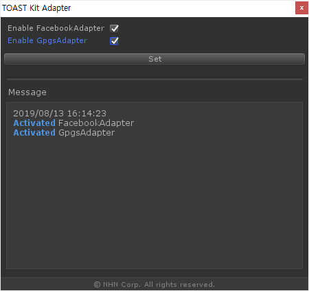

# Adapter

🌏 [English](README.en.md)

## 🚩 목차

* [개요](#개요)
* [스펙](#스펙)
* [AdapterTool](#-adaptertool)
* [API](#-api)

## 개요

Facebook, Google 등의 IdP는 Unity로 개발 중인 애플리케이션에서 쉽고 빠르게 IdP의 기능을 사용할 수 있도록 Unity SDK를 제공하고 있습니다. 하지만 IdP마다 API가 서로 다르므로, 여러 IdP의 기능을 각각 구현 시 많은 학습과 시간이 필요합니다.
Adapter는 하나의 공통화된 인터페이스를 제공해 여러 IdP의 기능을 쉽게 적용할 수 있습니다.

## 스펙

### Unity 지원 버전

* 2018.4.0 이상

### 지원 IdP

각 IdP SDK는 직접 다운로드 및 설치하셔야 합니다.

* Google Play Games plugin for Unity
    * [Download](https://github.com/playgameservices/play-games-plugin-for-unity)
    * Tested version
        * 0.9.56
        * 0.9.57
        * 0.9.63
        * 0.9.64
        * 0.10.09
* Facebook SDK for Unity 
    * [Download](https://developers.facebook.com/docs/unity/downloads)
    * Tested version
        * 7.15.0
        * 7.15.1
        * 7.16.0
        * 7.16.1
        * 7.17.0
        * 7.17.1
        * 7.17.2
        * 7.18.0
        * 7.18.1
        * 7.19.0
        * 7.19.1
        * 7.19.2

## 🔧 AdapterTool

Adapter에서 지원하는 IdP SDK가 없으면 아래와 같은 오류가 발생합니다.

```cs
error CS0103: The name 'FB' does not exist in the current context
```

사용하는 IdP에 따라서 Adapter 설정이 필요합니다.



### 사용방법

1. Menu > Tools > GPM > Adapter > Settings
2. 사용 여부에 따라 체크버튼을 선택하거나 선택을 해제합니다.
3. Set 버튼을 클릭하여 설정을 완료합니다.

> [`주의`]
>
> Adapter의 폴더 구조를 변경하지 마십시오.
> Adapter의 코드 및 파일을 수동으로 삭제하지 마십시오.


## 🔨 API

### IsSuccess

AdapterError 객체로 성공 여부를 확인합니다.
AdapterErrorCode에 대한 자세한 정보는 아래 ErrorCode 항목을 참고하십시오.

#### API

```cs
static bool IsSuccess(AdapterError error)
```

#### Example

```cs
private void SampleIsSucces(AdapterError error)
{
    if (GpmAdapter.IsSuccess(error) == true)
    {
        Debug.Log("success");
    }
    else
    {
        Debug.Log(string.Format("failure. error:{0}", error));
    }
}
```

### Login

IdP의 이름과 추가 정보를 사용하여 IdP 로그인을 시도합니다.
Adapter에서 지원하는 IdP의 이름은 GpmAdapterType.Idp 클래스를 통해 제공합니다.

> [참고]
>
> Facebook SDK 로그인 시에는 Facebook 권한 정보가 필요하며, 추가 정보에 `facebook_permissions` 키를 사용하여 설정해야 합니다. Facebook 권한 정보를 설정하지 않은 경우에는 기본값으로 `[public_profile, email]` 값이 설정됩니다. 자세한 사용법은 아래 Example을 참고하십시오.

#### API

```cs
static void Login(string idpName, Dictionary<string, object> additionalInfo, Action<AdapterError> callback)
```

#### Example

```cs
private void SampleLogin(string idpName)
{
    Dictionary<string, object> additionalInfo;
    
    switch (idpName)
    {
        case GpmAdapterType.Idp.FACEBOOK:
        {
            var facebookPermissionList = new List<string> { "public_profile", "email" };
            additionalInfo = new Dictionary<string, object>();
            additionalInfo.Add("facebook_permissions", facebookPermissionList);
            break;
        }
        case GpmAdapterType.Idp.GPGS:
        default:
        {
            additionalInfo = null;
            break;
        }
    }
    
    GpmAdapter.Idp.Login(GpmAdapterType.Idp.FACEBOOK, additionalInfo, (error) => 
    {
        if (GpmAdapter.IsSuccess(error) == true)
        {
            Debug.Log("success");
        }
        else
        {
            Debug.Log(string.Format("failure. error:{0}", error));
        }
    });
}
```

### Logout

IdP 로그아웃을 시도합니다.

#### API

```cs
static void Logout(string idpName, Action<AdapterError> callback)
```

#### Example

```cs
private void SampleLogout()
{
    GpmAdapter.Idp.Logout(GpmAdapterType.Idp.FACEBOOK, (error) => 
    {
        if (GpmAdapter.IsSuccess(error) == true)
        {
            Debug.Log("success");
        }
        else
        {
            Debug.Log(string.Format("failure. error:{0}", error));
        }
    });
}
```

### LogoutAll

모든 IdP 로그아웃을 시도합니다.
모든 IdP가 로그아웃되기 전에 오류가 발생하면, 더 이상 로그아웃을 처리하지 않고 오류를 반환합니다.

#### API

```cs
static void LogoutAll(Action<AdapterError> callback)
```

#### Example

```cs
private void SampleLogoutAll()
{
    GpmAdapter.Idp.LogoutAll((error) =>
    {
        if (GpmAdapter.IsSuccess(error) == true)
        {
            Debug.Log("success");
        }
        else
        {
            Debug.Log(string.Format("failure. error:{0}", error));
        }
    });
}
```

### GetAuthInfo

IdP의 인증 정보를 조회합니다.
Facebook은 AccessToken을 반환하며, Google은 ServerAuthCode를 반환합니다.
인증 정보가 Empty인 경우, DebugLogEnabled를 활성화하고 로그를 확인하십시오.

#### API

```cs
static void GetAuthInfo(string idpName, Action<string> callback)
```

#### Example

```cs
private void SampleGetAuthInfo()
{
    GpmAdapter.Idp.GetAuthInfo(GpmAdapterType.Idp.FACEBOOK, (facebookAuthInfo) => 
    {
        Debug.Log(string.Format("authInfo:{0}", facebookAuthInfo));
    });
}
```

### GetProfile

IdP의 프로필 정보를 조회합니다.
프로필의 기본 정보는 아래와 같습니다.

* id
* name
* email


#### API

```cs
static void GetProfile(string idpName, Action<Dictionary<string, object>> callback)
```

#### Example

```cs
private void SampleGetProfile()
{
    GpmAdapter.Idp.GetProfile(GpmAdapterType.Idp.FACEBOOK, (facebookProfile) =>
    {
        if (facebookProfile == null)
        {
            Debug.Log("Facebook profile is null.");
        }
        else
        {
            foreach (KeyValuePair<string, object>kvp in facebookProfile)
            {
                Debug.Log(string.Format("{0}:{1}\n", kvp.Key, kvp.Value));
            }
        }
    });
}
```

### GetLoggedInIdpList

로그인된 모든 IdP의 이름을 조회합니다.

#### API

```cs
static List<string> GetLoggedInIdpList()
```

#### Example

```cs
private void SampleGetLoggedInIdpList()
{
    var loggedInIdpList = GpmAdapter.Idp.GetLoggedInIdpList();
    foreach (var loggedInIdp in loggedInIdpList)
    {
        Debug.Log(string.Format("loggedInIdp:{0}", loggedInIdp));
    }
}
```

### GetUserId

IdP의 UserId 정보를 조회합니다.

#### API

```cs
static string GetUserId(string idpName)
```

#### Example

```cs
private void SampleGetUserId()
{
    var facebookUserId = GpmAdapter.Idp.GetUserId(GpmAdapterType.Idp.FACEBOOK);
    Debug.Log(string.Format("facebookUserId:{0}", facebookUserId));
}
```

### ErrorCode

| Error | Error Code | Description |
| --- | --- | --- |
| SUCCESS | 0 | 성공 |
| ADAPTER_NOT_FOUND | 1 | 어댑터를 찾을 수 없습니다. 어댑터를 설정하십시오. |
| NOT_LOGGED_IN | 2 | 로그인이 되어 있지 않습니다. 로그인 후에 해당 API를 호출하십시오. |
| USER_CANCELED | 3 | 유저가 취소하였습니다. |
| EXTERNAL_LIBRARY_ERROR | 4 | 외부 라이브러리 오류입니다. |