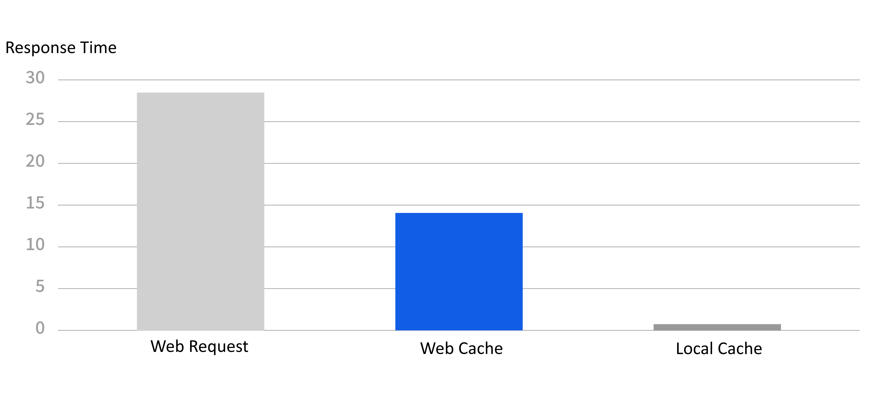
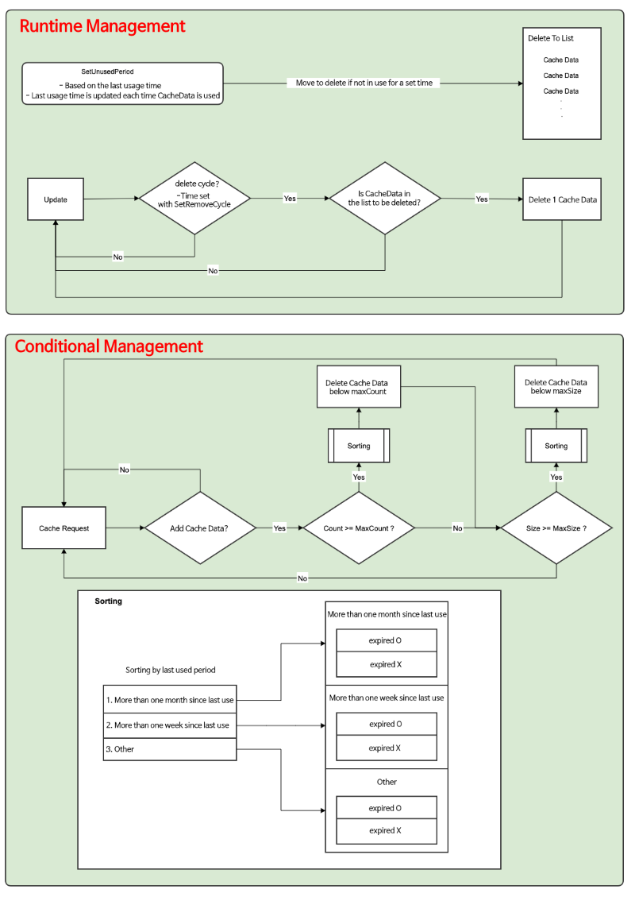
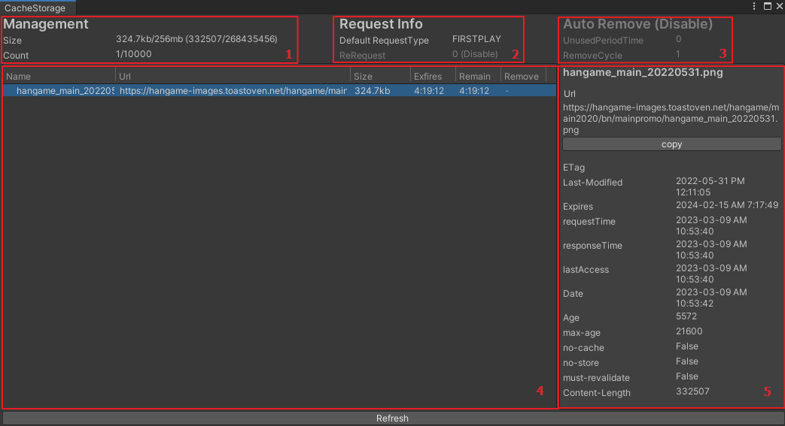
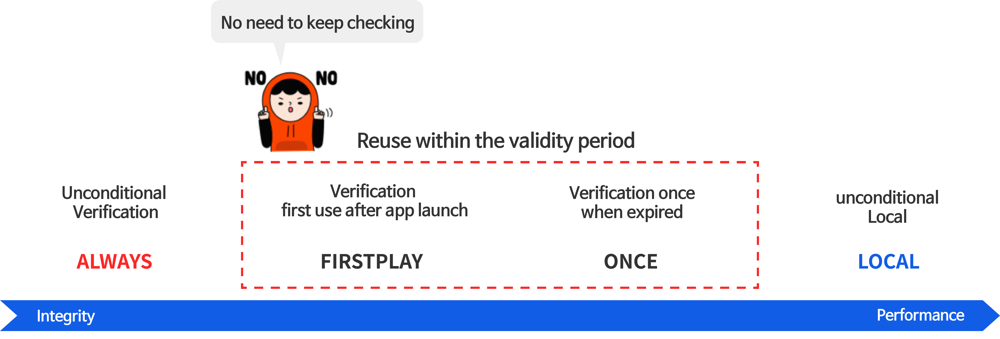

# CacheStorage

🌏 [한국어](README.md)

## 🚩 Table of Contents

* [Overview](#overview)
* [Installation](#installation)
* [Specification](#specification)
* [API](#api)
* [Release notes](./ReleaseNotes.en.md)

## Overview
* CacheStorage supports Cache when web communications are performed in Unity.
* Cache can be used to improve performance by reusing the data received when communicating.

### Performance Improvements

Store and reuse content based on HTTP when communicating on a network.
If the content is not modified, the response does not include the content, which significantly improves performance.



* CacheStorage sample-based performance test
    * UnityWebrequest: 28ms
    * WebCache: 14ms
    * Local: 1ms 

When you use the web cache, Can see that it is about twice as fast as normal communication.

### Ease of Use
It is simple as the management point is unified with one URL.

Reusing content is very fast. At the same time, data management of up-to-date content is also required.
If you use the web cache, it is easy to verify that the content is up-to-date with the same URL and can be reused.

### Capacity management
Can control the capacity by managing the cache.



1. Runtime Management
* It removes content that has not been used for a long time in real time.
* Both UnusedPeriodTime and RemoveCycle must be set to operate.
    * UnusedPeriodTime
        * Content that has not been used for a set period of time is deleted.
    * RemoveCycle
        * Remove one at each set cycle so that performance is not affected.

2.  Conditional Management
* When receiving new content, it is removed so that it does not exceed the set capacity and number.
* Removes caches with lower priority.
    * SetMaxSize
        * Set the maximum capacity.
    * SetMaxCount
        * Set the maximum number.

## Installation

1. [Install Game Package Manger](https://assetstore.unity.com/packages/tools/utilities/game-package-manager-147711)
2. Run : [Unity Menu > Tools > GPM > Manager](https://github.com/nhn/gpm.unity/blob/main/README.en.md#execute)
3. Service installation : CacheStorage

## Specification

### Versions that support Unity

* 2019.4.0 or higher

## How to Use

1. using Gpm.Declares Cache Storage.
2. Most features are defined in GpmCacheStorage.
3. Request Cache using GpmCacheStorage.Request.

### NameSpace
```cs
using Gpm.CacheStorage;
```

### Request
Request data from url through Request.
* Data is stored in cache and reused when invoking the same url.
* CacheRequestType lets you define when to validate to a server.
* If the data is the same when validating to the server, reuse the cache without receiving it again.

```cs
using Gpm.CacheStorage;

public void Something()
{
    string url;
    GpmCacheStorage.Request(url, (result) =>
    {
        if (result.IsSuccess() == true)
        {
            bytes[] data = result.Data;
        }
    });
}
```

### GpmCacheResult
Result value of cached data. Returns cache information and data.
* IsSuccess allows you to obtain success or not.
* By default, data is stored as Data.
* Text or Json can be converted by encoding and the default is utf8.

```cs
* boolean IsSuccess() // Returns whether the result was successful or not.
* CacheInfoInfo; // Returns cache information.
* byte[] Data; // Returns cache data.
* Returns data encoded in string Text; // utf8.


* Returns data encoded in string GetTextData() // utf8.
* string GetTextData (EncodingEncoding) // Returns encoded data.

* T GetJsonData() // returns json data encoded in utf8.
* T GetJson Data (Encoding Encoding) // Return json data encoded in utf8.
```


```cs
public void Something()
{
    string url;
    GpmCacheStorage.Request(url, (result) =>
    {
        // success
        if (result.IsSuccess() == true)
        {
            // date
            bytes[] data = result.Data;

            // text - Encoding.UTF8
            string text = result.Text;

            // text - Encoding.UTF8
            text = result.GetTextData();

            // text - Encoding.Default
            text = result.GetTextData(Encoding.Default);    

            // json - Encoding.UTF8
            JsonClass json = result.GetJsonData<JsonClass>();

            // json - Encoding.Default
            json = result.GetJsonData<JsonClass>(Encoding.Default);           
        }
    });
}
```

### Viewer
Can view cache information for Cache Storage.

* How to use
    * Can be opened through GPM/CacheStorage/Viewer in the menu.



1. Management
This is the Managed Cache menu.
    * Size: Current cache capacity / maximum capacity (byte unit)
        * The current cache capacity and the set maximum capacity.
        * Keeps the maximum capacity not exceeded.
    * Count: Current cache count / maximum count
        * The current cache number and the set maximum number.
        * Keeps the maximum number not exceeded.

2. Request Info
This information is used when requesting cache.
    *Default RequestType
        * The set CacheRequestType value.
        * Validate content according to conditions.
        * Used when CacheRequestType is not put in Request.
    *ReRequest
        * This is the set ReRequest value.
        * Contents are verified after the set time (in seconds).
        * Used when ReRequest is not included in Request.
        * The default value is 0 and is not used when 0.

3. Auto Remove
It removes content that has not been used for a long time in real time.
Both UnusedPeriodTime and RemoveCycle must be set for this to work.
    * UnusedPeriodTime
        * This is the set UnusedPeriodTime value.
        * Content that has not been used for the set time (in seconds) is deleted.
        * The default value is 0, and when it is 0, Auto Remove does not work.
    *RemoveCycle
        * Set RemoveCycle value.
        * Contents are removed one by one every set time (in seconds).
        * The default value is 1, and when it is 0, Auto Remove does not work.

4. Cache data information
    * Name: Cache name
    * Url: cache path
    * Size : Cache size (byte unit)
    * Exfires: Remaining time until expiration date
    * Remain: Remaining time until cache validation
        * Re-verification after the remaining time has elapsed.
        * The shorter of the remaining time until the expiration date and the ReRequest time (in seconds)
    * Remove: Remaining time until removal
        * If not used for the remaining time, it will be removed.
        * Time Used / Time set as UnusedPeriodTime (in seconds)
        * Auto Remove operates only when UnusedPeriodTime and RemoveCycle values ​​are not 0.

5. Cache Details Info

### Texture caching request
Can request a texture cache using GpmCacheStorage.RequestTexture.
* If the texture is loaded after running the app, reuse them will be reused.
* Load and use cached textures when cached data and web data are the same data.

```cs
public void Something()
{
    string url;
    CacheInfo cacheInfo = GpmCacheStorage.RequestTexture(url, (cachedTexture) =>
    {
        if (cachedTexture != null)
        {
            Texture texture = cachedTexture.texture;
        }
    });
}
```


## More effective web cache
Web cache is about twice as fast as normal requests.
Importing locally is faster, but cannot determine if it is up to date.


Can use the web cache more effectively by validating it only when you need it.

### Web Cache Validation Strategy

If security is critical or requires continuous renewal, use normal network communications to ensure integrity.
In addition, different verification strategies depending on whether content is more important for performance or integrity can further improve performance.



Cache Storage supports 4 validation strategies

### CacheRequestType
Can decide when to re-validate cached data to the server.
The default is FIRSTPLAY You can make changes through SetCacheRequestType.

* ALWAYS
    * Validate that data has changed on the server at every request.
    * Same as GpmCacheStorage.RequestHttpCache.
* FIRSTPLAY
    * It is revalidated once every time the app is launched.
    * Revalidates based on expiration or RequestTime settings.
* ONCE
    * No revalidation within the validity period.
    * Revalidates based on expiration or RequestTime settings.
* LOCAL
    * Uses cached data.
    * Same as GpmCacheStorage.RequestLocalCache.

#### Can request and able to request

```cs
using Gpm.CacheStorage;

public void Something()
{
    // Revalidate every time requested
    string url;
    CacheRequestType requestType = CacheRequestType.ALWAYS;
    GpmCacheStorage.Request(url, requestType, (result) =>
    {
        if (result.IsSuccess() == true)
        {
            bytes[] data = result.Data;
        }
    });
}
```

#### Cache Request Settings Type lets you change the default value
Default is FIRSTPLAY.

```cs
public void Something()
{
    // whenever he requests to re-confirm adequacy of settings.
    CacheRequestType requestType = CacheRequestType.ALWAYS;
    GpmCacheStorage.SetCacheRequestType(requestType);
}
```

### ReRequestTime
FIRSTPLAY, ONCE will reuse the cache until it expires based on the data received.
However, you can set the frequency of revalidation requests within the cluster.

The SetRequestTime setting allows you to set the request period in the cla.
* After a set number of seconds, the server will be re-validated upon callback.
* The default is 0.
* Do not re-request when set to 0.

```cs
public void Something()
{
    // Cache after 5 minutes of request is re-validated to the server
    double fiveMinutes = 5 * 60;
    GpmCacheStorage.SetReRequestTime(fiveMinutes);
}
```

Can request and a factor when request

```cs
using Gpm.CacheStorage;

public void Something()
{
    // Cache that has been requested for 5 minutes is revalidated to the server
    string url;
    double fiveMinutes = 5 * 60;
    GpmCacheStorage.Request(url, fiveMinutes, (result) =>
    {
        if (result.IsSuccess() == true)
        {
            bytes[] data = result.Data;
        }
    });
}
```


### Cache Expiration
Calculates expiration based on the header received from the server and verifies it again.
* If the max-age of CacheControl is present, re-validate it after seconds of that value.
* If Expired has a header, request it again after that time.

### CacheControl Settings
* If CacheControl has noStore, disable the cache.
* Always revalidate if noCache is present in CacheControl.
* Same as CacheRequestType.ALWAYS setting or max-age 0


### Capacity control
Can adjust the cache capacity and number so that there are not too many caches.

#### SetMaxSize
Sets the maximum capacity.
```cs
public void Something()
{
    // Delete from unnecessary cache when cache capacity exceeds 10MB
    long maxSize = 10 * 1024 * 1024; // 10 MB
    boolean appplayStorage = true; // apply storage (automatic deletion)
    GpmCacheStorage.SetMaxSize(maxSize, applayStorage);
}
```

#### SetMaxCount
Can set the maximum number.
```cs
public void Something()
{
    // Delete from unnecessary cache when more than 50000 caches are exceeded
    int maxCount = 50000;
    boolean appplayStorage = true; // apply storage (automatic deletion)
    GpmCacheStorage.SetMaxCount(maxCount, applayStorage);
}
```

#### SetUnusedPeriodTime
Caches that have not been used for that time period (seconds) are automatically deleted.
```cs
public void Something()
{
    // Delete cache that has not been used for 1 month
    double month = 24 * 60 * 60 * 30;
    GpmCacheStorage.SetUnusedPeriodTime(mont);
}
```

#### SetRemoveCycle
Removes the cache of the destination to be removed every corresponding number of seconds.
If you delete many caches at once, it can be loaded and distributed.
```cs
public void Something()
{
    // Delete cache to be removed every 2
    double twoSeconds = 2;
    GpmCacheStorage.SetRemoveCycle(mont);
}
```

## API

### Request

Request data with url.
If cached data and web data are the same data, use cached data.

**API**
```cs
public static CacheInfo Request(string url, Action<GpmCacheResult> onResult)
```
```cs
public static CacheInfo Request(string url, CacheRequestType requestType, Action<GpmCacheResult> onResult)
```
```cs
public static CacheInfo Request(string url, double reRequestTime, Action<GpmCacheResult> onResult)
```
```cs
public static CacheInfo Request(string url, CacheRequestType requestType, double reRequestTime, Action<GpmCacheResult> onResult)
```

* url
    * Cache url to request.
* requestType
    * The type of data that determines when cached data should be re-validated to the server.
    * Default is FIRSTPLAY. Can change it through SetCacheRequestType.
* reRequestTime.
    * Can set the frequency of re-verification requests on a per-function basis.
    * After the set time (in seconds) has elapsed since the last verification, it will be verified again.
    * If you do not set 0 or 0, the time set to SetRequestTime is applied.
    * SetRequestTime defaults to 0. If neither is set, re-verify based on the requestType.
* preLoad.
    * Read pre-stored cache before verifying on the web.
    * The callback is called again if the content has changed since validation.

**Example**
```cs
public void Something()
{
    string url;
    GpmCacheStorage.Request(url, (result) =>
    {
        if (result.IsSuccess() == true)
        {
            bytes[] data = result.Data;
        }
    });
}
```

```cs
public void Something()
{
    string url;
    GpmCacheStorage.Request(url, CacheRequestType.ALWAYS, (result) =>
    {
        if (result.IsSuccess() == true)
        {
            bytes[] data = result.Data;
        }
    });
}
```

### RequestHttpCache

Request data by url.
If the cached data and the web data are the same data, the cached data is used.

**API**
```cs
public static CacheInfo RequestHttpCache(string url, Action<GpmCacheResult> onResult)
```

**Example**
```cs
public void Something()
{
    string url;
    GpmCacheStorage.RequestHttpCache(url, (result) =>
    {
        if (result.IsSuccess() == true)
        {
            bytes[] data = result.Data;
        }
    });
}
```

### RequestLocalCache

Request already cached data by url.
Fails if not cached.

**API**
```cs
public static CacheInfo RequestLocalCache(string url, Action<GpmCacheResult> onResult)
```

**Example**
```cs
public void Something()
{
    string url;
    GpmCacheStorage.RequestLocalCache(url, (result) =>
    {
        if (result.IsSuccess() == true)
        {
            bytes[] data = result.Data;
        }
    });
}
```
### GetCachedTexture

Request an already cached texture by url.
If the texture is loaded after running the app, it will be reused.

**API**
```cs
public static CacheInfo GetCachedTexture(string url, Action<CachedTexture> onResult)
```

**Example**
```cs

public void Something()
{
    string url;
    CacheInfo cacheInfo = GpmCacheStorage.GetCachedTexture(url, (cachedTexture) =>
    {
        if (cachedTexture != null)
        {
            Texture texture = cachedTexture.texture;
        }
    });
}
```

### RequestTexture

Request cached data by url.
If the texture is loaded after running the app, it will be reused.
If the cached data and web data are the same data, the cached texture is loaded and used.

**API**
```cs
public static CacheInfo RequestTexture(string url, Action<CachedTexture> onResult)
```

```cs
public static CacheInfo RequestTexture(string url, bool preLoad, Action<CachedTexture> onResult)
```

```cs
public static CacheInfo RequestTexture(string url, CacheRequestType requestType, Action<CachedTexture> onResult)
```


```cs
public static CacheInfo RequestTexture(string url, CacheRequestType requestType, bool preLoad, Action<CachedTexture> onResult)
```

```cs
public static CacheInfo RequestTexture(string url, double reRequestTime, Action<CachedTexture> onResult)
```

```cs
public static CacheInfo RequestTexture(string url, double reRequestTime,  bool preLoad, Action<CachedTexture> onResult)
```

```cs
public static CacheInfo RequestTexture(string url, CacheRequestType requestType, double reRequestTime, bool preLoad, Action<CachedTexture> onResult)
```

* url
    * Cache url to request.
* requestType
    * The type of data that determines when cached data should be re-validated to the server.
    * Default is FIRSTPLAY. Can change it through SetCacheRequestType.

* reRequestTime.
    * Can set the frequency of re-verification requests on a per-function basis.
    * The criterion is seconds. If set to 10, the cache that is past 10 seconds will be revalidated.
    * If you do not set 0 or 0, the time set to SetRequestTime is applied.
    * SetRequestTime defaults to 0. If neither is set, re-verify based on the requestType.

**Example**
```cs
public void Something()
{
    string url;
    CacheInfo cacheInfo = GpmCacheStorage.RequestTexture(url, (cachedTexture) =>
    {
        if (cachedTexture != null)
        {
            Texture texture = cachedTexture.texture;
        }
    });
}
```

### GetCacheSize
Can see the amount of cache used.

**API**
```cs
public static long GetCacheSize()
```

**Example**
```cs
public long GetCacheSize()
{
    return GpmCacheStorage.GetCacheSize();
}
```

### GetMaxSize

Can See the maximum cache capacity to manage.

**API**
```cs
public static long GetMaxSize()
```

**Example**
```cs
public long GetMaxSize()
{
    return GpmCacheStorage.GetMaxSize();
}
```

### SetMaxSize

Can set the maximum cache capacity to manage.
* size
    * Default is 0.
    * When 0, unlimited storage.
* appplayStorage
    * When true, adjust the size of the storage capacity
    * When false, only the setting value is modified and applied when a file is added.

**API**
```cs
public static void SetMaxSize(long size = 0, bool applyStorage = true)
```

**Example**
```cs
public void Something()
{
    long maxSize = 10 * 1024 * 1024; // 10 MB
    bool applayStorage = true; // Apply Storage (Auto Remove)
    GpmCacheStorage.SetMaxSize(maxSize, applayStorage);
}
```

### GetCacheCount

Can see the number of caches used.

**API**
```cs
public static int GetCacheCount()
```

**Example**

```cs
public int GetCacheCount()
{
    return GpmCacheStorage.GetCacheCount();
}
```

### GetMaxCount

Can See the maximum number of caches to manage.

**API**
```cs
public static int GetMaxCount()
```

**Example**
```cs
public int GetMaxCount()
{
    return GpmCacheStorage.GetMaxCount();
}
```

### SetMaxCount

Can set the maximum number of caches to manage.
* count
    * Default is 0.
    * When 0, unlimited storage.
* appplayStorage
    * When true, adjust the size of the storage capacity
    * When false, only the setting value is modified and applied when a file is added.

**API**
```cs
public static void SetMaxCount(int count = 0, bool applyStorage = true)
```

**Example**
```cs
public void Something()
{
    int maxCount = 50000;
    bool applayStorage = true; // Apply Storage (Auto Remove))
    GpmCacheStorage.SetMaxCount(maxCount, applayStorage);
}
```

### ClearCache

Remove the managed cache.

**API**
```cs
public static void ClearCache()
```

**Example**
```cs
public void ClearCache()
{
    GpmCacheStorage.ClearCache();
}
```

### GetCachePath

Can know the path to the managed cache.

**API**
```cs
public static string GetCachePath()
```

**Example**
```cs
public string GetCachePath()
{
    return GpmCacheStorage.GetCachePath();
}
```

### SetCachePath

Sets the path to the managed cache.
The default is Application.temporaryCachePath .

**API**
```cs
public static void SetCachePath(string path)
```

**Example**
```cs
public void SetCachePath()
{
    string path = Application.temporaryCachePath;
    GpmCacheStorage.SetCachePath(path);
}
```

### GetReRequestTime

 Can see the webcache re-request time.

**API**
```cs
public static double GetReRequestTime()
```

**Example**
```cs
public double GetReRequestTime()
{
    return GpmCacheStorage.GetReRequestTime();
}
```

### SetReRequestTime

Can set the webcache re-request time.
Default is 0. The unit is seconds.


**API**
```cs
public static void SetReRequestTime(long value)
```

**Example**
```cs
public void SetReRequestTime()
{
    double reRequestTime = 5 * 60;
    GpmCacheStorage.SetReRequestTime(reRequestTime);
}
```


### GetUnusedPeriodTime

Can know how long to delete unnecessary assets.

**API**
```cs
public static double GetUnusedPeriodTime()
```

**Example**
```cs
public double GetUnusedPeriodTime()
{
    return GpmCacheStorage.GetUnusedPeriodTime();
}
```

### SetUnusedPeriodTime

Sets the deletion period for unnecessary assets.
The default is 0. The unit is seconds.

**API**
```cs
public static void SetUnusedPeriodTime(double value)
```

**Example**
```cs
public void SetUnusedPeriodTime()
{
    double unUsedPeriodTime = 5 * 60 * 60;
    GpmCacheStorage.SetUnusedPeriodTime(unUsedPeriodTime);
}
```

### GetRemoveCycle
Can see the deletion of delay.

**API**
```cs
public static double GetRemoveCycle()
```

**Example**
```cs
public double GetRemoveCycle()
{
    return GpmCacheStorage.GetRemoveCycle();
}
```

### SetRemoveCycle
Setting the deletion of delay.
The default value is 0.It was early units.

**API**
```cs
public static void SetRemoveCycle(double value)
```

**Example**
```cs
public void SetRemoveCycle()
{
    double reRequestTime = 5 * 60;
    GpmCacheStorage.SetRemoveCycle(reRequestTime);
}
```

### GetCacheRequestType

Can determine the CacheRequestType that is applied when requesting GpmCacheStorage.Request.

**API**
```cs
public static CacheRequestType GetCacheRequestType()
```

**Example**
```cs
public CacheRequestType GetCacheRequestType()
{
    return GpmCacheStorage.GetCacheRequestType();
}
```

### SetCacheRequestType

Sets the CacheRequestType that is applied when requesting GpmCacheStorage.Request.

**API**
```cs
public static void SetCacheRequestType(CacheRequestType value)
```

**Example**
```cs
public void SetCacheRequestType()
{
    CacheRequestType reRequestTime = 5 * 60;
    GpmCacheStorage.SetCacheRequestType(reRequestTime);
}
```