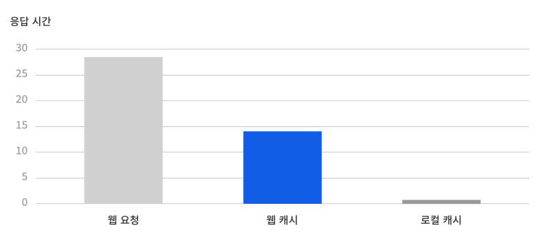
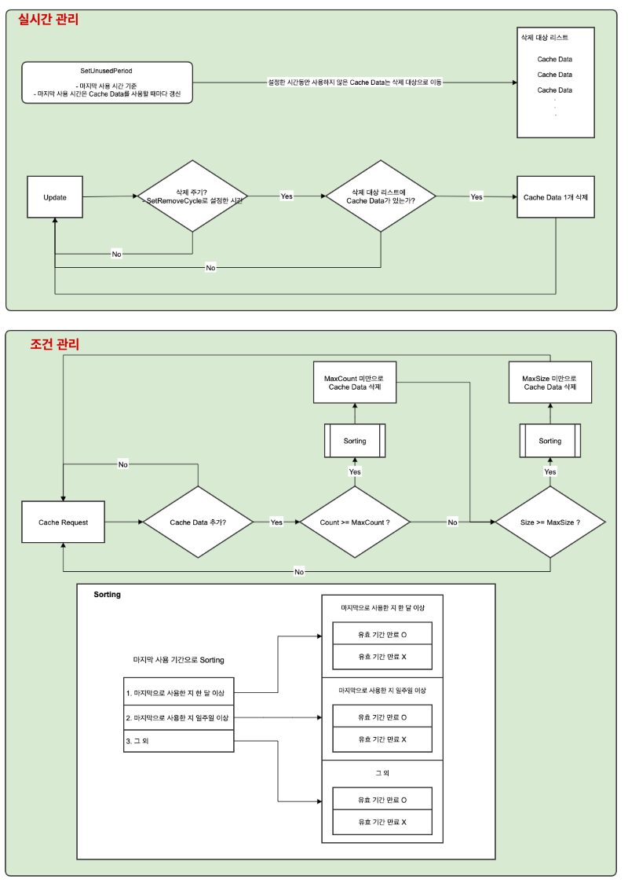
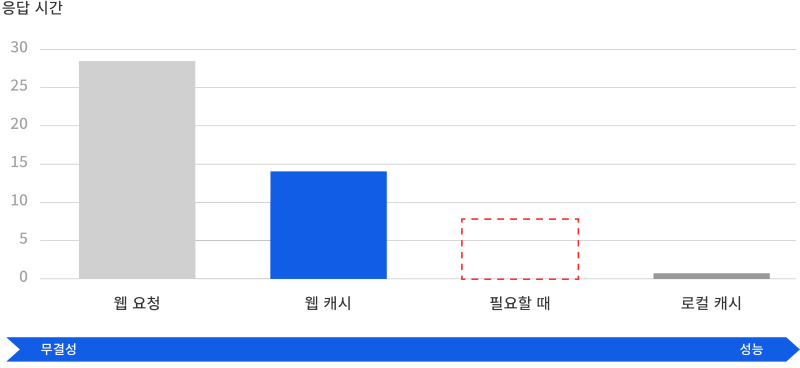
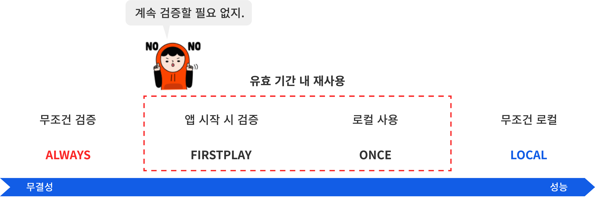

# CacheStorage

🌏 [English](README.en.md)

## 🚩 목차

* [개요](#개요)
* [설치](#설치)
* [스펙](#스펙)
* [API](#api)
* [Release notes](./ReleaseNotes.md)

## 개요

* CacheStorage는 Unity에서 웹 통신을 할 때 Cache를 지원합니다.
* Cache를 이용하여 통신을 할 때 받은 데이터를 재사용하여 성능을 개선할 수 있습니다.

### 성능 향상

네트워크 통신을 할 때 HTTP 기반으로 콘텐츠를 저장하고 재사용합니다.
이때 콘텐츠가 수정되지 않은 경우에는 응답에 콘텐츠를 포함하지 않기 때문에 전송 속도가 크게 향상됩니다



* CacheStorage 샘플 기반 성능 테스트
    * UnityWebRequest: 28ms
    * WebCache: 14ms
    * Local: 1ms 

웹 캐시를 사용했을 때 일반적인 통신보다 2배 정도 빨라진 것을 확인할 수 있습니다.

### 간편한 사용
관리 포인트가 URL 하나로 일원화되어 간편합니다.

콘텐츠를 재사용 하는 경우 속도가 매우 빠릅니다. 동시에 최신 콘텐츠의 데이터 관리도 필요합니다.
웹 캐시를 사용하게 되면 동일한 url로 최신 콘텐츠인지 검증하며 재사용할 수 있어 간편해집니다.

### 용량 관리
캐시를 관리하여 용량을 제어할 수 있습니다.



1. 실시간 관리
* 오랫동안 사용되지 않는 콘텐츠를 실시간으로 제거해 줍니다.
* UnusedPeriodTime와 RemoveCycle를 둘 다 설정해야 동작합니다.
    * UnusedPeriodTime
        * 설정한 시간 동안 사용하지 않은 콘텐츠는 지워줍니다.
    * RemoveCycle
        * 성능에 영향이 가지 않도록 설정한 주기마다 하나씩 제거합니다.

2. 조건 관리
* 새로운 콘텐츠를 받을 때 설정한 용량, 개수가 넘지 않도록 제거해 줍니다.
* 우선순위가 낮은 캐시부터 제거해 줍니다.
    * SetMaxSize
        * 최대 용량을 설정합니다.
    * SetMaxCount
        * 최대 개수를 설정합니다.

## 설치

1. [Game Package Manger 설치](https://assetstore.unity.com/packages/tools/utilities/game-package-manager-147711)
2. 실행 : [Unity Menu > Tools > GPM > Manager](https://github.com/nhn/gpm.unity#%EC%8B%A4%ED%96%89)
3. 서비스 설치 : CacheStorage

## 스펙

### Unity 지원 버전

* 2019.4.0 이상

## 사용 방법

1. using Gpm.CacheStorage를 선언합니다.
2. 대부분의 기능은 GpmCacheStorage에 정의되어 있습니다.
3. GpmCacheStorage.Request를 사용하여 Cache를 요청합니다.

### NameSpace
```cs
using Gpm.CacheStorage;
```

### Request
Request를 통해 url의 데이터를 요청합니다.
* 데이터는 cache로 저장되며 같은 url을 호출할 때 재사용 합니다.
* CacheRequestType을 통해 언제 서버에 검증할 것인지 정의할 수 있습니다.
* 서버에 검증할 때 동일한 데이터일 경우 다시 받지 않고 캐시를 재사용합니다.

```cs
using Gpm.CacheStorage;

public void Something()
{
    string url;
    GpmCacheStorage.Request(url, (result) =>
    {
        if (result.IsSuccess() == true)
        {
            bytes[] data = result.Data;
        }
    });
}
```

### GpmCacheResult
캐시된 데이터의 결괏값입니다. 캐시 정보와 데이터를 반환합니다.
* IsSuccess 통해 성공 여부를 받아올 수 있습니다.
* 기본적으로 데이터는 Data로 저장됩니다.
* Text나 Json은 인코딩을 통해 변환할 수 있으며 기본값은 utf8입니다.

```cs
* bool IsSuccess() // 결과 성공 여부를 반환합니다.
* CacheInfo Info; // 캐시 정보를 반환합니다.
* byte[] Data;  // 캐시 데이터를 반환합니다.
* string Text;  // utf8로 인코딩된 데이터를 반환합니다.


* string GetTextData() // utf8로 인코딩된 데이터를 반환합니다.
* string GetTextData(Encoding encoding) // 인코딩된 데이터를 반환합니다.

* T GetJsonData<T>() // utf8로 인코딩된 json 데이터를 반환합니다.
* T GetJsonData<T>(Encoding encoding) // utf8로 인코딩된 json 데이터를 반환합니다.
```

```cs
public void Something()
{
    string url;
    GpmCacheStorage.Request(url, (result) =>
    {
        // success
        if (result.IsSuccess() == true)
        {
            // date
            bytes[] data = result.Data;

            // text - Encoding.UTF8
            string text = result.Text;

            // text - Encoding.UTF8
            text = result.GetTextData();

            // text - Encoding.Default
            text = result.GetTextData(Encoding.Default);    

            // json - Encoding.UTF8
            JsonClass json = result.GetJsonData<JsonClass>();

            // json - Encoding.Default
            json = result.GetJsonData<JsonClass>(Encoding.Default);           
        }
    });
}
```

### Viewer
CacheStorage의 캐시 정보를 확인해 볼 수 있습니다.

* 사용 방법
    * 메뉴의 GPM/CacheStorage/Viewer 를 통해 오픈 가능합니다.


#### 1. Management
관리되는 캐시 메뉴입니다.

* Size : 현재 캐시 용량 / 최대 용량 (byte 단위)
    * 현재 Cache 용량과 설정된 최대 용량입니다.
    * 최대 용량이 넘지 않게 유지해줍니다.
* Count : 현재 캐시 개수 / 최대 개수
    * 현재 Cache 개수와 설정된 최대 개수입니다.
    * 최대 개수가 넘지 않게 유지해줍니다.

#### 2. Request Info
캐시를 요청할때 사용되는 정보입니다.

* Default RequestType
    * 설정된 CacheRequestType 값입니다.
    * 조건에 따라 콘텐츠를 검증합니다.
    * Request에 CacheRequestType를 넣지 않을 때 사용됩니다.
* ReRequest
    * 설정된 ReRequest 값입니다.
    * 설정한 시간(초 단위)이 지나면 콘텐츠를 검증합니다.
    * Request에 ReRequest를 넣지 않을 때 사용됩니다.
    * 기본값은 0이며 0일 때 사용하지 않습니다.

#### 3. Auto Remove
오랫동안 사용되지 않는 콘텐츠를 실시간으로 제거해 줍니다.
UnusedPeriodTime와 RemoveCycle를 둘 다 설정해야 동작합니다.

* UnusedPeriodTime
    * 설정된 UnusedPeriodTime 값입니다.
    * 설정한 시간(초 단위) 동안 사용하지 않은 콘텐츠는 지워줍니다.
    * 기본값은 0이며 0일 때 Auto Remove가 동작하지 않습니다.
* RemoveCycle
    * 설정된 RemoveCycle 값입니다.
    * 설정한 시간(초 단위)마다 콘텐츠가 하나씩 제거합니다.
    * 기본값은 1이며 0일 때 Auto Remove가 동작하지 않습니다.

#### 4. 캐시 데이터 리스트
관리하고 있는 캐시 데이터 리스트입니다.

* Name : 캐시 이름
* Url : 캐시 경로
* Size : 캐시 크기 (byte 단위)
* Exfires : 유효기간까지 남은 시간
* Remain : 캐시 검증까지 남은 시간
    * 남은 시간이 지나면 재검증합니다.
    * 유효기간까지 남은 시간과 ReRequest(초 단위) 시간 중 짧은 시간
* Remove : 제거될 때까지 남은 시간
    * 남은 시간 동안 사용하지 않으면 제거됩니다.
    * 사용한 시간 / UnusedPeriodTime로 설정된 시간 (초 단위)
    * UnusedPeriodTime와 RemoveCycle 값이 0이 아니어야 Auto Remove가 동작합니다.

#### 5. 캐시 상세 정보
리스트에서 선택된 캐시 데이터 상세 정보입니다.

### 텍스처 캐싱 요청
GpmCacheStorage.RequestTexture를 이용하여 텍스처 캐시를 요청할 수 있습니다.
* 앱 실행 후 로드한 텍스처라면 재사용합니다.
* 캐시된 데이터와 웹 데이터가 동일한 데이터인 경우 캐시된 텍스처를 로드하여 사용합니다.

```cs
public void Something()
{
    string url;
    CacheInfo cacheInfo = GpmCacheStorage.RequestTexture(url, (cachedTexture) =>
    {
        if (cachedTexture != null)
        {
            Texture texture = cachedTexture.texture;
        }
    });
}
```


## 더 효과적인 웹 캐시 사용
웹 캐시를 사용하면 일반 요청보다 속도가 2배 정도 빠릅니다.
로컬에서 불러오는 것은 더욱 빠르지만 최신 상태 여부를 확인할 수 없습니다.



이러한 특성을 활용하여 필요할 때만 검증하면 웹 캐시를 더욱 효과적으로 사용할 수 있습니다.

### 웹 캐시 검증 전략

보안이 중요하거나 지속적인 갱신이 필요할 경우는 일반적인 네트워크 통신을 이용해 무결성을 보장합니다.
그리고 콘텐츠가 성능이 더 중요한지 무결성이 더 중요한지에 따라 검증 전략을 달리하면 성능을 더욱 향상시킬 수 있습니다.



CacheStorage에서는 아래와 같이 4가지 검증 전략을 지원하고 있습니다.

### CacheRequestType
캐시된 데이터를 언제 서버에 다시 검증할지를 결정할 수 있습니다.
기본값은 FIRSTPLAY입니다 SetCacheRequestType 통해 변경할 수 있습니다.

* ALWAYS
    * 요청할 때마다 서버에 데이터가 바뀌었는지 검증합니다.
    * GpmCacheStorage.RequestHttpCache과 동일합니다.
* FIRSTPLAY
    * 앱 실행 시 때마다 한 번씩 재검증합니다.
    * 만료되거나 ReRequestTime 설정에 따라 재검증합니다.
* ONCE
    * 유효기간 내 재검증하지 않습니다.
    * 만료되거나 ReRequestTime 설정에 따라 재검증합니다.
* LOCAL
    * 캐시된 데이터를 사용합니다.
    * GpmCacheStorage.RequestLocalCache과 동일합니다.


#### Request 할 때 인자를 넣어서 요청할 수 있습니다.

```cs
using Gpm.CacheStorage;

public void Something()
{
    // 요청할 때마다 재검증
    string url;
    CacheRequestType requestType = CacheRequestType.ALWAYS;
    GpmCacheStorage.Request(url, requestType, (result) =>
    {
        if (result.IsSuccess() == true)
        {
            bytes[] data = result.Data;
        }
    });
}
```

#### SetCacheRequestType 통해 기본값을 변경할 수 있습니다.
기본값은 FIRSTPLAY입니다
```cs
public void Something()
{
    // 요청할 때마다 재검증하도록 설정
    CacheRequestType requestType = CacheRequestType.ALWAYS;
    GpmCacheStorage.SetCacheRequestType(requestType);
}
```


### ReRequestTime
FIRSTPLAY, ONCE는 받아온 데이터 기반으로 캐시가 만료되기 전까지 재사용합니다.
그러나 클라 내에서 재검증 요청 주기를 설정할 수 있습니다.

SetReRequestTime 설정을 통해 클라에서 재요청 주기를 설정할 수 있습니다.
* 설정된 초가 지나면 재 호출 시 서버에 다시 검증합니다.
* 기본값은 0입니다.
* 0으로 설정될 때 재요청을 하지 않습니다.

```cs
public void Something()
{
    // 요청한지 5분이 지난 캐시는 서버에 재검증하도록 설정
    double fiveMinutes = 5 * 60;
    GpmCacheStorage.SetReRequestTime(fiveMinutes);
}
```

Request 할 때 인자를 넣어서 요청할 수 있습니다.

```cs
using Gpm.CacheStorage;

public void Something()
{
    // 요청한지 5분이 지난 캐시는 서버에 재검증
    string url;
    double fiveMinutes = 5 * 60;
    GpmCacheStorage.Request(url, fiveMinutes, (result) =>
    {
        if (result.IsSuccess() == true)
        {
            bytes[] data = result.Data;
        }
    });
}
```

### 캐시 만료
서버에서 받아온 헤더를 기반으로 만료를 계산해 다시 검증합니다.
* CacheControl의 max-age가 있을 경우 해당 값의 초 후에 재검증합니다.
* Expires가 헤더에 있을 경우 해당 시간이 지나면 재요청합니다.

### CacheControl 설정
* CacheControl에 noStore가 있을 경우 캐시를 사용하지 않습니다.
* CacheControl에 noCache가 있을 경우 항상 재검증합니다.
    * CacheRequestType.ALWAYS 설정 또는 max-age 0과 동일합니다


### 용량 제어
캐시가 너무 많아지지 않도록 캐시 용량과 개수를 조정할 수 있습니다.

#### SetMaxSize
최대 용량을 설정합니다.
```cs
public void Something()
{
    // 캐시 용량이 10MB가 넘었을 때 필요 없는 캐시부터 삭제
    long maxSize = 10 * 1024 * 1024; // 10 MB
    bool applayStorage = true; // 저장소 적용(자동 삭제)
    GpmCacheStorage.SetMaxSize(maxSize, applayStorage);
}
```

#### SetMaxCount
 최대 개수를 설정할 수 있습니다.
```cs
public void Something()
{
    // 캐시가 50000개가 넘었을 때 필요 없는 캐시부터 삭제
    int maxCount = 50000;
    bool applayStorage = true; // 저장소 적용(자동 삭제)
    GpmCacheStorage.SetMaxCount(maxCount, applayStorage);
}
```

#### SetUnusedPeriodTime
해당 기간(초) 만큼 사용하지 않은 캐시를 자동적으로 삭제됩니다.
```cs
public void Something()
{
    // 1 달 동안 사용하지 않은 캐시는 삭제
    double month = 24 * 60 * 60 * 30;
    GpmCacheStorage.SetUnusedPeriodTime(mont);
}
```

#### SetRemoveCycle
해당 기간(초)마다 제거할 대상의 캐시를 제거합니다.
한 번에 많은 캐시를 삭제하게 되면 부하가 갈수 있어 분산시켜줍니다.
```cs
public void Something()
{
    // 2 마다 제거 예정 캐시 삭제
    double twoSeconds = 2;
    GpmCacheStorage.SetRemoveCycle(mont);
}
```

## API

### Request

url로 데이터를 요청합니다.
캐시된 데이터와 웹 데이터가 동일한 데이터인 경우 캐시된 데이터를 사용합니다.

**API**
```cs
public static CacheInfo Request(string url, Action<GpmCacheResult> onResult)
```
```cs
public static CacheInfo Request(string url, CacheRequestType requestType, Action<GpmCacheResult> onResult)
```
```cs
public static CacheInfo Request(string url, double reRequestTime, Action<GpmCacheResult> onResult)
```
```cs
public static CacheInfo Request(string url, CacheRequestType requestType, double reRequestTime, Action<GpmCacheResult> onResult)
```

* url
    * 요청할 캐시 경로입니다.
* requestType
    * 캐시된 데이터를 언제 서버에 다시 검증할지를 결정하는 타입입니다.
    * 기본값은 FIRSTPLAY입니다 SetCacheRequestType 통해 변경할 수 있습니다.

* reRequestTime
    * 함수 별로 재검증 요청 주기를 설정할 수 있습니다.
    * 기준은 초입니다. 10으로 설정한 다면 10초가 지난 캐시는 재검증합니다.
    * 0이나 설정하지 않을 시 SetReRequestTime로 설정된 시간이 적용됩니다.
    * SetReRequestTime의 기본값은 0이며 둘 다 설정하지 않을 시 requestType에 의거하여 재검증합니다.

**Example**
```cs
public void Something()
{
    string url;
    GpmCacheStorage.Request(url, (result) =>
    {
        if (result.IsSuccess() == true)
        {
            bytes[] data = result.Data;
        }
    });
}
```
```cs
public void Something()
{
    string url;
    GpmCacheStorage.Request(url, CacheRequestType.ALWAYS, (result) =>
    {
        if (result.IsSuccess() == true)
        {
            bytes[] data = result.Data;
        }
    });
}
```

### RequestHttpCache

url로 데이터를 요청합니다.
캐시된 데이터와 웹 데이터가 동일한 데이터인 경우 캐시된 데이터를 사용합니다.

**API**
```cs
public static CacheInfo RequestHttpCache(string url, Action<GpmCacheResult> onResult)
```

**Example**
```cs
public void Something()
{
    string url;
    GpmCacheStorage.RequestHttpCache(url, (result) =>
    {
        if (result.IsSuccess() == true)
        {
            bytes[] data = result.Data;
        }
    });
}
```

### RequestLocalCache

url로 이미 캐시된 데이터를 요청합니다. 
캐시 되어있지 않은 경우 실패합니다.

**API**
```cs
public static CacheInfo RequestLocalCache(string url, Action<GpmCacheResult> onResult)
```

**Example**
```cs
public void Something()
{
    string url;
    GpmCacheStorage.RequestLocalCache(url, (result) =>
    {
        if (result.IsSuccess() == true)
        {
            bytes[] data = result.Data;
        }
    });
}
```

### GetCachedTexture

url로 이미 캐시된 텍스처를 요청합니다.
앱 실행 후 로드한 텍스처라면 재사용합니다.

**API**
```cs
public static CacheInfo GetCachedTexture(string url, Action<CachedTexture> onResult)
```

**Example**
```cs

public void Something()
{
    string url;
    CacheInfo cacheInfo = GpmCacheStorage.GetCachedTexture(url, (cachedTexture) =>
    {
        if (cachedTexture != null)
        {
            Texture texture = cachedTexture.texture;
        }
    });
}
```

### RequestTexture

url로 캐시된 데이터를 요청합니다. 
앱 실행 후 로드한 텍스처라면 재사용합니다.
캐시된 데이터와 웹 데이터가 동일한 데이터인 경우 캐시된 텍스처를 로드하여 사용합니다.

**API**
```cs
public static CacheInfo RequestTexture(string url, Action<CachedTexture> onResult)
```

```cs
public static CacheInfo RequestTexture(string url, bool preLoad, Action<CachedTexture> onResult)
```

```cs
public static CacheInfo RequestTexture(string url, CacheRequestType requestType, Action<CachedTexture> onResult)
```


```cs
public static CacheInfo RequestTexture(string url, CacheRequestType requestType, bool preLoad, Action<CachedTexture> onResult)
```

```cs
public static CacheInfo RequestTexture(string url, double reRequestTime, Action<CachedTexture> onResult)
```

```cs
public static CacheInfo RequestTexture(string url, double reRequestTime,  bool preLoad, Action<CachedTexture> onResult)
```

```cs
public static CacheInfo RequestTexture(string url, CacheRequestType requestType, double reRequestTime, bool preLoad, Action<CachedTexture> onResult)
```

* url
    * 요청할 캐시 경로입니다.
* requestType
    * 캐시된 데이터를 언제 서버에 다시 검증할지를 결정하는 타입입니다.
    * 기본값은 FIRSTPLAY입니다 SetCacheRequestType 통해 변경할 수 있습니다.

* reRequestTime
    * 함수 별로 재검증 요청 주기를 설정할 수 있습니다.
    * 마지막 검증한 이후 설정한 시간(초 단위)가 지나면 재검증합니다.
    * 0이나 설정하지 않을 시 SetReRequestTime로 설정된 시간이 적용됩니다.
    * SetReRequestTime의 기본값은 0이며 둘 다 설정하지 않을 시 requestType에 의거하여 재검증합니다.

* preLoad
    * 웹에 검증하기 전에 미리 저장된 캐시를 읽어옵니다.
    * 검증 이후 콘텐츠가 바뀌었을 경우 콜백이 다시 호출됩니다.

**Example**
```cs
public void Something()
{
    string url;
    CacheInfo cacheInfo = GpmCacheStorage.RequestTexture(url, (cachedTexture) =>
    {
        if (cachedTexture != null)
        {
            Texture texture = cachedTexture.texture;
        }
    });
}
```

### GetCacheSize

관리 중인 캐시 용량을 알 수 있습니다.

**API**
```cs
public static long GetCacheSize()
```

**Example**
```cs
public long GetCacheSize()
{
    return GpmCacheStorage.GetCacheSize();
}
```

### GetMaxSize

관리할 최대 캐시 용량을 알 수 있습니다.

**API**
```cs
public static long GetMaxSize()
```

**Example**
```cs
public long GetMaxSize()
{
    return GpmCacheStorage.GetMaxSize();
}
```

### SetMaxSize

관리할 최대 캐시 용량을 설정할 수 있습니다.
* size
    * 기본값은 0입니다.
    * 0일 때 무제한 저장합니다.
* applayStorage
    * true 일 때 저장소의 용량 크기를 조절합니다
    * false 일 때 설정값만 수정되고 파일이 추가될 때 적용됩니다.

**API**
```cs
public static void SetMaxSize(long size = 0, bool applyStorage = true)
```

**Example**
```cs
public void Something()
{
    long maxSize = 10 * 1024 * 1024; // 10 MB
    bool applayStorage = true; // 저장소 적용(자동 삭제)
    GpmCacheStorage.SetMaxSize(maxSize, applayStorage);
}
```

### GetCacheCount

관리 중인 캐시 수를 알 수 있습니다.

**API**
```cs
public static int GetCacheCount()
```

**Example**

```cs
public int GetCacheCount()
{
    return GpmCacheStorage.GetCacheCount();
}
```

### GetMaxCount

관리할 최대 캐시 개수를 알 수 있습니다.

**API**
```cs
public static int GetMaxCount()
```

**Example**
```cs
public int GetMaxCount()
{
    return GpmCacheStorage.GetMaxCount();
}
```

### SetMaxCount

관리할 최대 캐시 개수를 설정할 수 있습니다.
* count
    * 기본값은 0입니다.
    * 0일 때 무제한 저장합니다.
* applayStorage
    * true 일 때 저장소의 용량 크기를 조절합니다
    * false 일 때 설정값만 수정되고 파일이 추가될 때 적용됩니다.

**API**
```cs
public static void SetMaxCount(int count = 0, bool applyStorage = true)
```

**Example**
```cs
public void Something()
{
    int maxCount = 50000;
    bool applayStorage = true; // 저장소 적용(자동 삭제)
    GpmCacheStorage.SetMaxCount(maxCount, applayStorage);
}
```

### ClearCache

관리 중인 캐시를 제거합니다.

**API**
```cs
public static void ClearCache()
```

**Example**
```cs
public void ClearCache()
{
    GpmCacheStorage.ClearCache();
}
```

### GetCachePath

관리되는 캐시의 경로를 알 수 있습니다.

**API**
```cs
public static string GetCachePath()
```

**Example**
```cs
public string GetCachePath()
{
    return GpmCacheStorage.GetCachePath();
}
```

### SetCachePath

관리되는 캐시의 경로를 설정합니다.
기본값은 Application.temporaryCachePath입니다.

**API**
```cs
public static void SetCachePath(string path)
```

**Example**
```cs
public void SetCachePath()
{
    string path = Application.temporaryCachePath;
    GpmCacheStorage.SetCachePath(path);
}
```


### GetReRequestTime

웹캐시 재요청 시간을 알 수 있습니다.

**API**
```cs
public static double GetReRequestTime()
```

**Example**
```cs
public double GetReRequestTime()
{
    return GpmCacheStorage.GetReRequestTime();
}
```

### SetReRequestTime

웹캐시 재요청 시간을 정할 수 있습니다.
기본값은 0입니다. 단위는 초입니다.


**API**
```cs
public static void SetReRequestTime(double value)
```

**Example**
```cs
public void SetReRequestTime()
{
    double reRequestTime = 5 * 60;
    GpmCacheStorage.SetReRequestTime(reRequestTime);
}
```

### GetUnusedPeriodTime

불필요한 에셋의 삭제 기간을 알 수 있습니다.

**API**
```cs
public static double GetUnusedPeriodTime()
```

**Example**
```cs
public double GetUnusedPeriodTime()
{
    return GpmCacheStorage.GetUnusedPeriodTime();
}
```

### SetUnusedPeriodTime

불필요한 에셋의 삭제 기간을 설정합니다.
기본값은 0입니다. 단위는 초입니다.

**API**
```cs
public static void SetUnusedPeriodTime(double value)
```

**Example**
```cs
public void SetUnusedPeriodTime()
{
    double unUsedPeriodTime = 5 * 60 * 60;
    GpmCacheStorage.SetUnusedPeriodTime(unUsedPeriodTime);
}
```

### GetRemoveCycle

지연 삭제 주기를 알 수 있습니다.

**API**
```cs
public static double GetRemoveCycle()
```

**Example**
```cs
public double GetRemoveCycle()
{
    return GpmCacheStorage.GetRemoveCycle();
}
```

### SetRemoveCycle

지연 삭제 주기를 설정합니다.
기본값은 0입니다. 단위는 초입니다.

**API**
```cs
public static void SetRemoveCycle(double value)
```

**Example**
```cs
public void SetRemoveCycle()
{
    double reRequestTime = 5 * 60;
    GpmCacheStorage.SetRemoveCycle(reRequestTime);
}
```

### GetCacheRequestType

GpmCacheStorage.Request를 요청할 때 적용되는 CacheRequestType를 알 수 있습니다.

**API**
```cs
public static CacheRequestType GetCacheRequestType()
```

**Example**
```cs
public CacheRequestType GetCacheRequestType()
{
    return GpmCacheStorage.GetCacheRequestType();
}
```

### SetCacheRequestType

GpmCacheStorage.Request를 요청할 때 적용되는 CacheRequestType를 설정합니다.

**API**
```cs
public static void SetCacheRequestType(CacheRequestType value)
```

**Example**
```cs
public void SetCacheRequestType()
{
    CacheRequestType reRequestTime = 5 * 60;
    GpmCacheStorage.SetCacheRequestType(reRequestTime);
}
```