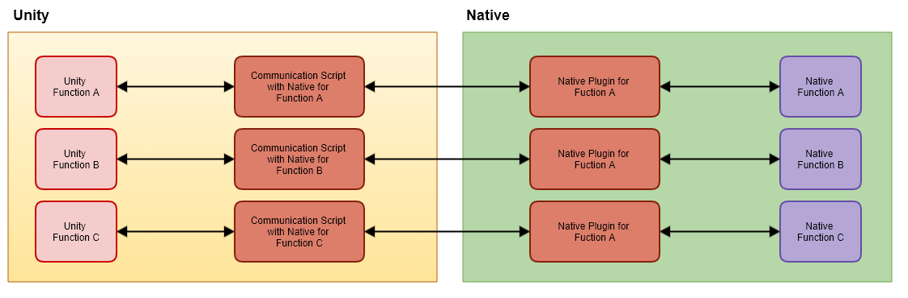
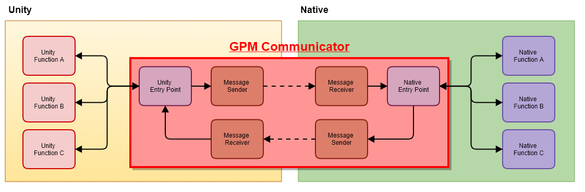

# Communicator

🌏 [한국어](README.md)

## 🚩 Table of Contents

* [Overview](#overview)
* [Specification](#specification)
* [API](#-api)
* [Usage](#-Usage)

## Overview

Unity에서는  Native와 Data를 주고 받을 수 있는 기능을 제공하고 있습니다. 하지만 Unity에서 제공하는 기본 기능을 사용하는 것은 많은 학습과 시간이 필요합니다. 
Communicator는 하나의 공통화된 인터페이스를 제공해 Data를 쉽게 주고 받을 수 있습니다.

### 플러그인을 구현하는 일반적인 구조와 단점



* 플러그인 개발에 많은 리소스가 필요합니다.
* 기능별로 개발된 플러그인은 많은 코드가 중복됩니다.

### Communicator의 구조와 사용시 장점



* 통일된 인터페이스로 Native와 통신이 가능합니다

## Specification

### Unity support version

* 2018.4.0 or higher

## 🔨 API

### InitializeClass

Unity에서 보낸 Message를 받을 Native Class를 생성합니다.
* Android의 경우 Package를 포함한 전체 경로와 Class 이름를 넣습니다
* iOS의 경우 Class 이름만 넣습니다

**API**
```cs
static void InitializeClass(GpmCommunicatorVO.Configuration configuration)
```

**Example**
```cs
public void Initialize()
{
    GpmCommunicatorVO.Configuration configuration = new GpmCommunicatorVO.Configuration()
    {
#if UNITY_ANDROID
        className = "ANDROID_CLASS_NAME"
#elif UNITY_IOS
        className = "IOS_CLASS_NAME";
#endif

        GpmCommunicator.InitializeClass(configuration);
    }
}
```

### AddReceiver

Native에서 보낸 Message를 받을 Receiver를 등록합니다.

**API**
```cs
static void AddReceiver(string domain, GpmCommunicatorCallback.CommunicatorCallback callback)
```

**Example**
```cs
public void AddReceiver()
{
    GpmCommunicator.AddReceiver("DOMAIN", OnReceiver); 
}

private void OnReceiver(GpmCommunicatorVO.Message message)
{
    StringBuilder sb = new StringBuilder(resultText.text);

    sb.AppendLine();
    sb.AppendLine("OnReceiver");
    sb.AppendLine("Domain" + message.domain);
    sb.AppendLine("Data" + message.data);
    sb.AppendLine("Extra" + message.extra);

    Debug.Log(sb.ToString());
}
```

### CallSync

Native로 Message를 전송합니다.
처리 결과를 즉시 return 값으로 받을 수 있습니다.

**API**
```cs
public static GpmCommunicatorVO.Message CallSync(GpmCommunicatorVO.Message message)
```

**Example**
```cs
public void CallSync()
{
    GpmCommunicatorVO.Message message = new GpmCommunicatorVO.Message()
    {
        domain = DOMAIN,
        data = "USER_SYNC_DATA",
        extra = "USER_SYNC_EXTRA"
    };

    GpmCommunicatorVO.Message responseMessage = GpmCommunicator.CallSync(message);

    StringBuilder sb = new StringBuilder();
    sb.AppendLine("CallSync Response");
    sb.AppendLine("Domain : " + responseMessage.domain);
    sb.AppendLine("Data : " + responseMessage.data);
    sb.AppendLine("Extra : " + responseMessage.extra);

    Debug.Log(sb.ToString());
}

```

### CallAsync

Native로 Message를 전송합니다.
비동기 처리 결과를 AddReceiver API를 통해 등록한 Receiver를 통해 받을 수 있습니다.

**API**
```cs
static void CallAsync(GpmCommunicatorVO.Message message)
```

**Example**
```cs
public void CallAsync()
{
    GpmCommunicatorVO.Message message = new GpmCommunicatorVO.Message()
    {
        domain = DOMAIN,
        data = "USER_ASYNC_DATA",
        extra = "USER_ASYNC_EXTRA"
    };

    GpmCommunicator.CallAsync(message);
}
```

## 🔨 Usage

### Communicator 설치

* Manager에서 Communicator를 설치합니다

### Native Class 만들기

**Android**
* Android Studio에 프로젝트를 생성하고 파일을 생성합니다
    * Sample.java 
        ```java
        // Package 경로를 확인합니다.
        package com.gpm.communicator.sample;

        import android.util.Log;

        import com.gpm.communicator.Interface.GpmCommunicatorReceiver;
        import com.gpm.communicator.GpmCommunicator;
        import com.gpm.communicator.vo.GpmCommunicatorMessage;

        public class GpmCommunicatorSample {
            private final String DOMAIN = "GPM_COMMUNICATOR_SAMPLE";

            public GpmCommunicatorSample() {
                // Receiver 생성
                GpmCommunicatorReceiver listener = new GpmCommunicatorReceiver() {
                    @Override
                    public void onRequestMessageAsync(GpmCommunicatorMessage message) {
                        // Async Receiver 처리
                        GpmCommunicator.sendResponseMessage(message);
                    }

                    @Override
                    public String onRequestMessageSync(GpmCommunicatorMessage message) {
                        // Sync Receiver 처리
                        GpmCommunicator.sendResponseMessage(message);
                        return "Return Sync Data";
                    }
                };

                // Receiver 등록
                GpmCommunicator.addReceiver(DOMAIN, listener);
            }
        }        
        ```
* aar 파일을 생성 합니다.
* 생성된 aar 파일을 Unity 프로젝트의 **Asset/Plugins/Android** 폴더에 넣습니다
        
**iOS**
* Unity 프로 젝트의 Asset/Plugins/IOS 폴더에 파일을 생성합니다.
    * Sample.h
        ```objc
        #import <Foundation/Foundation.h>

        @interface GPMCommunicatorSample: NSObject

        @end
        ```
    * Sample.mm
        ```objc
        #import "GPMCommunicatorSample.h"
        #import "GPMCommunicator.h"
        #import "GPMCommunicatorReceiver.h"
        #import "GPMCommunicatorMessage.h"

        #define GPM_COMMUNICATOR_SAMPLE_DOMAIN @"GPM_COMMUNICATOR_SAMPLE"

        @implementation GPMCommunicatorSample

        - (id)init {
            if((self = [super init]) == nil) {
                return nil;
            }
            
            // Receiver 생성
            GPMCommunicatorReceiver* receiver = [[GPMCommunicatorReceiver alloc] init];

            receiver.onRequestMessageSync = ^NSString *(Message *message) {
                //Sync Message 처리
                [[GPMCommunicator sharedGPMCommunicator] sendResponseWithMessage:message];
                return @"Retuen Sync Data";
            };

            receiver.onRequestMessageAsync = ^(Message *message) {
                // Async Message 처리
                [[GPMCommunicator sharedGPMCommunicator] sendResponseWithMessage:message];
            };

            // Receiver 등록
            [[GPMCommunicator sharedGPMCommunicator] addReceiverWithDomain:GPM_COMMUNICATOR_SAMPLE_DOMAIN receiver:receiver];
            return self;
        }
        @end
        ```

### Unity Class 만들기

* Sample.cs를 만듭니다
    ```cs
    namespace Gpm.Communicator.Sample
    {
        using System.Text;
        using Gpm.Communicator;
        using UnityEngine;
        using UnityEngine.UI;

        public class GpmCommunicatorSample
        {
            private const string DOMAIN = "GPM_COMMUNICATOR_SAMPLE";
            private const string ANDROID_CLASS_NAME = "com.gpm.communicator.sample.GpmCommunicatorSample";
            private const string IOS_CLASS_NAME = "GPMCommunicatorSample";
        }
    }
    ```

### Native Class 초기화 하기

* Sample.cs에 Initialize Method를 추가 합니다.
    ```cs
    namespace Gpm.Communicator.Sample
    {
        using System.Text;
        using Gpm.Communicator;
        using UnityEngine;
        using UnityEngine.UI;

        public class GpmCommunicatorSample
        {
            ...
            
            public void Initialize()
            {
                GpmCommunicatorVO.Configuration configuration = new GpmCommunicatorVO.Configuration()
                {
        #if UNITY_ANDROID
                className = ANDROID_CLASS_NAME;
        #elif UNITY_IOS
                className = IOS_CLASS_NAME;
        #endif
                };

                GpmCommunicator.InitializeClass(configuration);
            }
        }
    }
    ```

### Unity Receiver 등록하기

* Sample.cs에 AddReceiver Method를 추가 합니다.
    ```cs
    namespace Gpm.Communicator.Sample
    {
        using System.Text;
        using Gpm.Communicator;
        using UnityEngine;
        using UnityEngine.UI;

        public class GpmCommunicatorSample
        {
            ...
            
            public void AddReceiver()
            {            
                GpmCommunicator.AddReceiver(DOMAIN, OnReceiver);
            }
            
            private void OnReceiver(GpmCommunicatorVO.Message message)
            {
                StringBuilder sb = new StringBuilder(resultText.text);

                sb.AppendLine();
                sb.AppendLine("OnReceiver");
                sb.AppendLine("Domain : " + message.domain);
                sb.AppendLine("Data : " + message.data);
                sb.AppendLine("Extra : " + message.extra);

                Debug.Log(sb.ToString());
            }
        }
    }
    ```

### Async/Sync 추가하기

* Sample.cs
    ```cs
    namespace Gpm.Communicator.Sample
    {
        using System.Text;
        using Gpm.Communicator;
        using UnityEngine;
        using UnityEngine.UI;

        public class GpmCommunicatorSample
        {        
            public void CallAsync()
            {
                GpmCommunicatorVO.Message message = new GpmCommunicatorVO.Message()
                {
                    domain = DOMAIN,
                    data = "USER_ASYNC_DATA",
                    extra = "USER_ASYNC_EXTRA"
                };

                GpmCommunicator.CallAsync(message);
            }

            public void CallSync()
            {
                GpmCommunicatorVO.Message message = new GpmCommunicatorVO.Message()
                {
                    domain = DOMAIN,
                    data = "USER_SYNC_DATA",
                    extra = "USER_SYNC_EXTRA"
                };

                GpmCommunicatorVO.Message responseMessage = GpmCommunicator.CallSync(message);

                StringBuilder sb = new StringBuilder();
                sb.AppendLine("CallSync Response");
                sb.AppendLine("Domain : " + responseMessage.domain);
                sb.AppendLine("Data : " + responseMessage.data);
                sb.AppendLine("Extra : " + responseMessage.extra);
                
                Debug.Log(sb.ToString());
            }
        }
    }
    ```