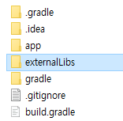
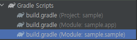
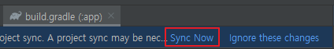
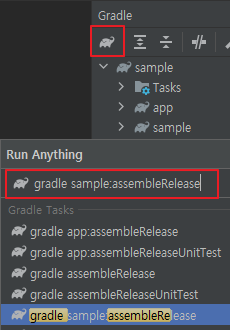

# Communicator

🌏 [한국어](README.md)

## 🚩 Table of Contents

* [Overview](#Overview)
* [Specifications](#Specifications)
* [API](#-api)
* [Usage](#-Usage)
* [Release notes](./ReleaseNotes.en.md)

## Overview

* Unity provides the feature that enables transmitting data to/from Native.
* Android uses AndroidJavaClass and iOS uses DllImport to connect with Native.
* Communicator provides Unity and Native with a common interface that allows data to be transmitted and received to facilitate data transmission.

### Standard structures that implement plugins and their weaknesses


* Require many resources to develop plugins.
    * In Unity requires a native connection by AndroidJavaClass or DllImport.
    * In Native requires registering Unity's GameObject and Callback.
    * For Android requires a connection with unity-classes.jar.
    * Additional tasks such as registering Callback in Unity class that use native feature are required.
* For plugins developed for different purposes, most of their codes overlap with one another.

### The structure of Communicator and its benefits


* Allows communication with Native through the unified interface.
    * ~~In Unity requires a native connection by AndroidJavaClass or DllImport.~~
    * ~~In Native requires registering Unity's GameObject and Callback.~~
    * ~~For Android requires a connection with unity-classes.jar.~~
    * ~~Additional tasks such as registering Callback in Unity class that use native feature are required.~~

## Specifications

### Supported Unity Version

* 2018.4.0 or higher

## 🔨 API

### InitializeClass

Generates a Native Class to receive a message from Unity.

* For Android, enter the full path including the package and class name.
* For iOS, enter only the class name.

**API**

```cs
static void InitializeClass(GpmCommunicatorVO.Configuration configuration)
```

**Example**

```cs
public void Initialize()
{
    GpmCommunicatorVO.Configuration configuration = new GpmCommunicatorVO.Configuration()
    {
#if UNITY_ANDROID
        className = "${ANDROID_CLASS_NAME}"
#elif UNITY_IOS
        className = "${IOS_CLASS_NAME}"
#endif
    };
    
    GpmCommunicator.InitializeClass(configuration);
}
```

### AddReceiver

Register a Receiver to receive a message from Native.

**API**
```cs
static void AddReceiver(string domain, GpmCommunicatorCallback.CommunicatorCallback callback)
```

**Example**
```cs
public void AddReceiver()
{
    GpmCommunicator.AddReceiver("${DOMAIN}", OnReceiver); 
}

private void OnReceiver(GpmCommunicatorVO.Message message)
{
    StringBuilder sb = new StringBuilder();

    sb.AppendLine();
    sb.AppendLine("OnReceiver");
    sb.AppendLine("Domain" + message.domain);
    sb.AppendLine("Data" + message.data);
    sb.AppendLine("Extra" + message.extra);

    Debug.Log(sb.ToString());
}
```

### CallSync

Sends the message to Native.
The process result can be immediately received as a return value.

**API**
```cs
public static GpmCommunicatorVO.Message CallSync(GpmCommunicatorVO.Message message)
```

**Example**
```cs
public void CallSync()
{
    GpmCommunicatorVO.Message message = new GpmCommunicatorVO.Message()
    {
        domain = "${DOMAIN}",
        data = "USER_SYNC_DATA",
        extra = "USER_SYNC_EXTRA"
    };

    GpmCommunicatorVO.Message responseMessage = GpmCommunicator.CallSync(message);

    StringBuilder sb = new StringBuilder();
    sb.AppendLine("CallSync Response");
    sb.AppendLine("Domain : " + responseMessage.domain);
    sb.AppendLine("Data : " + responseMessage.data);
    sb.AppendLine("Extra : " + responseMessage.extra);

    Debug.Log(sb.ToString());
}

```

### CallAsync

Sends the message to Native.
The Receiver registered using AddReceiver API can receive the async process result.

**API**
```cs
static void CallAsync(GpmCommunicatorVO.Message message)
```

**Example**
```cs
public void CallAsync()
{
    GpmCommunicatorVO.Message message = new GpmCommunicatorVO.Message()
    {
        domain = "${DOMAIN}",
        data = "USER_ASYNC_DATA",
        extra = "USER_ASYNC_EXTRA"
    };

    GpmCommunicator.CallAsync(message);
}
```

## 🔨 Usage

### Installing Communicator

Install Communicator with GPM Manager.

### Creating Native Class

#### 1. Android

1. Create a project with Android Studio. (e.g. com.gpm.communicator.sample)
2. Create a folder within the project. (e.g. Project/externalLibs)

    

3. Copy the Unity **Assets/GPM/Communicator/Plugins/Android/GpmCommunicatorPlugin.aar** file to the folder you created.
4. **File/New/New Module/Android Library** in Android Studio.
5. Create the GpmCommunicatorSample.java file and paste the code below.

```java
// GpmCommunicatorSample.java 
// Check the Package path.
package com.gpm.communicator.sample;

import com.gpm.communicator.Interface.GpmCommunicatorReceiver;
import com.gpm.communicator.GpmCommunicatorPlugin;
import com.gpm.communicator.vo.GpmCommunicatorMessage;

public class GpmCommunicatorSample {
    private final String DOMAIN = "GPM_COMMUNICATOR_SAMPLE";

    public GpmCommunicatorSample() {
        // Creates a Receiver.
        GpmCommunicatorReceiver listener = new GpmCommunicatorReceiver() {
            @Override
            public void onRequestMessageAsync(GpmCommunicatorMessage message) {
                // Processes a Async Receiver.
                GpmCommunicatorPlugin.sendResponseMessage(message);
            }

            @Override
            public GpmCommunicatorMessage onRequestMessageSync(GpmCommunicatorMessage message) {
                // Processes a Sync Receiver.
                return message;
            }
        };

        // Registers a Receiver.
        GpmCommunicatorPlugin.addReceiver(DOMAIN, listener);
    }
}  
```
6. Add the following syntax to the bundle.gradle file.

    

```java
dependencies {
    // Add
    compileOnly files('../externalLibs/GpmCommunicatorPlugin.aar')

    ...
}
```
7. Proceed to gradle sync.

    

8. Proceed to aar build.

    
 
#### 2. iOS

Create the file in **Asset/Plugins/IOS** folder of the Unity project.

```objc
// GPMCommunicatorSample.h
#import <Foundation/Foundation.h>

@interface GPMCommunicatorSample: NSObject
@end
```

```objc
// GPMCommunicatorSample.mm
#import "GPMCommunicatorSample.h"
#import "GPMCommunicator.h"
#import "GPMCommunicatorReceiver.h"
#import "GPMCommunicatorMessage.h"

#define GPM_COMMUNICATOR_SAMPLE_DOMAIN @"GPM_COMMUNICATOR_SAMPLE"

@implementation GPMCommunicatorSample

- (id)init {
    if((self = [super init]) == nil) {
        return nil;
    }
    
    // Creates a Receiver.
    GPMCommunicatorReceiver* receiver = [[GPMCommunicatorReceiver alloc] init];

    receiver.onRequestMessageSync = ^GPMCommunicatorMessage *(GPMCommunicatorMessage *message) {
        // Processes a Sync Message.
        return message;
    };

    receiver.onRequestMessageAsync = ^(GPMCommunicatorMessage *message) {
        // Processes a Async Message.
        [[GPMCommunicator sharedGPMCommunicator] sendResponseWithMessage:message];
    };

    // Registers a Receiver.
    [[GPMCommunicator sharedGPMCommunicator] addReceiverWithDomain:GPM_COMMUNICATOR_SAMPLE_DOMAIN receiver:receiver];
    return self;
}
@end
```

### Creating Unity Class

Create Sample.cs
    
```cs
namespace Gpm.Communicator.Sample
{
    using UnityEngine;
    using Gpm.Communicator;
    using System.Text;

    public class Sample : MonoBehaviour
    {
        private const string DOMAIN = "GPM_COMMUNICATOR_SAMPLE";
        private const string ANDROID_CLASS_NAME = "com.gpm.communicator.sample.GpmCommunicatorSample";
        private const string IOS_CLASS_NAME = "GPMCommunicatorSample";

        private void Awake()
        {
            Initialize();
            AddReceiver();
        }

        /// <summary>
        /// Initialize Native class
        /// </summary>
        public void Initialize()
        {
            GpmCommunicatorVO.Configuration configuration = new GpmCommunicatorVO.Configuration()
            {
    #if UNITY_ANDROID
                className = ANDROID_CLASS_NAME
    #elif UNITY_IOS
                className = IOS_CLASS_NAME
    #endif
            };

            GpmCommunicator.InitializeClass(configuration);
        }

        /// <summary>
        /// Register Unity Receiver
        /// </summary>
        public void AddReceiver()
        {
            GpmCommunicator.AddReceiver(DOMAIN, OnReceiver);
        }

        private void OnReceiver(GpmCommunicatorVO.Message message)
        {
            StringBuilder sb = new StringBuilder();

            sb.AppendLine();
            sb.AppendLine("OnReceiver");
            sb.AppendLine("Domain : " + message.domain);
            sb.AppendLine("Data : " + message.data);
            sb.AppendLine("Extra : " + message.extra);

            Debug.Log(sb.ToString());
        }

        /// <summary>
        /// Call Async
        /// </summary>
        public void CallAsync()
        {
            GpmCommunicatorVO.Message message = new GpmCommunicatorVO.Message()
            {
                domain = DOMAIN,
                data = "USER_ASYNC_DATA",
                extra = "USER_ASYNC_EXTRA"
            };

            GpmCommunicator.CallAsync(message);
        }

        /// <summary>
        /// Call Sync
        /// </summary>
        public void CallSync()
        {
            GpmCommunicatorVO.Message message = new GpmCommunicatorVO.Message()
            {
                domain = DOMAIN,
                data = "USER_SYNC_DATA",
                extra = "USER_SYNC_EXTRA"
            };

            GpmCommunicatorVO.Message responseMessage = GpmCommunicator.CallSync(message);

            StringBuilder sb = new StringBuilder();
            sb.AppendLine("CallSync Response");
            sb.AppendLine("Domain : " + responseMessage.domain);
            sb.AppendLine("Data : " + responseMessage.data);
            sb.AppendLine("Extra : " + responseMessage.extra);

            Debug.Log(sb.ToString());
        }
    }
}
```