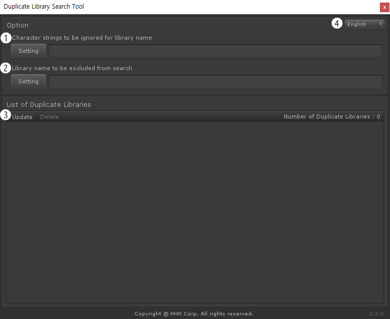
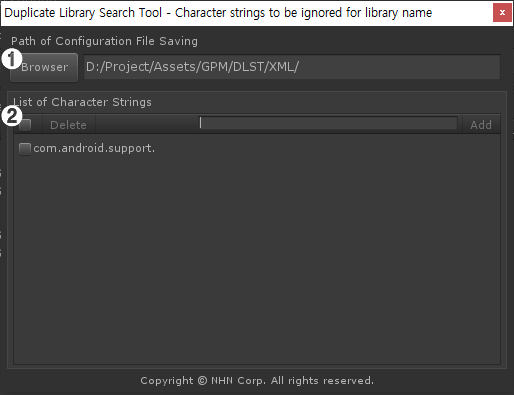
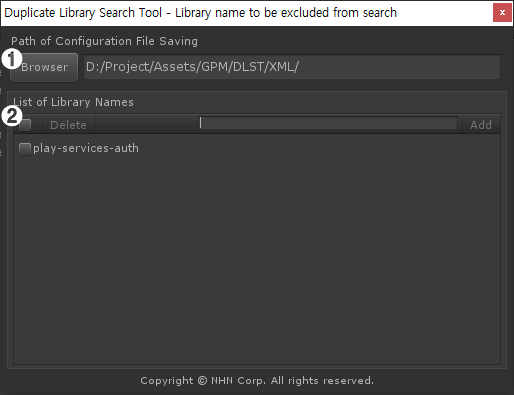

# Duplicate Library Search Tool(DLST)

🌏 [한국어](README.md)

## 🚩 Table of Contents

* [Overview](#overview)
* [Specifications](#specifications)
* [Search Rules](#search-rules)
* [Usage](#-usage)

## Overview

* When a multiple number of external libraries are used, you may encounter duplicate library issues.  
* Duplicate Library Search Tool, or DLST,  searches and removes duplicate libraries.

## Specifications

### Supporting Unity Version

* 2018.4.0 or higher

### Supporting Library Formats 

* jar
* aar
* dll
* framework
* bundle

## Search Rules 

### Search Folder 

* \*/Plugins/*

### Rules in Name

DLST classifies library file names as below: 

```
{filename}.{extension}
{filename}-{version}.{extension}
{filename}_{version}.{extension}
{filename} {version}.{extension}
```

For a search,  it compare excluding version or extension.<br>
Find out the version in the following format.
```
Regular expression : [a-zA-Z]?(\d+)(.\d+)?(.\d+)?(.\d+))

* 예 : 1.0 / 1.0.0 / 1.0.0.0 / v1.0.0 / r1.2 / a2.3.4
```

* Examples of File Name Conversion
    ```
    aaa-1.0.0.jar -> aaa.jar
    bbb-2.2.2.aar -> bbb.aar
    ccc-1.aar -> ccc-1.aar
    ddd-v1.aar -> ddd-v1.aar
    ddd-v1.0.0.aar -> ddd.aar
    eee-vvv.aar -> eee-vvv.aar
    ```
* Example of Search
    * Determined as a duplicate library. 
        ```
        aaa-1.0.0.jar -> aaa.jar
        aaa-2.0.0.jar -> aaa.jar
        aaa-v3.0.0.jar -> aaa.jar
        ```
    * Determined not as a duplicate library.
        ```
        bbb-2.2.2.aar -> bbb.aar
        bbbb-2.2.2.aar -> bbbb.aar
        bbb-ccc.aar -> bbb-ccc.aar
        ```

### Search Options 

* Ignore particular character strings in a library name 
    * Particular character strings may be ignored in the search of a file name.
        ```
        * Example of Configuration 
            File name: com.android.support.support-v4-25.3.1.aar
            Character strings to ignore: com.android.support.
            File name applied with ignored character strings applied: support-v4-25.3.1.aar
            File name excluding version or extension, for a search: support-v4

        * Example of Search
            Character strings to ignore: com.android.support.
            File 1
                com.android.support.support-v4-25.3.1.aar
                -> File name for search: support-v4
            File 2
                support-v4-27.0.0.aar
                -> File name for search: support-v4
            - Determined as a duplicate library, after search
        ```
* Library names to be excluded from search 
    * Names that are same as configured for search are excluded from search. 
        ```
        * Example of Configuration 1

        Library name to exclude: play-services-auth

        File name
            play-services-auth-15.0.1.aar
            -> File name for search: play-services-auth

        - Exclude from search

        File name
            com.google.android.gms.play-services-auth-15.0.1.aar 
            -> File name for search: com.google.android.gms.play-services-auth

        - Include for search
        ```
        ```
        * Example of Configuration 2

        Character string to ignore: com.google.android.gms.
        Library name to exclude: play-services-auth

        File name
            com.google.android.gms.play-services-auth-15.0.1.aar 
            -> File name for search: play-services-auth

        - Exclude from search
        ```

## 🔨 Usage 

### Execute DLST 

Menu > Tools > GPM > Duplicate Library Search Tool(DLST)

### UI

#### DLST Windows 



1. Configuration window for **character strings to ignore for a library name**.
2. Configuration window for **library names to exclude from search**
3. List of duplicate libraries
    * Show searched libraries.
    * 'Refresh' : Update search results.
    * 'Delete' : Choose a library from search result and remove it. 
4. Change language for the tool: Korean and English are supported.
5. Open the DLST document.

#### Configuration window for **character strings to ignore for a library name**.



1. Specify a location to save file for configured character strings.
2. List of strings
    * Show configured character strings.
    * 'Add' : Enter character strings to add. Click activated button to add character strings onto the list.
    * 'Delete' : Delete selected character strings from the list.

#### Configuration window for **library names to exclude from search** 



1. Specify a location to save file for configured library names.
2. List of library names
    * Show configured library names.
    * 'Add' : Enter library names to add. Click activated button to add libraries onto the list.
    * 'Delete' : Delete selected libraries from the list.