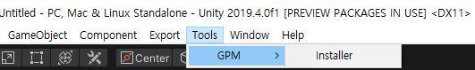
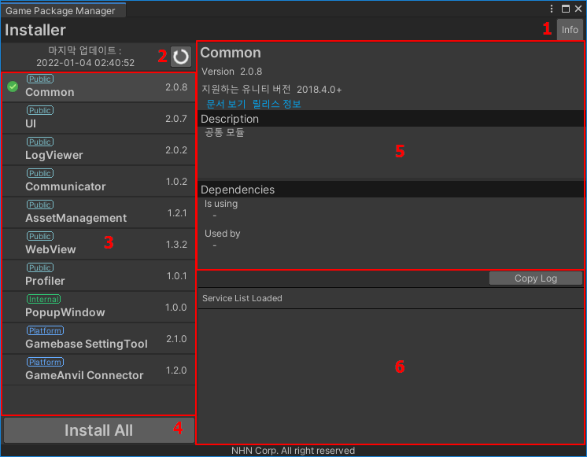
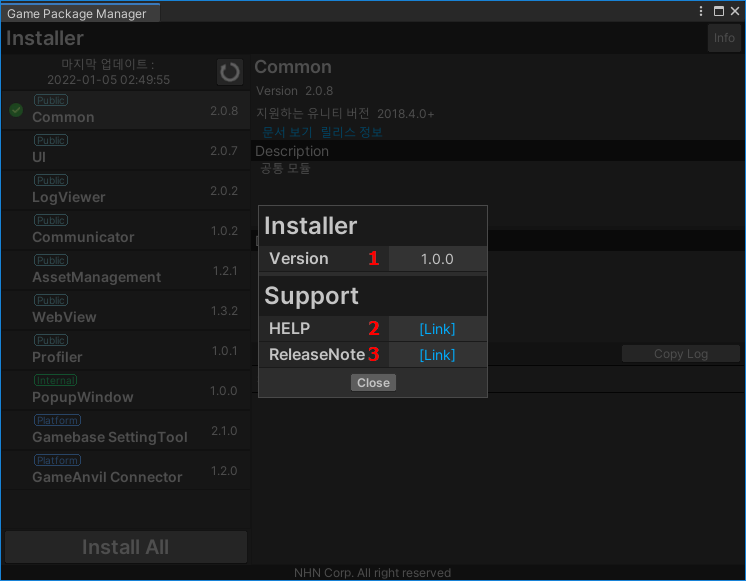
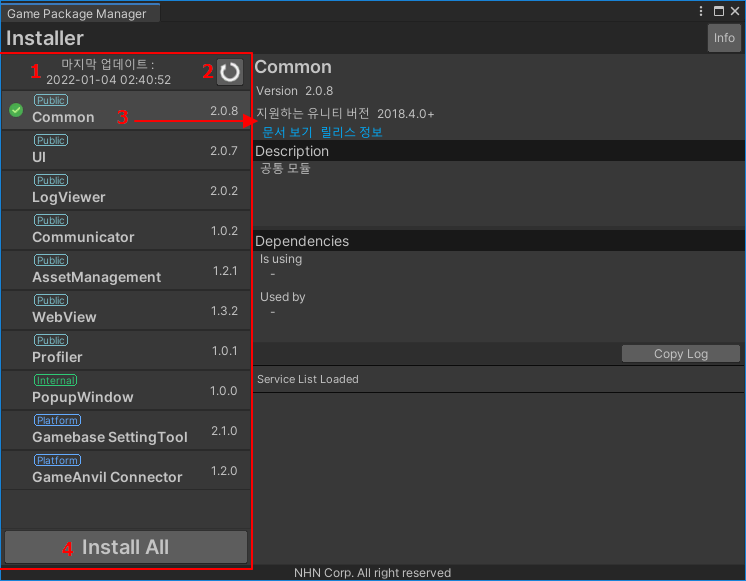
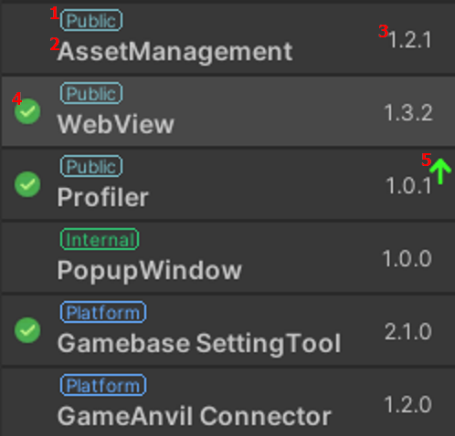
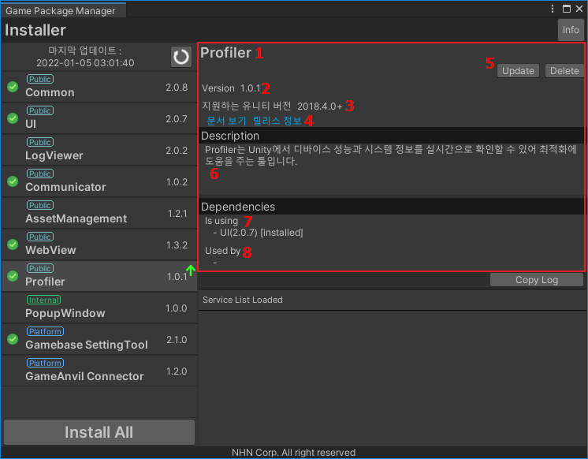
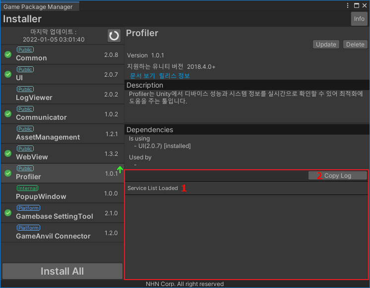
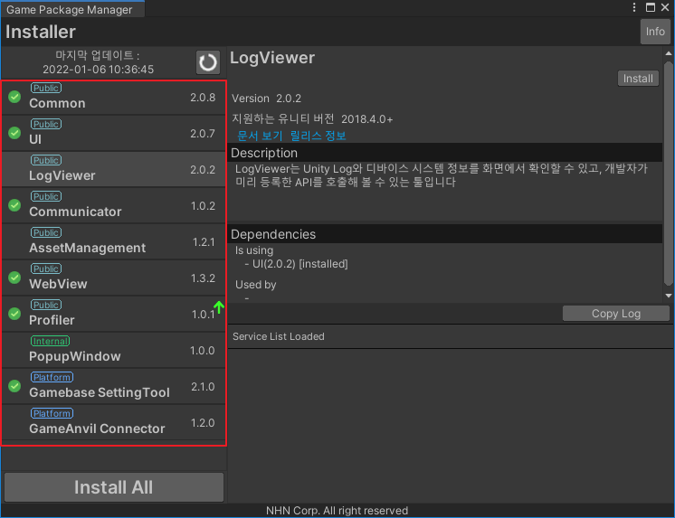
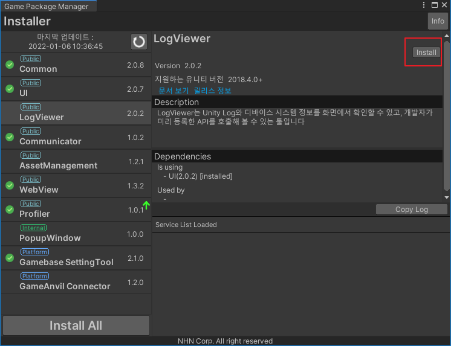
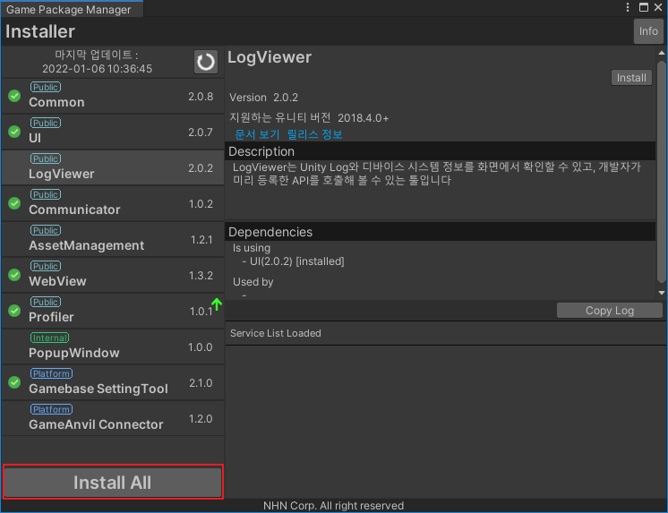

# Installer

## 🚩 목차

* [개요](#개요)
* [스펙](#스펙)
* [기능 설명](#기능-설명)
    * [Installer 열기](#Installer-열기)
    * [레이아웃](#레이아웃-구조)
    * [Installer 정보](#Installer-정보)
    * [서비스 리스트](#서비스-리스트)
    * [서비스 선택 정보](#서비스-선택-정보)
    * [서비스 선택 정보](#서비스-세부-정보)
    * [Installer 로그](#Installer-로그)
* [사용 방법](#사용-방법)
    * [서비스 개별 설치](#서비스-개별-설치)
    * [서비스 일괄 설치](#서비스-일괄-설치)
* [Release notes](./ReleaseNotes.md)
 
## 개요
* Installer는 Game Package Manager 서비스를 관리하는 툴입니다.
* 참조 : [Game Package Manager](https://github.nhnent.com/game-platform/gpm.unity)

## 스펙
### Unity 지원 버전
* 2019.4 이상

## 기능 설명

### Installer 다운로드
* 아래 링크에서 유니티 패키지를 다운로드 받아 설치합니다.
* [다운로드](https://github.nhnent.com/game-platform/gpm.unity/raw/master/release/Internal/Installer/gpm_installer.unitypackage)
    
    

### Installer 열기
 * 유니티 메뉴의 [Tools/GPM/Installer]를 통해 Installer 툴을 열 수 있습니다.

 

### 레이아웃 구조
 * Installer는 다음과 같은 레이아웃을 가집니다.
 * 왼쪽 레이아웃을 통해 서비스 리스트를 관리하며 설치, 삭제, 업데이트를 지원합니다.
 

1. Installer 정보
2. 서비스 갱신 및 시간
3. 서비스 리스트
4. 서비스 일괄 설치
5. 선택된 서비스 설명
6. Installer 로그

### Installer 정보
 * Installer의 정보를 알 수 있습니다.
 

1. Installer 버전
2. Installer 문서
3. Installer Release notes

### 서비스 리스트
* Game Package Manager의 서비스 리스트를 보여줍니다.

1. 서비스 리스트 갱신 시간
2. 서비스 리스트 갱신
3. 서비스 선택
4. 서비스 일괄 설치

### 서비스 선택 정보
* Game Package Manager의 서비스의 기본 정보를 보여줍니다.

1. 서비스 분류 태그
    * Public : 에셋 스토어에 배포 된 Game Package Manager 공개 서비스
    * Internal : 사내에서만 접근 가능한 Game Package Manager 사내 서비스
    * Platform : NHN에서 제공하는 게임 플랫폼 서비스
2. 서비스 이름
3. 서비스 버전
4. 설치된 서비스 여부 
    *  
5. 업데이트 가능 여부
    * 

### 서비스 세부 정보
선택된 서비스의 자세한 정보를 보여줍니다.

1. 서비스 이름
2. 서비스 버전
3. 지원 유니티 버전
4. 문서 링크 바로가기
5. 설치, 업데이트 삭제 버튼
6. 서비스 설명
7. Is using : 현재 서비스가 사용하는 다른 서비스 목록
8. Used by : 현재 서비스를 사용하고 있는 다른 서비스 목록

### Installer 로그
 Installer의 실행 로그를 보여줍니다. 버그 제보 시 로그를 같이 첨부 부탁드립니다.

1. 로그 리스트
2. 로그 리스트 복사

## 사용 방법
    
### 서비스 개별 설치
1. 설치할 서비스를 선택합니다.

2. 세부 정보 창의 설치, 업데이트, 삭제 버튼을 통해 진행할 수 있습니다.

### 서비스 일괄 설치
* Installer는 서비스를 쉽고 빠르게 일괄 설치하도록 지원합니다.
* 리스트 하단의 Install All 버튼을 통해 미설치 서비스를 한 번에 설치할 수 있습니다.

