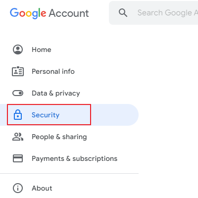
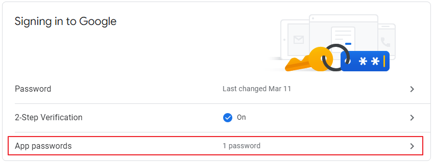
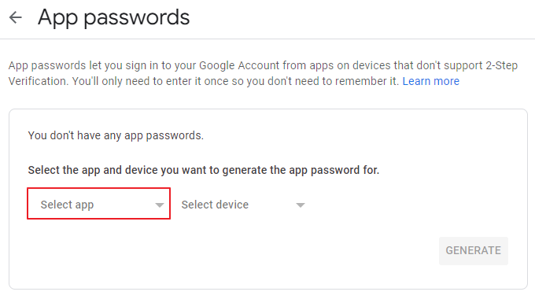
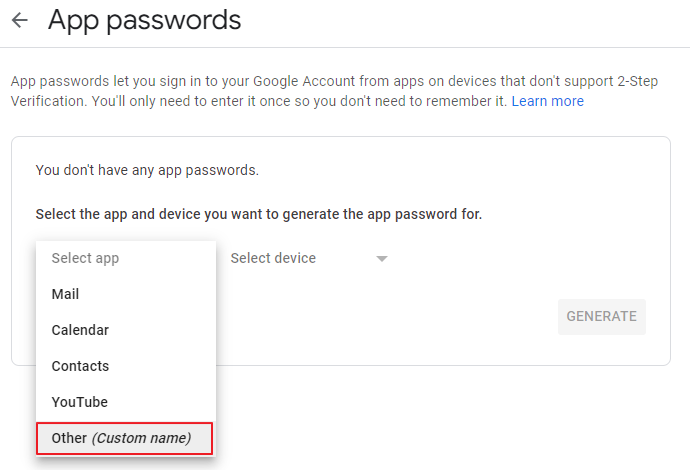
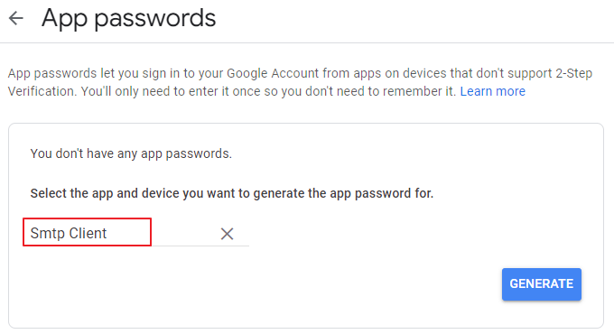
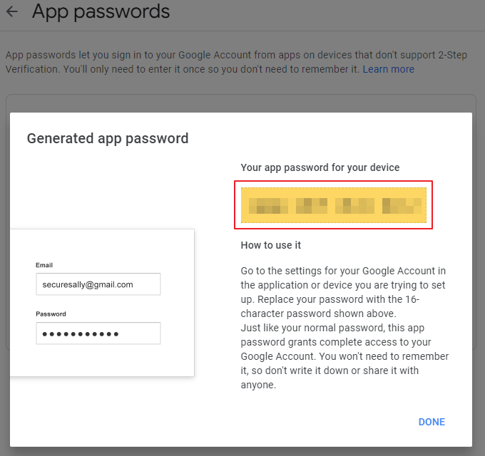

# LogViewer

🌏 [한국어](README.md)

## 🚩 Table of Contents

* [Overview](#Overview)
* [Specification](#Specification)
* [Features](#Features)
* [Usage](#-Usage)
* [Release notes](./ReleaseNotes.en.md)

## Overview

* LogViewer enables users to view Unity logs with device system information on the screen and to call APIs registered by developers.

## Specification

### Unity Support Version

* 2018.4.0 or higher

## Features

### Console

* Display the Unity logs on the screen.
* View only the desired logs using the `Category` or `Filter` features.
* Enable or disable the log type you need.
* Send logs via email


1. Menu
    * Category
    * Filter
        * Search 
            *  Print out only such logs that contain input characters.
        * Ignore Case
            * Select: Case sensitive
            * Clear: Case insensitive
    * Play Time
        * Configure whether to display the time elapsed from the start of an app to when a log is created. 
        * Displays in seconds.
    * Scene
        * Configure whether to display the name of the scene in playing when there is a log.
    * Send Mail
        * Send all logs to specified email address.
    * Clear
        * Delete all logs. 

2. Log Type
    * 
        * Check log count of the LogType.Log type.
    * 
        * Check log count of the LogType.Warning type.
    * 
        * Check log count of the LogType.Assert, LogType.Error, and LogType.Exception types.
    * Click each log type to enable or disable it.

3. Log View
    * Check the list of logs.

4. Log Details
    *  View details of a selected log from the list.


### Function

* User can call APIs added by developers from LogViewer.


1. Cheat Key          
    * Pass string entered with callback registered through the AddCheatKeyCallback API.
2. Command
    * Call API registered by using the AddCommand API.

#### System

* View the device system information.


* Update Button
    * Update system information.


## 🔨 Usage

### Preparation

* Configuring GpmLogViewer GameObject
    * Add the GPM/LogViewer/Prefabs/GpmLogViewer.prefab file to the scene.
    *  Configuring Inspector </br>
    
        * Set Gesture Enable
            * Enable or disable LogView gesture.
        * Mail Setting 
            * To: The Recipient's email address
            * User Name: Sender's email address
            * User Password: Sender's email password
            * Smtp Host: SMTP Host
            * Smpt Port: SMTP Port
            * Cc: Email address to be added for reference)            

#### Precautions for Email Setting
* All Platforms
  
    * Change API compatibility level to .NET 2.0 or above, or .NET Standard 2.0 or above.
* iOS
    * When building using IL2CPP, create `link.xml` under the Assets folder and include the following.
        ```xml
        <linker>
            <assembly fullname="System">
                <type fullname="System.Net.Configuration.MailSettingsSectionGroup" preserve="all"/>
                <type fullname="System.Net.Configuration.SmtpSection" preserve="all"/>
                <type fullname="System.Net.Configuration.SmtpNetworkElement" preserve="all"/>
                <type fullname="System.Net.Configuration.SmtpSpecifiedPickupDirectoryElement" preserve="all"/>
            </assembly>
        </linker>
        ```


* Configuring Gmail
    * Must be set using [app password](https://support.google.com/accounts/answer/185833).
    
    * <b>Allow less secure apps</b> will be unavailable after May 31, 2022.
        * To : The Recipient's email address
        * User Name : User Name: Sender's email address
        * User Password : [app password] of the sending Sender's email address 
        * Smtp Host : smtp.gmail.com
        * Smtp Port : 587

#### Configuring gmail app password
1. Select the Security tab in your Google Account.



2. In the Security tab, under Signing in to Google, select App password.
    * 2-Step Verification must be enabled to set the App password.
	


3. Under App password, tap Select app.



4. In the app selection area, tap Other (Custom Name).



5. Put <b>Smtp Client</b> in the name to Generate it.



6. For User Password, use the app password for your device.



### Enabling LogViewer in Runtime

* Enabling Each Platform
    * All Platforms
        * Enable using the Back Quote Key.</br>
            
    * Use gesture to enable iOS/Android platforms.
        * Touch the screen for a second with five fingers.

* The following types of logs automatically trigger the LogViewer.
    * LogType.Error
    * LogType.Exception

### Code

#### Console
1. Category
    * Inputting Categories
        ```cs
        Debug.Log(GpmLogViewer.Instance.MakeLogWithCategory("TestLog", "UserCategory"));
        ```

2.  Log Type
    * Log        
        ```cs
        Debug.Log("");
        ```
    * Warnning        
        ```cs
        Debug.LogWarning("");
        ```
    * Assert/Error/Exception        
        ```cs
        Debug.LogAssertion("");
        Debug.LogError("");
        Debug.LogException("");
        ```
#### Command

1. Cheat Key      
    * Adding Cheat Keys
        ```cs
        public void AddCheatKeySample()
        {
            Function.Instance.AddCheatKeyCallback((cheatKey) =>
            {
                Debug.Log("Call cheat key callback with : " + cheatKey);
            });
        }
        ```
2. Command
    * Adding Commands
        ```cs
        private void TestCommand(int index)
        {       
            Debug.Log("Index : " + index);         
        }

        public void AddCommandSample()
        {
            Function.Instance.AddCommand(this, "TestCommand", new object[] { 2 });
        }
        ```
