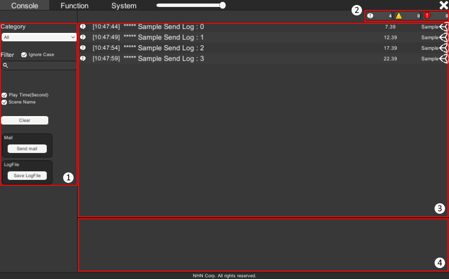
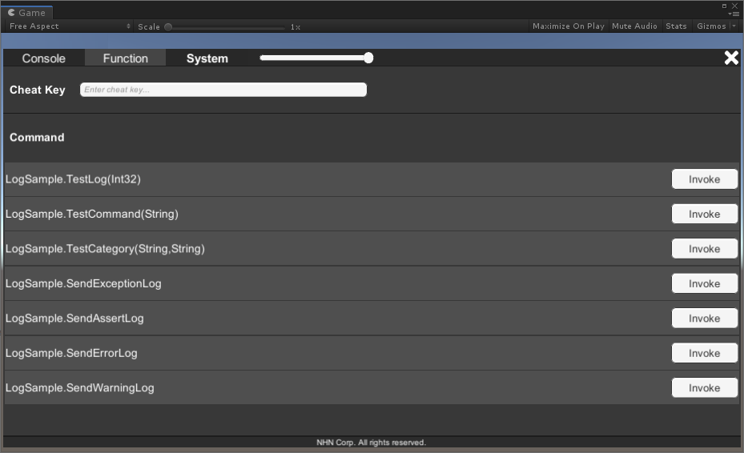
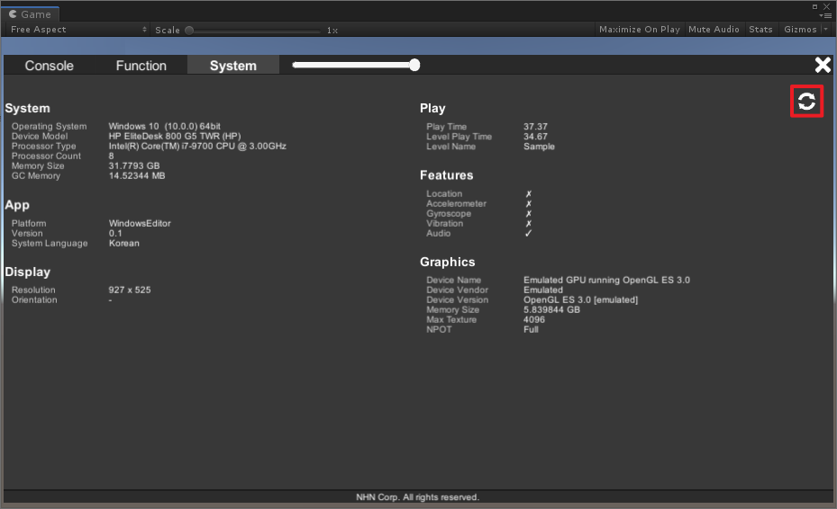
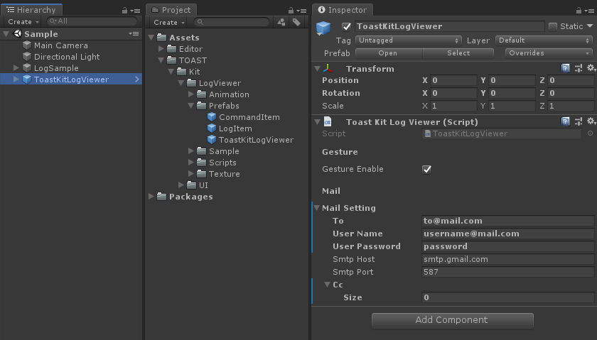
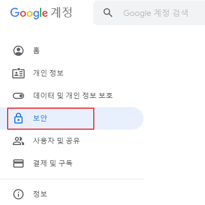
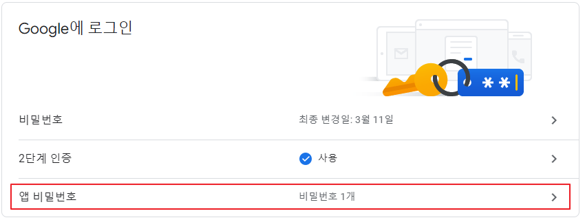
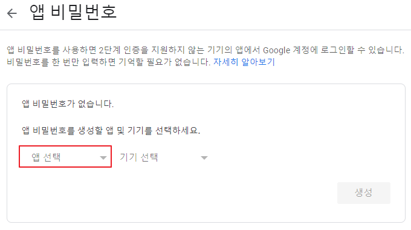
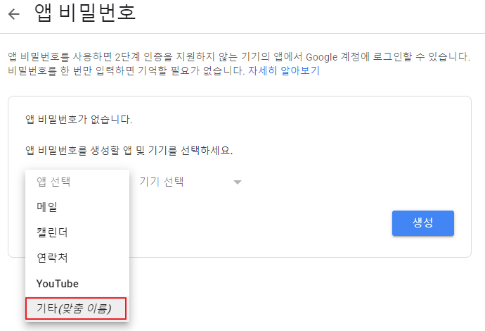
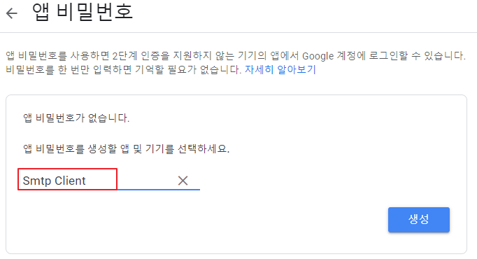
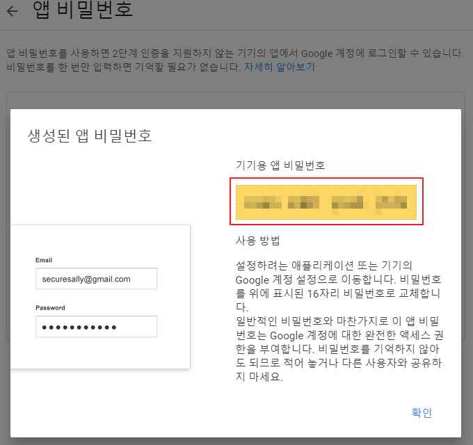

# LogViewer

🌏 [English](README.en.md)

## 🚩 목차

* [개요](#개요)
* [설치](#설치)
* [스펙](#스펙)
* [기능 설명](#기능-설명)
* [사용방법](#-사용방법)
* [Release notes](./ReleaseNotes.md)

## 개요

* LogViewer는 Unity Log와 디바이스 시스템 정보를 화면에서 확인할 수 있고, 개발자가 미리 등록한 API를 호출해 볼 수 있는 툴입니다.

## 설치

1. [Game Package Manger 설치](https://assetstore.unity.com/packages/tools/utilities/game-package-manager-147711)
2. 실행 : [Unity Menu > Tools > GPM > Manager](https://github.com/nhn/gpm.unity#%EC%8B%A4%ED%96%89)
3. 서비스 설치 : LogViewer

## 스펙

### Unity 지원 버전

* 2018.4.0 이상

## 기능 설명

### Console

* Unity Log를 화면에 보여줍니다.
* 카테고리와 필터 기능을 제공하여 원하는 로그만 선택하여 볼 수 있습니다.
* 원하는 로그 타입을 켜거나 끌 수 있습니다.
* 로그를 이메일로 전송할 수 있습니다.



1. 메뉴
    * Category
    * Filter
        * Search
            *  입력한 단어를 포함한 로그만 출력합니다.
        * Ignore Case
            * 체크 : 대소문자를 구분합니다.
            * 체크 해제 : 대소문자를 구분하지 않습니다.
    * Play Time
        * 앱 시작 후 로그가 발생했을 때까지 경과한 시간을 보여줄지 설정합니다.
        * 초 단위로 표시합니다.
    * Scene
        * 로그가 발생했을 때 재생 중인 Scene 이름을 보여줄지 설정합니다.
    * Send Mail
        * 전체 로그를 설정한 이메일로 전송합니다.
    * Save LogFile
        * 전체 로그를 로컬 파일로 저장합니다.
    * Clear
        * 전체 로그를 삭제합니다.

2. 로그 타입
    * 
        * LogType.Log 타입의 로그 수를 확인할 수 있습니다.
    * 
        * LogType.Warning 타입의 로그 수를 확인할 수 있습니다.
    * 
        * LogType.Assert, LogType.Error, LogType.Exception 타입의 로그 수를 확인할 수 있습니다.
    * 각 로그 타입을 클릭하면 해당 로그 타입을 켜거나 끌 수 있습니다.

3. 로그 뷰
    * 로그 목록을 확인할 수 있습니다.

4. 로그 상세
    *  로그 뷰에서 선택한 로그의 상세정보를 확인할 수 있습니다.


### Function

* 개발자가 추가한 API를 LogViewer에서 호출할 수 있습니다.



1. Cheat Key          
    * AddCheatKeyCallback API를 통해 등록한 콜백으로 입력한 문자열을 전달합니다.
2. Command
    * AddCommand API를 통해 등록한 API를 호출합니다.

#### System

* 시스템 정보를 확인할 수 있습니다.



* 갱신 버튼
    * 시스템 정보를 갱신합니다.


## 🔨 사용방법

### 사용 준비하기

* GpmLogViewer GameObject 설정    
    * GPM/LogViewer/Prefabs/GpmLogViewer.prefab 파일을 Scene에 추가합니다.
    *  Inspector 설정</br>
    
        * Gesture Enable 설정
            * LogView를  활성화하는 제스처를 켜거나 끌 수 있습니다.
        * Opener Enable 설정
            * LogView를  활성화하는 UI를 켜거나 끌 수 있습니다.
        * 이메일 설정
            * To: 받는 사람 이메일 주소
            * User Name: 보내는 사람 이메일 주소
            * User Password: 보내는 사람 이메일 암호
            * Smtp Host: SMTP 호스트
            * Smtp Port: SMTP 포트
            * Cc: 참조에 추가할 이메일 주소            

#### 이메일 설정 시 유의 사항

* Platform 공통
    * Api Compatibilty Level을 .NET 2.0 이상 또는 .NET Standard 2.0 이상으로 변경합니다.
* iOS
    * IL2CPP로 빌드 할 경우 Assets 폴더에 `link.xml`파일 생성 후 아래 내용을 추가합니다.
        ```xml
        <linker>
            <assembly fullname="System">
                <type fullname="System.Net.Configuration.MailSettingsSectionGroup" preserve="all"/>
                <type fullname="System.Net.Configuration.SmtpSection" preserve="all"/>
                <type fullname="System.Net.Configuration.SmtpNetworkElement" preserve="all"/>
                <type fullname="System.Net.Configuration.SmtpSpecifiedPickupDirectoryElement" preserve="all"/>
            </assembly>
        </linker>
        ```

* gmail로 설정하기
    * gmail은 [앱 비밀번호](https://support.google.com/accounts/answer/185833)를 사용하여 설정하여야 합니다.
    * <b>보안 수준이 낮은 앱 허용</b>은 2022.5.31일 이후로 사용할 수 없습니다.
        * To : 받는 이메일 주소
        * User Name : 보내는 이메일 주소
        * User Password : 보내는 이메일 주소의 [앱 비밀번호](https://support.google.com/accounts/answer/185833)
        * Smtp Host : smtp.gmail.com
        * Smtp Port : 587

#### gmail 앱 비밀번호 설정
1. 구글 계정에서 보안 탭을 선택합니다.



2. 보안 탭 내의 Google에 로그인에서 앱 비밀번호를 선택합니다.
    * 앱 비밀번호 설정을 위해선 2단계 인증이 활성화돼야 합니다.



3. 앱 비밀번호에서 앱 선택을 누릅니다.



4. 앱 선택 영역에서 기타(맞춤 이름)을 누릅니다.



5. 이름에 <b>Smtp Client</b>를 넣어 생성합니다.



6. User Password에 기기용 앱 비밀번호를 사용합니다.



### 런타임에서  LogViewer 활성화하기

* 플랫폼별 활성화 방법
    * 플랫폼 공통
        * BackQuote Key로 활성화합니다. (Gesture Enable)
            * 
        * Log 버튼을 클릭하여 활성화합니다. (Opener Enable)
            * 
    * iOS/Android
        * 제스처를 사용하여 활성화합니다. (Opener Enable)
            * 손가락 다섯 개로 1초간 화면을 터치합니다.

*  다음 타입의 로그가 발생하면 자동으로 활성화됩니다.
    *  LogType.Error
    *  LogType.Exception 

### Code

#### NameSpace
```cs
using Gpm.LogViewer;
```

#### Console
1. Category
    * 카테고리 입력 방법
        ```cs
        Debug.Log(GpmLogViewer.Instance.MakeLogWithCategory("TestLog", "UserCategory"));
        ```

2.  Log 타입
    * Log        
        ```cs
        Debug.Log("");
        ```
    * Warnning        
        ```cs
        Debug.LogWarning("");
        ```
    * Assert/Error/Exception        
        ```cs
        Debug.LogAssertion("");
        Debug.LogError("");
        Debug.LogException("");
        ```
#### Command

1. Cheat Key      
    * Cheat Key 추가 방법
        ```cs
        public void AddCheatKeySample()
        {
            Function.Instance.AddCheatKeyCallback((cheatKey) =>
            {
                Debug.Log("Call cheat key callback with : " + cheatKey);
            });
        }
        ```
2. Command
    * Command 추가 방법
        ```cs
        private void TestCommand(int index)
        {       
            Debug.Log("Index : " + index);         
        }

        public void AddCommandSample()
        {
            Function.Instance.AddCommand(this, "TestCommand", new object[] { 2 });
        }
        ```
