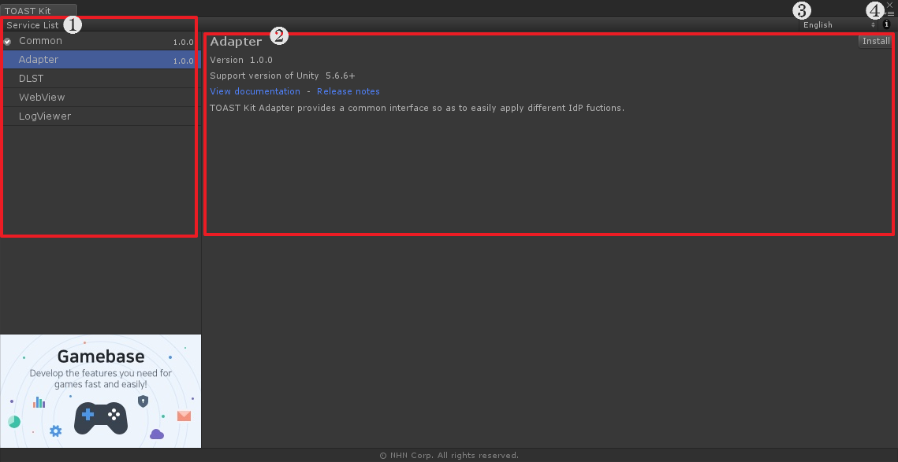

# Manager

🌏 [한국어](README.md)

## 🚩 Table of Contents

* [Overview](#overview)
* [Specification](#specification)
* [Usage](#-usage)

## Overview

Check the service list of TOAST Kit from TOAST Kit Manager, while you install, remove, or update services as you need.

## Specification

### Unity Support Version

* 2018.4.0 or higher

## 🔨 Usage

### Execute

* Menu > Tools > TOAST > Kit > Manager

### 1. Service List

* Check the list of services provided by TOAST Kit.

### 2. Service Information

* Detail information is available regarding each service. 
    * Version information
    * Unity support version
    * View documentation, Release notes, Licenses
    * Service description
* Click [Install] to install service.
* Click [Remove] to remove service.
* Click [Update] to update service.
* Service which under preparation shows [Under Preparation].

### 3. Language

* Change the language. 

### 4. Information

* Check your manager information.  
    * Version information
    * Supporting mail