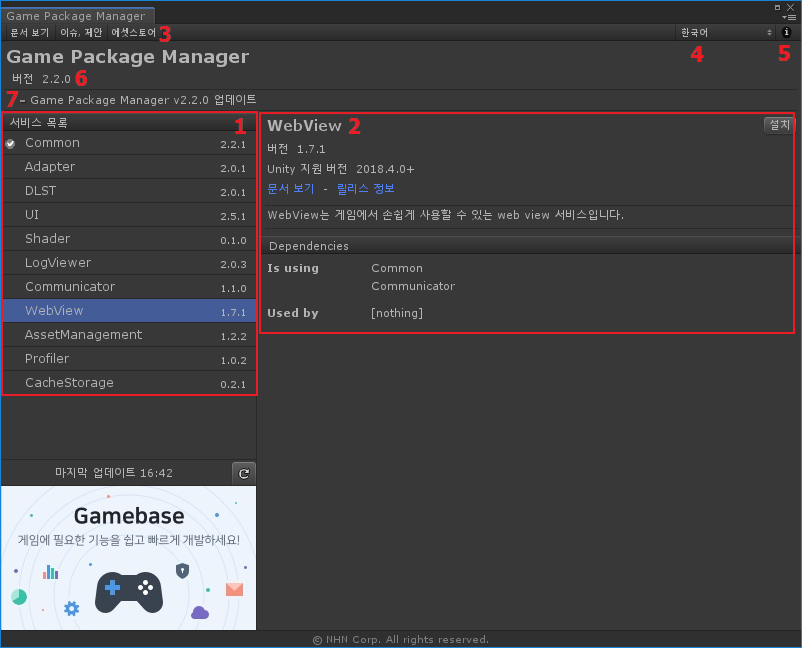

# Manager

🌏 [English](README.en.md)

## 🚩 목차

* [개요](#개요)
* [스펙](#스펙)
* [사용방법](#-사용방법)

## 개요

Manager에서 서비스 목록을 확인할 수 있고, 원하는 서비스를 설치, 제거, 업데이트할 수 있습니다.

## 스펙

### Unity 지원 버전

* 2018.4.0 이상

## 🔨 사용방법

### 실행

* Menu > Tools > GPM > Manager

### 1. 서비스 목록

* 제공하는 서비스 목록을 확인할 수 있습니다.

### 2. 서비스 정보

* 해당 서비스에 대한 자세한 정보를 제공합니다.
    * 버전 정보
    * Unity 지원 버전
    * 문서 보기, 릴리스 정보, 라이선스
    * 서비스 설명
* [설치] 버튼을 클릭하면 서비스를 설치할 수 있습니다.
* [제거] 버튼을 클릭하면 서비스를 제거할 수 있습니다.
* [업데이트] 버튼을 클릭하면 서비스를 업데이트할 수 있습니다.
* 준비 중인 서비스는 [준비 중]이라고 표시됩니다.

### 3. 언어

* 언어를 변경할 수 있습니다.

### 4. 정보

* Manager 정보를 확인할 수 있습니다.
    * 버전 정보
    * 지원 메일