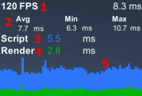
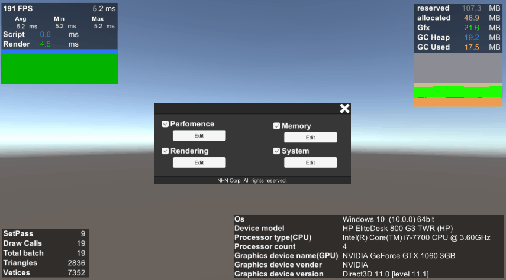
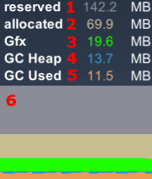
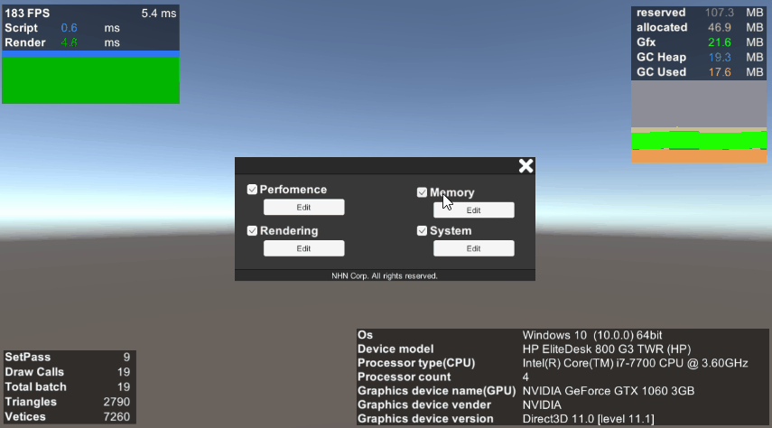
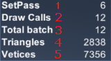
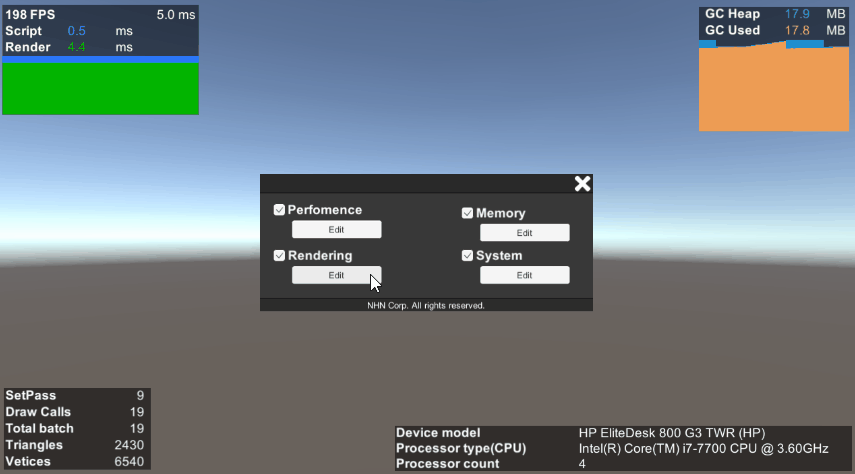
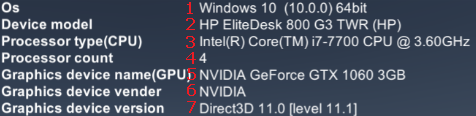
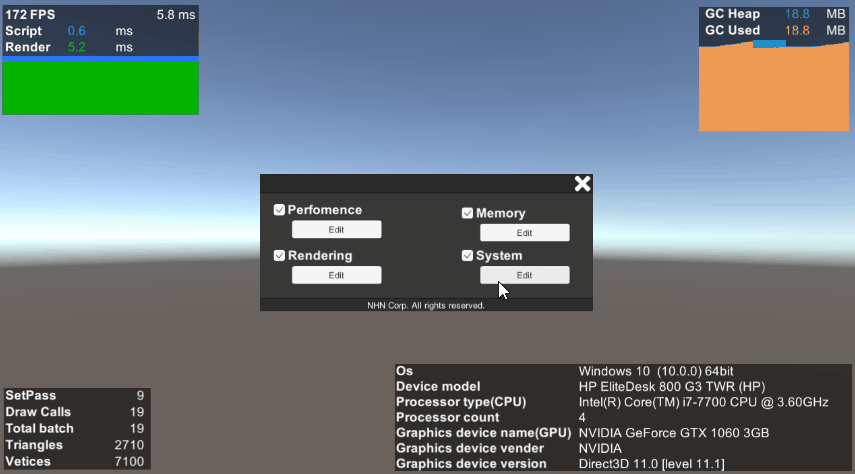
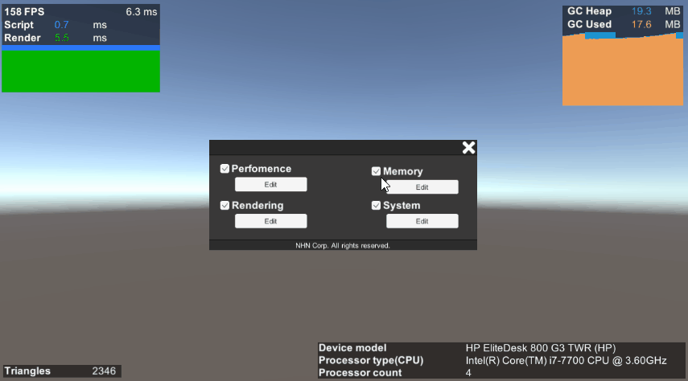

# Profiler

🌏 [English](README.en.md)

##  Table of Contents

* [Overview](#Overview)
* [Specification](#Specification)
* [Function Description](#Function-Description)
* [How to use](#How-to-Use)

## Overview

* **Profiler** is a tool that helps the optimization as it allows users to see the device performance and system information on the screen. 

## Specification

### Versions that support Unity 

* 2018.4.0 or higher

## Function description

### Performance Profiler
* It allows users to see the CPU and GPU performance in real time. 

1. FPS
    * Shows tie FPS and FrameTime. 
2. AvgGroup
    * Shows the average FrameTime. 
    * Shows the minimum FrameTime. 
    * Shows the maximum FrameTime. 
3. Script
    * Shows the script's FrameTime. 
4. Render
    * Shows FrameTime after LastUpdate until the frame ends rendering. 
5. Graph
    * Visually shows FrameTime of Script and Render. 

#### Can see only the options you want. 

    

### Memory Profiler
* Can check the real-time memory allocation and usage.

1. reserved
    * Total memory reserved for the apps on the OS
2. allocated
    * Memory allocated to the apps on the OS
3. Gfx
    * Estimated memory usage for the graphic driver
    * Used when the development is activated
4. GC Heap
    * Heap memory allocated in the script
5. GC Used
    * Memory used in the script

#### Can see only the options you want.

### Rendering Profiler
* Can check the values used for rendering in real time.
* Available for Unity 2020.2 or higher.

1. SetPass
    * Shows the number of shader passes called when rendering a frame.
2. Draw Calls
    * Shows the number of DrawCalls called when rendering a frame.
3. Total batch
    * Shows the total number of batches called when rendering a frame.
4. Triangles
    * Shows the number of triangles processed when rendering a frame.
5. Vetices
    * Shows the number of vertices processed when rendering a frame.

#### Can see only the options you want.

### System Profiler
* Can check the system information.

1. Os
    * Displays detailed information on the operating system of the device, including its version.
2. Device model
    * Shows the device model name.
3. Processor type(CPU)
    * Shows the processor name.
4. Processor count
    * Shows the number of processors.
5. Graphics device name(GPU)
    * Shows the graphics card name.
6. Graphics device vender
    * Shows the supplier of the graphics device.
7. Graphics device version
    * Shows the graphic API type and driver version.

#### You can see only the options you want.

    

## How to use

### Preparing for use

* GpmProfiler GameObject settings    
    * Add the **GPM/Profiler/Prefabs/GpmProfiler.prefab** file to Scene. 

### Editing   Profiler in Runtime

* How to edit on each platform
    * Common method for all platforms
        * Activate the edit window with the **F5** Key.
    * The iOS/Android platform activates the edit window with gestures.
        * Touch the screen with four fingers for two seconds.

* After activating the edit window
    * While activated, drag it to the desired position.
    * Can see only the options you want to see.
    
