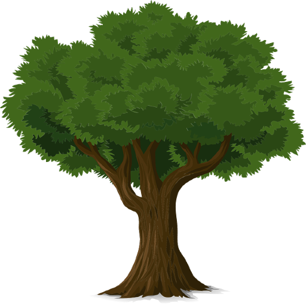
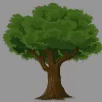
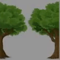
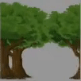
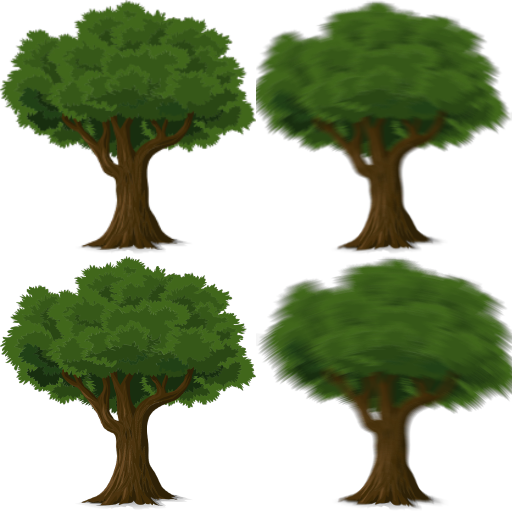
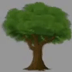
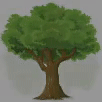
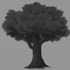
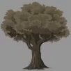
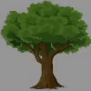

# Shader

🌏 [English](README.en.md)

## 🚩 목차

* [개요](#개요)
* [스펙](#스펙)
* [이펙트](#이펙트)
* [Release notes](./ReleaseNotes.md)

## 개요

다양한 효과의 셰이더를 제공합니다.

## 스펙

### Unity 지원 버전

* 2018.4.0 이상

### 지원하는 기능
| Effects | 2D | 3D |
| --- | --- | --- |
| Dissolve | O | O |
| ScrollUV | O | X |
| ScrollUVLayer | O | X |
| SpriteAnimation | O | X |
| SwitchTexture | O | O |
| Grayscale | O | O |
| Sepia | O | O |
| Zoom | O | X |

## 이펙트

소스 이미지 

### Dissolve
용해 효과 

### ScrollUV
UV 스크롤 

### ScrollUVLayer
전면, 후면 UV 스크롤 

### SpriteAnimation
이미지 프레임을 순서대로 표시 

### SwitchTexture
두 Texture 간 변경 

### Grayscale
흑백 효과 

### Sepia
오래된 사진 효과 

### Zoom
확대 효과 

