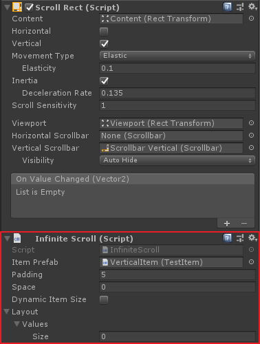
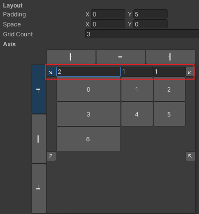
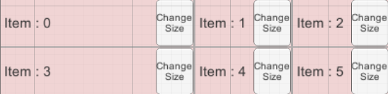
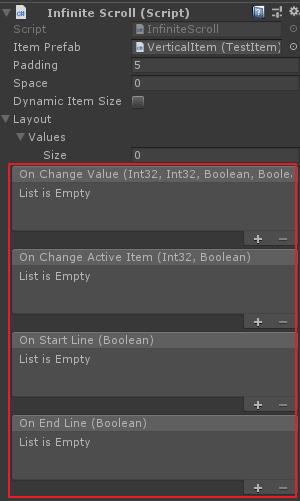
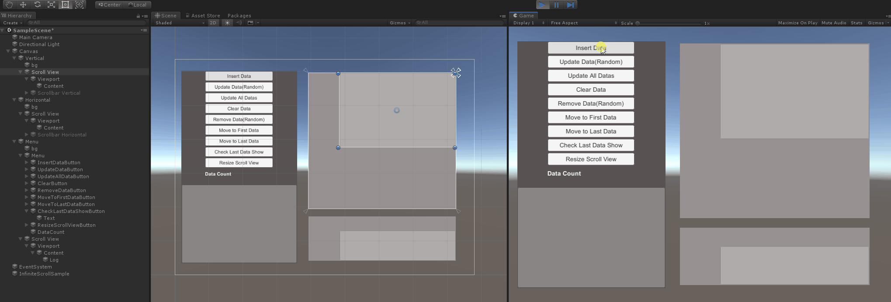
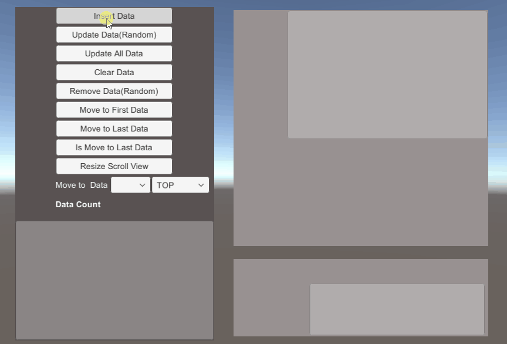

# Infinite Scroll

🌏 [한국어](README.md)

## 🚩 Table of Contents

* [Overview](#overview)
* [How to use](#how-to-use)
* [API](#-api)
* [Sample](#-sample)

## Overview

Scroll Rect (Scroll View) creates items to fit in content and allows them to be reusable.

* InfiniteScroll creates elements of content with user-inserted InfiniteScrollData (or inherited) class.
    * InfiniteScroll.InsertData()
* In the Prefab which is to be used as element of content, the InfiniteScrollItem (or inherited) class must be attached before use.
    * Implement Prefab on InfiniteScrollItem.UpdateData()

## How to use

### produce

* Add an Infinite Scroll component to the object to which the scroll rectangle (Scroll Rect(Scroll View)) is attached.
* Add a prefab with a class that inherits InfiniteScrollItem to the Item Prefab.

### Apply scroll data
* InfiniteScrollItem is used by applying the data of the content within the inherited class.
    ```
    public override void UpdateData(InfiniteScrollData scrollData)
    {
        base.UpdateData(scrollData);

        // Apply data as InfiniteScrollData content
    }
    ```

### Item Dynamic Resizing
* Enable the Dynamic Item Size option.
* InfiniteScrollItem inherited class
    * Use SetSize to change the size.
    * When the size is changed without using SetSize, the OnUpdateItemSize() function is called to reflect it on the scroll.

### Apply scroll grid
* Set the size to divide the Values ​​grid of Layout.
* Set the grid ratio with the ratio of the Element of Values.
    * 
    * This is the result of dividing the ratio of 2:1:1 as shown below.
    * It can be specified according to the size with a value exceeding 1, such as 200, 100, or 100.
    * 

### Scroll Events
Events called according to changes in the status of ScrollView.

You can register and utilize the callback function through the Inspector or AddListener.

#### Inspector


#### onChangeValue
The event that is called when the value of ScrollView is changed.
* (int)firstDataIndex
    * Index of the first data as seen in the scroll
* (int)lastDataIndex
    * Index of the last data seen in the scroll
* (bool)isStartLine
    * Whether the scroll is the starting point
* (bool)isEndLine
    * Whether the scroll is the last point
```cs
onChangeValue.AddListener(firstDataIndex, lastDataIndex, isStartLine, isEndLine =>
{
    // funtion
});
```

#### onChangeActiveItem
Event called when Scroll Item is visible or disappeared.
* (int)dataIndex
    * Index of changed scroll data
* (bool)active
    * Whether scroll items are enabled
```cs
onChangeActiveItem.AddListener(dataIndex, active =>
{
    // funtion
});
```

#### onStartLine
This event is called when the start point of ScrollView changes.
* (bool)isStartLine
    * Whether the scroll is the starting point
```cs
onStartLine.AddListener((bool)isStartLine =>
{
    // funtion
});
```

#### onEndLine
This event is called when the last point in ScrollView changes.
* (bool)isEndLine
    * Whether the scroll is the last point
```cs
onEndLine.AddListener((bool)isEndLine =>
{
    // funtion
});
```

## 🔨 API

Regarding how to use API, see Assets/GPM/UI/Sample/InfiniteScroll/Scripts/InfiniteScrollSample.cs.

### InsertData

Add data as the element of content.

```cs
public void InsertData(InfiniteScrollData data)
```
```cs
public void InsertData(InfiniteScrollData data, int insertIndex)
```
```cs
public void InsertData(InfiniteScrollData[] datas)
```
```cs
public void InsertData(InfiniteScrollData[] datas, int insertIndex)
```

### UpdateData

Update inserted data.

```cs
public void UpdateData(InfiniteScrollData data)
```

### UpdateAllData

Update all data.

```cs
public void UpdateAllData()
```

### RemoveData

Delete inserted data.

```cs
public void RemoveData(InfiniteScrollData data)
```
```cs
public void RemoveData(int dataIndex)
```

### Clear

Delete all data.

```cs
public void Clear()
```

### MoveToFirstData

Move content to the first data.

```cs
public void MoveToFirstData()
```

### MoveToLastData

Move content to the last data.

```cs
public void MoveToLastData()
```

### IsMoveToLastData

Check if content has been moved to the last data.

```cs
public bool IsMoveToLastData()
```

### MoveTo

Move content to the specified data.

```cs
public void MoveTo(InfiniteScrollData data, MoveToType moveToType, float time = 0)
```

```cs
public void MoveTo(int dataIndex, MoveToType moveToType, float time = 0)
```

### ResizeScrollView

The API is required to have Infinite Scroll deal with size changes when the size of ScrollView has been changed.

```cs
public void ResizeScrollView()
```

## 🐾 Sample

Assets/GPM/UI/Sample/InfiniteScroll



---



