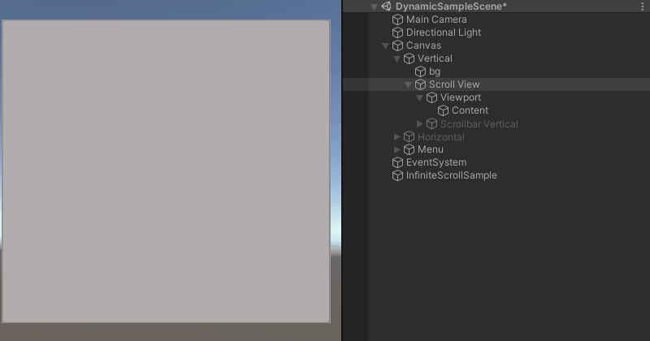
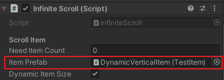
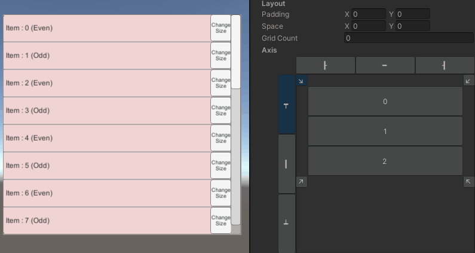
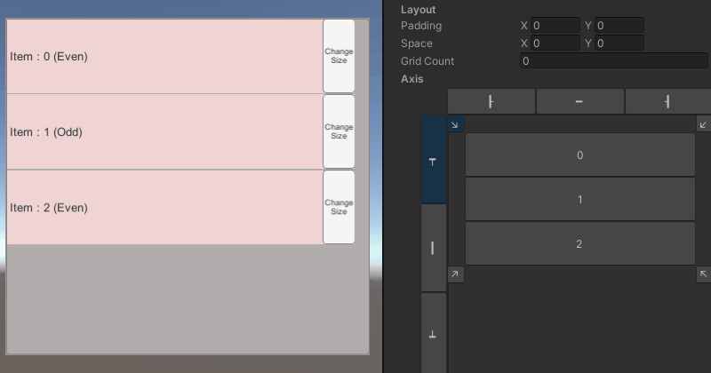
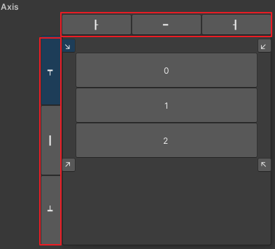
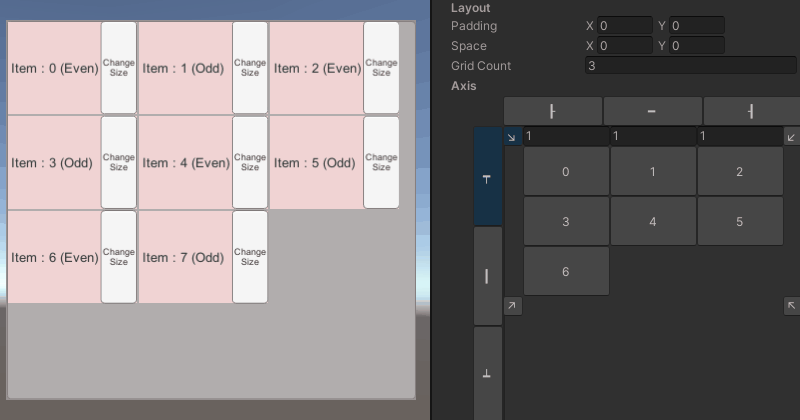
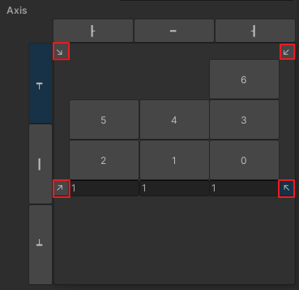

# Infinite Scroll

🌏 [English](README.en.md)

## 🚩 목차

* [개요](#개요)
* [사용 방법](#사용-방법)
* [API](#-api)
* [Sample](#-sample)

## 개요

스크롤 사각 영역(Scroll Rect(Scroll View))을 사용할 때 뷰포트(Viewport) 크기에 맞게 스크롤 아이템(ScrollItem)을 생성하여 재사용할 수 있는 컴포넌트입니다.

### ScrollItem 재사용
ScrollItem을 재사용함으로써 메모리를 절약하고 성능을 향상시킵니다.



* InfiniteScroll은 사용자가 삽입한 InfiniteScrollData(혹은 상속받은) 클래스로 콘텐츠(Content)의 요소(Element)를 생성합니다.
    * 'InfiniteScroll.InsertData()' 사용
* 콘텐츠의 요소로 사용할 프리팹(Prefab)에서는 InfiniteScrollItem(혹은 상속받은) 클래스를 연결해서 사용해야 합니다.
    * 'InfiniteScrollItem.UpdateData()' 메서드 구현

### 스크롤 관리
스크롤 사용 목적에 따라 기준점과 방향을 조절할 수 있습니다.


## 사용 방법

### 설정


* 스크롤 사각 영역(Scroll Rect(Scroll View))이 붙어있는 오브젝트에 Infinite Scroll 컴포넌트를 추가합니다.
* InfiniteScrollItem을 상속받은 클래스가 포함된 프리팹을 Item Prefab에 연결합니다.



### 스크롤 데이터 적용
* 스크롤 데이터(Data)를 적용하려면 InfiniteScrollItem 클래스를 상속한 클래스 내에서 UpdateData 메서드를 구현해야 합니다. 이를 통해 내부의 콘텐츠(Content)의 데이터(Data)를 적용할 수 있습니다.

    ```
    public override void UpdateData(InfiniteScrollData scrollData)
    {
        base.UpdateData(scrollData);

        // InfiniteScrollData 콘텐츠로 데이터 적용
    }
    ```

### ScrollItem 추가
* InfiniteScrollData를 상속하는 데이터(Data)클래스를 InsertData 함수를 통해 ScrollItem을 추가합니다. 
* 추가한 데이터(Data)는 스크롤 내부에서 관리되며 InfiniteScrollItem의 UpdateData로 전달되어 ScrollItem을 갱신할 수 있습니다.
```
public InfiniteScroll scroll;

class TestScrollData : InfiniteScrollData
{
}

void InsertData()
{
    TestScrollData data = new TestScrollData();

    scroll.InsertData(data);
}
```

### ScrollItem 필터링
스크롤 내에서 관리되는 데이터(Data)를 필터링하여 표시되는 내용을 제어할 수 있습니다.
* SetFilter 함수를 사용하여 ScrollItem을 보이지 않도록 할 수 있습니다.
* 반환 값이 fasle인 ScrollItem은 보이고 true인 ScrollItem은 보이지 않습니다.
```
public InfiniteScroll scroll;

class TestScrollFilter : InfiniteScrollData
{
    public bool filter;
}

void Filter()
{
    scroll.SetFilter(TestFilter);
}

bool OnFilter(InfiniteScrollData data)
{
    if (data is TestScrollFilter testData)
    {
        return testData.filter;
    }

    return false;
}
```

#### 홀수, 짝수 필터링


### ScrollItem 동적 크기 조정
* Dynamic Item Size 옵션을 활성화합니다.
* InfiniteScrollItem 상속받은 클래스
    * SetSize를 사용하여 크기를 변경합니다.
    * SetSize를 사용하지 않고 크기 변경 시 OnUpdateItemSize() 함수를 호출해 스크롤에 반영합니다.

### ScrollItem 그리드 적용
* ScrollItem을 그리드로 분할해 적용할 수 있습니다.
    

#### 인스펙터
* Layout의 Values 그리드를 분할할 크기를 설정합니다.
    * 
* Values의 Element의 비율로 그리드 비율을 설정합니다. 
    * Grid Count가 2 이상일 때 활성화됩니다.
    * ScrollItem 방향에 따라 UI 위치가 바뀔 수 있습니다.
    * 

### 스크롤 기준점 적용
* 스크롤의 기준점을 설정할 수 있습니다.
    * 가로(왼쪽, 가운데, 오른쪽)
    * 세로(상단, 중단, 하단)
* 

#### 인스펙터
* 각 기준점에 대해 표시하는 버튼을 선택하여 방향을 설정할 수 있습니다.
    * 

### ScrollItem 방향 적용
* ScrollItem이 정렬되는 방향을 설정할 수 있습니다.
    * 

#### 인스펙터
* 각 방향에 대해 표시하는 버튼을 선택하여 방향을 설정할 수 있습니다.
    * 

### 스크롤 이벤트
ScrollView의 상태 변화에 따라 호출하는 이벤트입니다.

Inspector나 AddListener를 통해 콜백 함수를 등록하여 활용할 수 있습니다.

#### 인스펙터


#### onChangeValue
ScrollView의 값이 변경되었을 때 호출하는 이벤트입니다.
* (int)firstDataIndex
    * 스크롤에서 보이는 첫 번째 Data의 Index
* (int)lastDataIndex
    * 스크롤에서 보이는 마지막 Data의 Index
* (bool)isStartLine
    * 스크롤이 시작 지점인지 여부
* (bool)isEndLine
    * 스크롤이 마지막 지점인지 여부
```cs
onChangeValue.AddListener(firstDataIndex, lastDataIndex, isStartLine, isEndLine =>
{
    // funtion
});
```

#### onChangeActiveItem
Scroll Item이 보이거나 사라질 때 호출하는 이벤트입니다.
* (int)dataIndex
    * 변경된 스크롤 Data의 Index
* (bool)active
    * ScrollItem의 활성화 여부
```cs
onChangeActiveItem.AddListener(dataIndex, active =>
{
    // funtion
});
```

#### onStartLine
ScrollView의 시작 지점인지 여부가 바뀔 때 호출하는 이벤트입니다.
* (bool)isStartLine
    * 스크롤이 시작 지점인지 여부
```cs
onStartLine.AddListener((bool)isStartLine =>
{
    // funtion
});
```

#### onEndLine
ScrollView의 마지막 지점인지 여부가 바뀔 때 호출하는 이벤트입니다.
* (bool)isEndLine
    * 스크롤이 마지막 지점인지 여부
```cs
onEndLine.AddListener((bool)isEndLine =>
{
    // funtion
});
```


## 🔨 API

API 사용 방법은 Assets/GPM/UI/Sample/InfiniteScroll/Scripts/InfiniteScrollSample.cs를 참고하시기 바랍니다.

### InsertData

콘텐츠의 요소로 보여줄 데이터를 추가합니다.
* data : 추가할 데이터
* insertIndex : 추가하길 원하는 index.

```cs
public void InsertData(InfiniteScrollData data)
```
```cs
public void InsertData(InfiniteScrollData data, int insertIndex)
```
```cs
public void InsertData(InfiniteScrollData[] datas)
```
```cs
public void InsertData(InfiniteScrollData[] datas, int insertIndex)
```

### UpdateData

삽입한 데이터를 업데이트합니다.

```cs
public void UpdateData(InfiniteScrollData data)
```

### UpdateAllData

모든 데이터를 업데이트합니다.
immediately가 true 이면 즉시 데이터를 갱신합니다.
```cs
public void UpdateAllData(bool immediately = false)
```

### RemoveData

삽입한 데이터를 삭제합니다.
* InfiniteScrollData : 관리되는 데이터가 있다면 해당 데이터를 삭제합니다.
* dataIndex : 관리되는 데이터의 데이터를 삭제합니다.

```cs
public void RemoveData(InfiniteScrollData data)
```
```cs
public void RemoveData(int dataIndex)
```

### Clear

모든 데이터를 삭제합니다.

```cs
public void Clear()
```

### MoveToFirstData

첫 번째 데이터로 콘텐츠를 이동합니다.

```cs
public void MoveToFirstData()
```

### MoveToLastData

마지막 데이터로 콘텐츠를 이동합니다.

```cs
public void MoveToLastData()
```

### IsMoveToLastData

콘텐츠가 마지막 데이터로 이동했는지 확인합니다.

```cs
public bool IsMoveToLastData()
```

### MoveTo

해당 데이터로 콘텐츠를 이동합니다.
* itemIndex : 필터링 된 scrollItem의 index로 이동합니다.
* MoveToType : 데이터의 어느 위치로 움직이는지를 정합니다. Top, Center, Bottom
* time : 이동할 때까지의 시간을 설정합니다. 0일 때 즉시 이동합니다.
* InfiniteScrollData : 관리되는 데이터가 있다면 해당 데이터로 이동합니다.

```cs
public void MoveTo(int itemIndex, MoveToType moveToType, float time = 0)
```

```cs
public void MoveTo(InfiniteScrollData data, MoveToType moveToType, float time = 0)
```

### MoveToFromDataIndex

관리 중인 Data의 Index로 콘텐츠를 이동합니다.
* dataIndex : 관리되는 데이터의 index로 이동합니다.
* MoveToType : 데이터의 어느 위치로 움직이는지를 정합니다. Top, Center, Bottom
* time : 이동할 때까지의 시간을 정합니다. 0일 때 즉시 이동합니다.

```cs
public void MoveToFromDataIndex(int dataIndex, MoveToType moveToType, float time = 0)
```
### SetFilter

스크롤에 보이길 원하는 scrollItem을 선별합니다.
* bool형 함수를 추가하여 필터링 되는지가 결정됩니다.
* true 일 때 필터링 되어 보이지 않고 false 일 때 그대로 보입니다.
* 전체 갱신 시 SetFilter를 다시 호출하면 다시 필터링 됩니다.
* null 추가 시 필터링 되지 않습니다.

```cs
public void SetFilter(Predicate<InfiniteScrollData> onFilter)
```

### SetScrollAxis
스크롤 콘텐츠의 기준점을 설정합니다.

```cs
public void SetScrollAxis(ScrollAxis axis)
```

### GetScrollAxis
스크롤 콘텐츠의 기준점을 받아옵니다.

```cs
public ScrollAxis GetScrollAxis()
```

### SetPadding
스크롤의 여백을 설정합니다.

```cs
public void SetPadding(Vector2 padding)
```

### GetPadding
스크롤의 여백을 받아옵니다.

```cs
public Vector2 GetPadding()
```

### SetSpace
ScrollItem 사이의 공간을 설정합니다.

```cs
public void SetSpace(Vector2 space)
```

### GetSpace
ScrollItem 사이의 공간을 받아옵니다.

```cs
public Vector2 GetSpace()
```

### ResizeScrollView

ScrollView 크기가 변경될 때 Infinite Scroll에서 크기 변경을 처리하는 데 필요한 API입니다.

```cs
public void ResizeScrollView()
```

## 🐾 Sample

Assets/GPM/UI/Sample/InfiniteScroll

