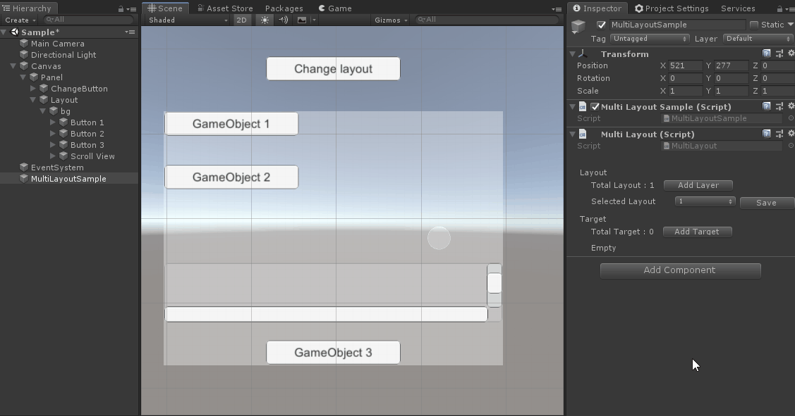

# Multi Layout

🌏 [English](README.en.md)

## 🚩 목차

* [개요](#개요)
* [API](#-api)
* [Sample](#-sample)

## 개요

MultiLayout 컴포넌트는 UI 컴포넌트의 RectTransform 정보를 여러 개의 레이아웃으로 설정해 해상도, 화면 방향 등에 대응할 수 있도록 도와줍니다.

## 🔨 API

### SelectLayout

설정된 레이아웃 중 하나를 선택합니다.

#### API

```cs
public void SelectLayout(int layoutIndex)
```

#### Example

```cs
public void SetOrientation(ScreenOrientation orientataion)
{
    if (orientataion == ScreenOrientation.Portrait)
    {
        multiLayout.SelectLayout(1);
    }
    else
    {
        multiLayout.SelectLayout(0);
    }
}
```

## 🐾 Sample

Assets/GPM/UI/Sample/MultiLayout

### Editor



### Runtime

