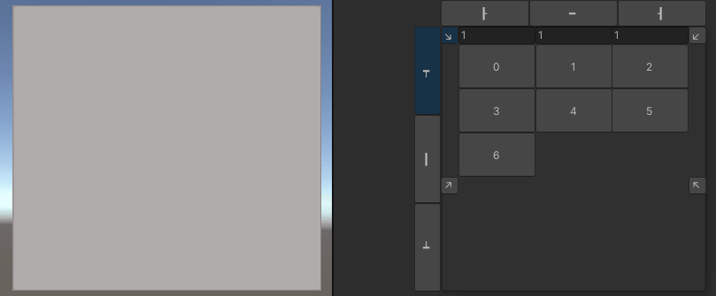
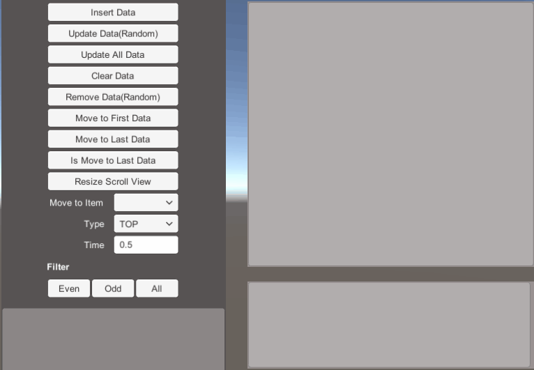
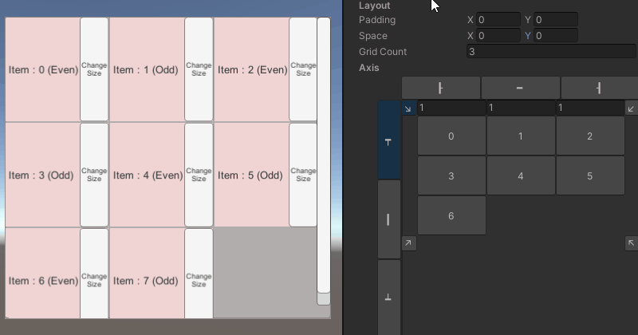

# Release notes

🌏 [English](ReleaseNotes.en.md)

## 2.10.0

### Date

* 2024.09.25

### Added
* WebCacheImage
    * 헤더 추가할 수 있는 기능
    * 캐시 요청 타입 선택할 수 있는 기능
    * 캐시 재요청 시간 변경할 수 있는 기능
    * 캐시 유효 최소 및 최대 설정할 수 있는 기능

### Updated
* CacheStorage 1.4.0 업데이트

## 2.9.0

### Date

* 2024.3.8

### Added

* InfiniteScroll
    *  기준점과 방향을 변경할 수 있는 기능 추가([438](https://github.com/nhn/gpm.unity/issues/438), [455](https://github.com/nhn/gpm.unity/issues/455))
        * 
    * 데이터 필터링 기능 추가([442](https://github.com/nhn/gpm.unity/issues/442))
        * 

### Updated

* InfiniteScroll
    * x축과 y축으로 space와 padding 정렬을 적용할 수 있는 기능이 개선
        * 

### Fixed

* InfiniteScroll
    * 데이터가 중간에 추가될 때 오브젝트 관리가 정상적으로 처리되도록 수정([470](https://github.com/nhn/gpm.unity/issues/470)) 

## 2.8.0

### Date

* 2023.11.24

### Add
* InfiniteScroll
    * 지정한 위치에 데이터를 추가할 수 있는 InsertData API 추가([438](https://github.com/nhn/gpm.unity/issues/438))
	
### Fixed
* InfiniteScroll
    * 활성화 후, 컴포넌트 갱신 순서에 따라 업데이트 영향을 받지 않도록 수정([413](https://github.com/nhn/gpm.unity/issues/413))
* MultiLayout
    * pivot 적용 순서에 따른 position 변경 문제 수정([456](https://github.com/nhn/gpm.unity/issues/456))

### Updated
* InfiniteScroll
    * Position 오타 수정

## 2.7.3

### Date

* 2023.6.1

### Fixed
* TabController
   * 프리팹 스테이지에서 변경사항이 적용되지 않는 버그 수정
   * 특정 Unity 버전에서 프리팹 저장 시 링크가 제거되는 버그 수정

### Updated
* Common 2.3.1 업데이트
* CacheStorage 1.3.0 업데이트
* WebCacheImage
   * URL을 변경했을 때 기존 요청을 취소하도록 개선
* TabController
   * 비어 있는 항목을 자동으로 제거하지 않도록 개선

## 2.7.2

### Date

* 2023.4.24

### Updated
* Common 2.3.0 업데이트
* CacheStorage 1.2.0 업데이트

## 2.7.1

### Date

* 2023.2.21

### Fixed
* InfiniteScroll
    * UpdateData 함수가 불필요하게 많이 호출되는 현상 수정([355](https://github.com/nhn/gpm.unity/issues/355))
    * InsertData 호출 이후 즉시 Move 호출했을 때 정상 작동되도록 수정([356](https://github.com/nhn/gpm.unity/issues/355))

### Updated
* InfiniteScroll
    * UpdateData 함수 호출 시 Item도 업데이트하도록 개선

## 2.7.0

### Date

* 2022.12.23

### Added
* TabControl UI 신규 기능 추가
    * UI에서 자주 사용하는 Tab과 TabPage를 제어하는 컴포넌트입니다.
        * TabController, Tab, TabPage
    * [TabControl 가이드](TabControl/README.md)
    

    
### Fixed
* InfiniteScroll
    * CanvasUpdate 로직에서 아이템 사이즈 변경 시 시점에 따라서 스크롤 사이즈 계산 잘못하는 문제 수정
    * CanvasUpdate 로직에서 TextMeshPro 생성 시 경고가 발생하던 문제 수정

### Updated
* InfiniteScroll
    * 지연 업데이트 하도록 구조 변경
    * 스크롤 아이템 더 적게 생성하여 재사용 하도록 최적화

## 2.6.0

### Date

* 2022.11.02

### Added
* InfiniteScroll
    * 부드러운 스크롤 이동 기능 추가
* ResizeLayoutHandler
    * 사이즈 변경되었을 때 이벤트 알 수 있는 모듈 추가

## 2.5.1

### Date

* 2022.07.08

### Updated

* Common 2.1.0을 2.1.2로 업데이트

## 2.5.0

### Date

* 2022.05.30

### Added
* WebCacheImage 추가

### Updated
* Common v2.1.0 의존성 추가
* CacheStorage v0.1.0 의존성 추가

### Fixed
* InfiniteScroll
    * 리스트 클리어 시 후 스크롤 아이템 재사용 하지 않는 문제 수정

## 2.4.0

### Date

* 2022.04.18

### Added
* InfiniteScroll
    * 스크롤 이벤트 추가 [(180)](https://github.com/nhn/gpm.unity/issues/180)
        * OnChangeValue
        * OnChangeActiveItem
        * OnStartLine
        * OnEndLine

* WrapLayoutGroup
    * 셈플 추가
    * 문서 추가

## 2.3.0

### Date

* 2022.03.21

### Added
* InfiniteScroll
    * 정렬 Grid로 분할할 수 있도록 기능 추가 [(161)](https://github.com/nhn/gpm.unity/issues/161)

### Fixed
* InfiniteScroll
    * 초기화 순서에 따라 리스트 보이지 않는 문제 수정

## 2.2.0

### Date

* 2022.02.21

### Added
* WrapLayoutGroup 추가

## 2.1.1

### Date

* 2022.01.17

### Fixed
* InfiniteScroll
    * ScrollItem Item size 전체 사이즈 0으로 잘못 계산하는 문제 수정

## 2.1.0

### Date

* 2022.01.13

### Added
* InfiniteScroll
    * ScrollItem active 함수 추가
    * ScrollItem Item size 설정 함수 추가

### Updated
* InfiniteScroll
    * dynamicItemSize 환경에서 가변길이 ScrollItem 대응 가능하도록 수정 로직 수정[(165)](https://github.com/nhn/gpm.unity/issues/165)

### Fixed
* InfiniteScroll
    * dynamicItemSize 환경에서 보이지 않는 ScrollItem 오브젝트 활성화 되는 문제 수정

## 2.0.7

### Date

* 2020.06.21

### Added
* InfiniteScroll
    * 스크롤 아이템 간격 기능 추가

## 2.0.6

### Date

* 2020.05.26

### Fixed
* InfiniteScroll
    * 초기화 전 Clear 호출할 때 오류 수정

## 2.0.5

### Date

* 2020.05.13

### Changed
* DragableRect DraggableRect로 이름 변경

## 2.0.4

### Date

* 2020.05.03

### Updated
* ContentSizeSetter
    * ExecuteInEditMode 프리팹 모드 팝업 이슈로 ExcuteAlways로 변경
* LayoutUpdate
    * ExecuteInEditMode 프리팹 모드 팝업 이슈로 ExcuteAlways로 변경

### Fixed
* DragableRect 
    * 온/오프 반복 시 이벤트 누적되는 문제 수정
* LayoutUpdate
    * 부모 RectTransform가 없을 경우에 대한 예외 처리를 추가합니다.

## 2.0.3

### Date

* 2020.04.16

### Added
* DragableRect 기능 추가
* ContentSizeSetter 기능 추가

### Updated
* InfiniteScroll 초기화 로직 개선
* 폴더 구조 변경

## 2.0.2

### Date

* 2020.03.11

### Fixed

* Asseambly Definition 적용 후 빌드시 컴파일 오류 수정

## 2.0.1

### Date

* 2020.03.10

### Added

* Assembly Definition 적용

### 2.0.0

### Date

* 2020.12.21

### Updated

* TOAST Kit에서 Game Package Manager로 브랜드 이름 변경

---

## 1.1.0

### Added

#### Infinite Scroll

* Support dynamic item size

## 1.0.1

### Fixed

#### Infinite Scroll

* Fixed initialization problem related to Item in Clear().

## 1.0.0

### Features

* MultiLayout
* InfiniteScroll