# Tab Control

🌏 [English](README.en.md)

## 🚩 목차

* [개요](#개요)
    * [구성요소](#구성요소)
    * [TabController](#tabcontroller)
    * [Tab](#tab)
    * [TabPage](#tabpage)
* [사용 방법](#사용-방법)
    * [TabControl 처음부터 만들어보기](#tabcontrol-처음부터-만들어보기)
    * [Tab에 Data 연동하기](#tab에-data-연동하기)
    * [Tab 커스터마이징](#tab-커스터마이징)
* [API](#api)
    * [TabController](#tabcontroller-api)
    * [Tab, TabButton](#tab-tabbutton-api)
    * [TabPage](#tabpage-api)
* [Sample](#sample)

## 개요

UI에서 자주 사용하는 Tab과 TabPage를 제어하는 컴포넌트입니다.

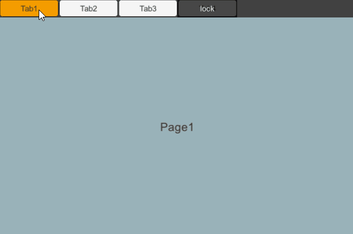

### 구성요소
Tab Control은 3가지 요소로 구성됩니다.
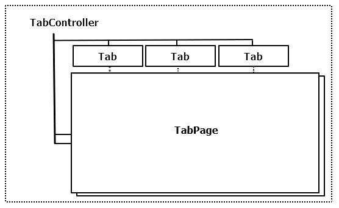
1. TabController
    * Tab과 TabPage를 연결하고 제어합니다.
2. Tab
	* Tab을 버튼으로 쉽게 사용할 수 있는 TabButton 컴포넌트가 제공됩니다.
    * Tab을 선택하여 연결된 TabPage를 열 수 있습니다.
    * 각각의 Tab은 TabController에 하나만 사용할 수 있습니다.
    * Tab에 Data를 적용하고 사용합니다.
3. TabPage
    * 동일한 TabController 내에서 TabPage를 공유할 수 있습니다.
    * 선택된 Tab에서 전달된 Data를 사용하여 TabPage를 업데이트합니다.

### TabController
TabController는 Tab과 TabPage를 제어합니다.

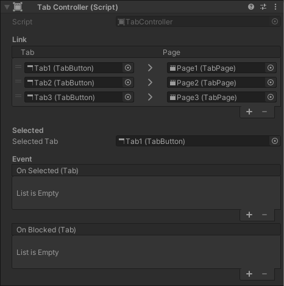

* Link
    * Tab과 TabPage를 연결합니다.
* Selected
    * SelectedTab
        * 초기에 선택된 Tab을 설정할 수 있습니다.
* Event
    * OnSelectedTab(Tab)
        * Tab이 선택되었을 때 이벤트
    * OnBlocked(Tab)
        * Tab 선택이 차단되었을 때 이벤트

### Tab

Tab 버튼의 상태, Data를 설정하고 받아올 수 있는 컴포넌트입니다.
Tab을 선택하여 연결된 TabPage를 엽니다.
TabController에 연결하여 사용합니다.

* Tab을 버튼으로 쉽게 사용할 수 있는 TabButton 컴포넌트가 제공됩니다.
* Tab 컴포넌트 사용 시 선택 이벤트에 Tab.OnClick()을 직접 호출해야 합니다.
	* 예) : ugui Button.OnClick() 이벤트에 Tab.OnClick() 연결합니다.
* 각각의 Tab은 TabController에 하나만 사용할 수 있습니다.
* Tab에 Data를 적용하고 사용합니다.

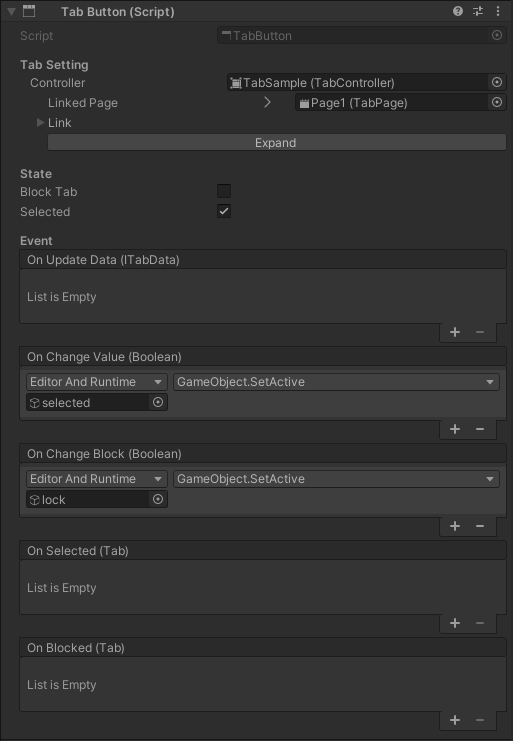

#### Tab Setting

* Controller
    * Tab에 연결된 TabController
    * LinkedPage
        * 선택 시 열리는 연결된 TabPage입니다.
    * Link
        * 연결된 TabController를 확인하고 수정할 수 있습니다.
        * 현재 편집 중인 Tab이 활성화됩니다.
            
            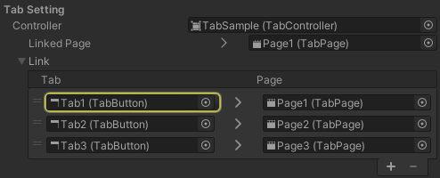

#### State

* Block Tab
    * Tab 잠김 여부 체크
    * 잠기면 선택이 되지 않습니다.
    * 선택 시 OnBlocked 이벤트를 받습니다.
* Selected
    * Tab 선택 여부 체크
    * 선택 시 OnSelected 이벤트를 받습니다.

#### Event

* OnUpdateData(ITabData)
    * Tab의 Data가 업데이트되었을 때 발생하는 이벤트
    `Tip : Tab Data 변경에 따른 Tab Button을 설정할 수 있습니다.`
* OnChangeValue(bool)
    * 선택 여부가 변경되었을 때 발생하는 이벤트
    `Tip : Editor And Runtime으로 설정하면 선택 여부에 따른 Tab 변화를 에디터에서 쉽게 확인할 수 있습니다.`
* OnChangeBlock(bool)
    * 잠김 여부가 변경되었을 때 발생하는 이벤트
    `Tip : Editor And Runtime으로 설정하면 잠김 여부에 따른 Tab 변화를 에디터에서 쉽게 확인할 수 있습니다.`
* OnSelected(Tab)
    * Tab을 선택했을 때 발생하는 이벤트
* OnBlocked(Tab)
    * 잠긴 Tab을 선택했을 때 발생하는 이벤트

### TabPage

TabPage는 선택 되는 Tab의 이벤트를 전달받습니다.

* TabPage는 동일한 TabController 내에서 TabPage를 공유할 수 있습니다.
* 선택된 Tab에서 전달된 Data를 사용하여 TabPage를 업데이트합니다.

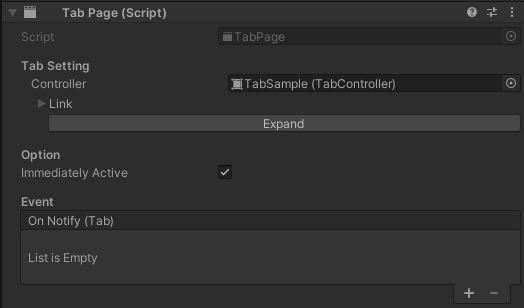

#### Tab Setting

* Controller
    * Tab에 연결된 TabController
    * Link
        * 연결된 TabController를 확인하고 수정할 수 있습니다.
        * 현재 편집 중인 TabPage가 활성화됩니다.

        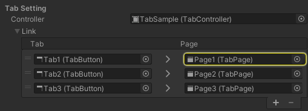

#### Option

* Immediately Active
    * Tab 선택 시 TabPage 즉시 활성화 여부.
    `Tip : 로직 변경 후 직접 활성화시키고 싶을 때는 Off 해서 활용`

#### Event

* OnNotify(Tab)
    * Tab이 선택되었을 때 연결된 모든 TabPage에 전달되는 이벤트
    `Tip : Tab의 IsSelected()를 사용하여 선택된 TabPage만 업데이트 할 수 있습니다.`
    `Tip : Tab의 GetData()에서 받은 데이타로 UI를 설정하실 수 있습니다.`

---

## 사용 방법

### TabControl 처음부터 만들어보기

TabController에 Tab 컴포넌트와 TabPage를 연결해 새 Tab을 구성해 봅니다.

1. Tab Control을 사용하기 위한 TabController 컴포넌트를 추가합니다.
    * 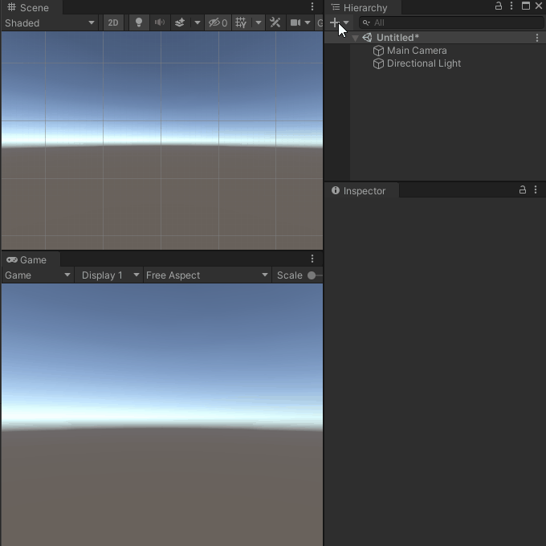
2. 눌리는 버튼은 TabButton 컴포넌트를 추가합니다.
    * 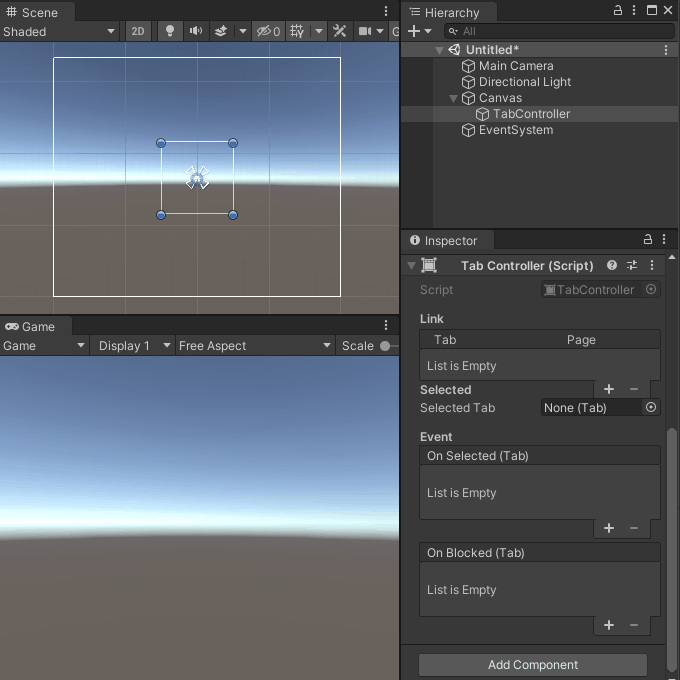
3. 열리는 오브젝트는 TabPage 컴포넌트를 추가합니다.
    * 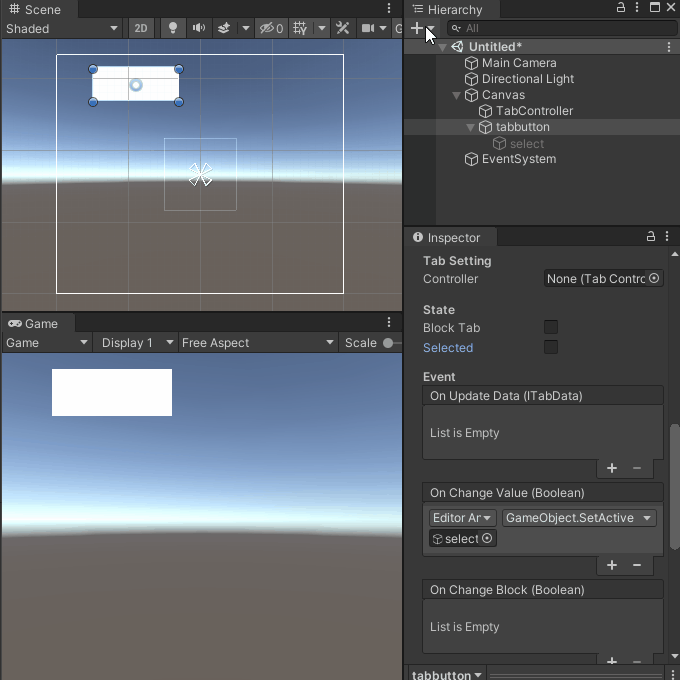
4. TabController에 Tab과 TabPage를 연결시킵니다. 여러 방법이 있습니다.
    * TabButton에서 TabController를 넣고 LinkdPage나 Link에 TabPage를 연결
    * TabController에서 TabButton과 TabPage를 연결
    * 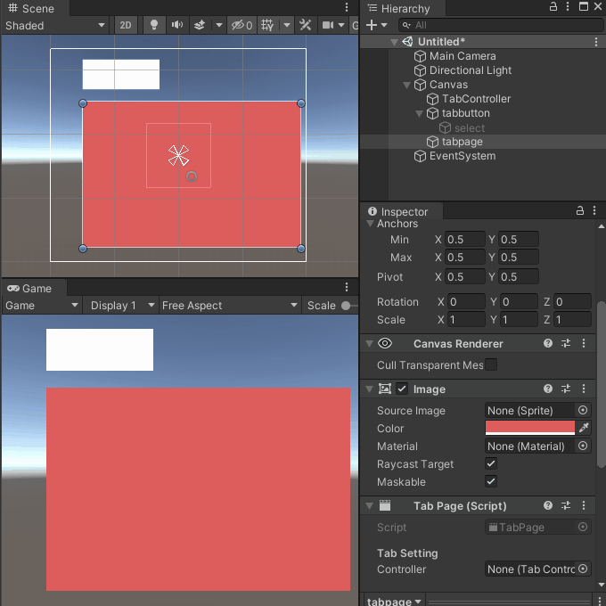
5. 실행시켜 Tab Control 동작을 확인해 봅니다.
    * 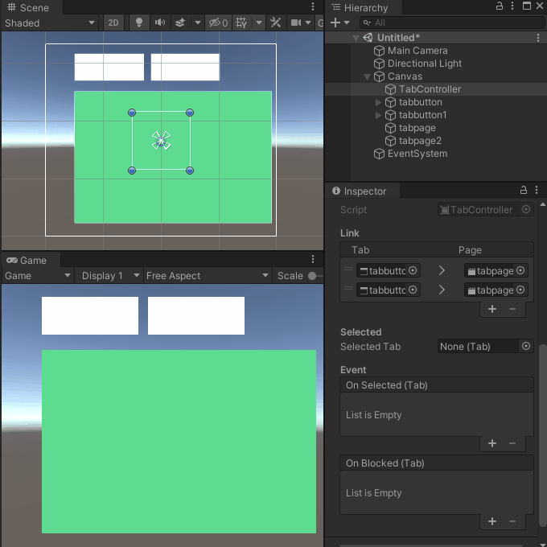

* TabSample 참조

### Tab에 Data 연동하기

Tab에 Data를 설정하여 사용합니다.

* ITabData 인터페이스를 상속하여 Data 정의
* Tab의 SetData를 통해 Data 설정
* Tab의 GetData를 통해 Data 사용

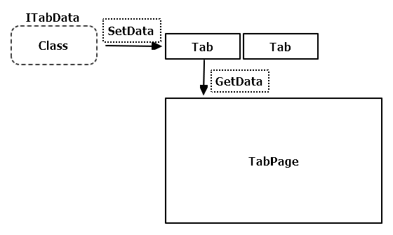

1. Data로 사용할 클래스를 정의합니다.
ITabData 인터페이스를 상속합니다.

```
public class SampleTabData : ITabData
{
    public string text;
}
```

2. Tab에 ITabData 인터페이스를 상속한 클래스를 설정합니다.
직접 Tab을 받아와 설정할 수도 있으며
TabController의 GetTab를 통해 Tab을 찾을 수도 있습니다.

```
public TabController tabController;
public Tab tab;
void SampleFunc()
{
    // tabController의 GetTab으로도 Tab을 받아올 수 있습니다.
    // tab = tabController.GetTab(0);

    SampleTabData data = new SampleTabData();
    data.text = "sampleText";

    // Tab에 Data를 넣습니다.
    tab.SetData(data);
}
```

3. Tab에서는 onUpdateData 이벤트로 Data를 받아와 UI를 업데이트할 수 있습니다.
onUpdateData는 Tab에서 SetData 호출 시 발생되는 이벤트입니다.

```
public Text buttonText;

// 설정 함수를 정의합니다.
public void DataSetting(ITabData updateData)
{
    // 전달받은 ITabData를 캐스팅해 사용합니다.
    SampleTabData data = (SampleTabData)updateData;

    // Tab UI 업데이트
    buttonText.text = data.text;
}
```

* tab의 onUpdateData에 AddListener로 추가할 수 있습니다.

```
Tab tab;
void SampleFunc()
{
    tab.onUpdateData.AddListener(DataSetting);
}
```

* Tab의 인스펙터에서도 추가할 수 있습니다.

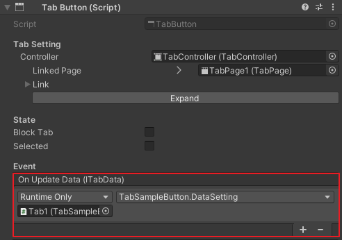

4. TabPage에서는 onNotify 이벤트를 통해 UI를 업데이트 할 수 있습니다.

* onNotify 이벤트는 Tab 선택 시 연결된 모든 TabPage에서 발생되는 이벤트입니다.
* Tab의 IsSelected()를 사용하여 선택된 TabPage만 업데이트 할 수 있습니다.
* Tab의 GetData()에서 받은 데이타로 UI를 설정하실 수 있습니다.

```
public Text pageText;

// 설정 함수를 정의합니다.
public void PageDataSetting(Tab tab)
{
    // onNotify 이벤트는 연결된 모든 TabPage에 전달됩니다.
    // 선택된 Tab일 경우만 업데이트합니다.
    if (tab.IsSelected() == true)
    {
        // GetData를 통해 전달받은 ITabData를 캐스팅해 사용합니다.
        SampleTabData data = (SampleTabData)tab.GetData();

        // TabPage UI 업데이트
        pageText.text = data.text;
    }
}
```

* tab의 onNotify AddListener로 추가할 수 있습니다.

```
TabPage tabPage;
void SampleFunc()
{
    tabPage.onNotify.AddListener(PageDataSetting);
}
```

* TabPage의 인스펙터에서도 추가할 수 있습니다.

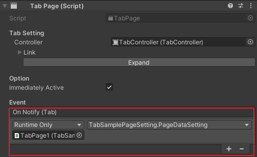

* TabDataSettingSample 참조

### Tab 커스터마이징

Tab은 여러 가지 형태로 사용 가능합니다.

1. TabButton 컴포넌트 생성
    * ugui의 raycast Target 기반으로 반응합니다.
2. Tab 컴포넌트 생성
    * ugui Button을 생성하고 OnClick() 이벤트에 Tab.OnClick() 연결하는 식으로 사용할 수 있습니다.
3. CustomTab 생성
    * Tab 또는 TabButton 상속하여 사용할 수 있습니다.
    * 이벤트 함수를 override 하여 자유롭게 커스터마이징 할 수 있습니다.
        * public virtual void OnUpdateData(ITabData data)
        * public virtual void OnChangeValue(bool selected)
        * public virtual void OnSelected()
        * public virtual void OnBlocked()

```
public class CustomTabSample : Tab
{
    public override void OnUpdateData(ITabData data)
    {
        base.OnUpdateData(data);

        // funtion
    }

    public override void OnChangeValue(bool active)
    {
        base.OnChangeValue(active);

        // funtion
    }
}
```

---

## 🔨 API

API 사용 방법은 Assets/GPM/UI/Sample/TabControl/Scripts/
샘플 코드를 참고하시기 바랍니다.

### TabController API

#### GetSelectedIndex

선택된 Tab이 몇 번째인지 알 수 있습니다.

``` cs
public int GetSelectedIndex()
```

#### GetSelectedTab

선택된 Tab을 알 수 있습니다.

``` cs
public Tab GetSelectedTab()
```

#### GetSelectedPage

선택된 TabPage를 알 수 있습니다.

``` cs
public TabPage GetSelectedPage()
```

#### GetTabCount

Tab 개수를 알 수 있습니다.

``` cs
public int GetTabCount()
```

#### GetTab

Tab을 알 수 있습니다.

``` cs
public Tab GetTab(int index)
```

#### GetTabIndex

Tab이 몇 번째 인지 알 수 있습니다.

``` cs
public int GetTabIndex(Tab tab)
```

#### Contain

Tab이 이미 있는지 알 수 있습니다.

``` cs
public bool Contain(Tab tab)
```

#### AddTab

Tab을 추가합니다.

``` cs
public void AddTab(Tab tab, TabPage page)
```

#### SelectFirstTab

첫 번쨰 Tab을 선택합니다.

``` cs
public void SelectFirstTab()
```

#### Select

Tab을 선택합니다.

``` cs
public void Select(int index = 0)
```

#### Select

Tab을 선택합니다.

``` cs
public void Select(Tab selectTab)
```

#### onSelected

Tab이 선택되었을 때 호출하는 이벤트입니다.

* (Tab)tab
    * 선택된 Tab

``` cs
onSelected.AddListener((Tab)tab =>
{
    // funtion
});
```

#### onBlocked

Tab을 선택했으나 차단되었을 때 호출하는 이벤트입니다.

* (Tab)tab
    * 차단된 Tab

``` cs
onBlocked.AddListener((Tab)tab  =>
{
    // funtion
});
```

- - -

### Tab, TabButton API

#### GetData

Data를 알 수 있습니다.

``` cs
public ITabData GetData()
```

#### SetData

Data를 설정합니다.

``` cs
public void SetData(ITabData data, bool notify = true)
```

#### GetLinkedPage

Tab에 연결된 TabPage를 알 수 있습니다.

``` cs
public TabPage GetLinkedPage()
```

#### SetLinkPage

Tab에 연결된 TabPage를 설정합니다.

``` cs
public void SetLinkPage(TabPage page)
```

#### OnClick

클릭 이벤트를 사용할 수 있습니다. 객체로 클릭을 제어할 수 있습니다.

``` cs
public virtual void OnClick()
```

#### IsBlock

선택이 차단되는 Tab인지 확인할 수 있습니다.

``` cs
public bool IsBlock()
```

#### SetBlockTab

선택을 차단하는 Tab인지 설정할 수 있습니다.

``` cs
public void SetBlockTab(bool value)
```

#### IsSelected

선택된 Tab인지 확인할 수 있습니다.

``` cs
public bool IsSelected()
```

#### Select

Tab을 선택합니다

``` cs
public void Select()
```

#### NotifyPage

연결된 TabPage의 이벤트를 발생시킵니다.

``` cs
public void NotifyPage()
```

#### onUpdateData

Tab의 Data가 바뀌었을 때 호출하는 이벤트입니다.
SetData를 사용했을 때 호출됩니다.

* (ITabData)tabData
    * Tab에 적용된 Tab Data

``` cs
onUpdateData.AddListener((ITabData)tabData =>
{
    // funtion
});
```

#### onChangeValue

Tab의 선택 여부 상태가 바뀔 때 호출하는 이벤트입니다.

* (bool)selected
    * 선택된 Tab인지 여부

``` cs
onChangeValue.AddListener((bool)selected =>
{
    // funtion
});
```

#### onChangeBlock

Tab의 차단 여부 상태가 바뀔 때 호출하는 이벤트입니다.

* (bool)blockTab
    * 차단 Tab인지 여부

``` cs
onChangeBlock.AddListener((bool)blockTab =>
{
    // funtion
});
```

#### onSelected

Tab이 선택되었을 때 호출하는 이벤트입니다.

* (Tab)tab
    * 선택된 Tab

``` cs
onSelected.AddListener((Tab)tab =>
{
    // funtion
});
```

#### onBlocked

Tab을 선택했으나 차단되었을 때 호출하는 이벤트입니다.

* (Tab)tab
    * 차단된 Tab

``` cs
onBlocked.AddListener((Tab)tab  =>
{
    // funtion
});
```

- - -

### TabPage API

#### onNotify

Tab이 선택되었을 때 연결된 모든 TabPage에 호출하는 이벤트입니다.

* (Tab)tab
    * 연결된 Tab

``` cs
onNotify.AddListener((Tab)tab =>
{
    // onNotify는 연결된 모든 TabPage에 전달됩니다.
    // 선택된 Tab일 경우만 업데이트합니다.
    if (tab.IsSelected() == true)
    {
        // 선택된 Tab의 Data를 받아옵니다.
        ITabData tabData = tab.GetData();
		
        // tabData로 TabPage UI 업데이트
    }
});
```

---

## 🐾 Sample

### TabSample

Assets/GPM/UI/Sample/TabControl/Scene/TabSample.scene
기본적인 Tab Control 샘플입니다.


### TabDataSettingSample

Assets/GPM/UI/Sample/TabControl/Scene/TabDataSettingSample.scene

Tab에서 Data를 설정하고 적용해 보는 샘플입니다.

* 각각의 Tab에 Level Data를 넣고 Level Data를 조정합니다.
* Level에 따라 선택할 수 있는 Tab이 다릅니다.
* 2가지 타입의 TabPage를 공유하고 선택된 Data에 따라 내용이 표시됩니다.
* Data가 바뀌었을 때 Tab이 막혔을 때의 사용방법을 알 수 있습니다.

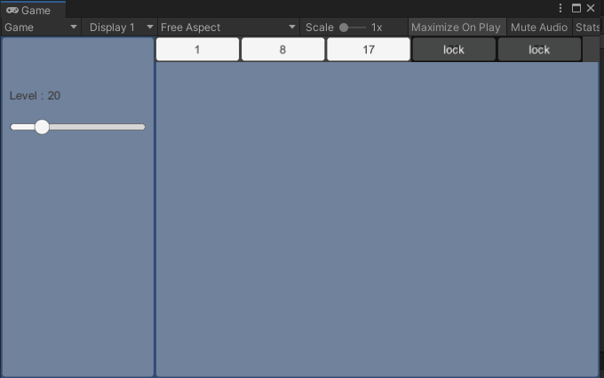

### DynamicTabSample

Assets/GPM/UI/Sample/TabControl/Scene/DynamicTabSample.scene

실시간으로 Tab Data를 추가 삭제하는 샘플입니다.

* Tab 프리팹을 복사하여 동적으로 Tab을 추가하고 관리하고 있습니다.
* 코드로 Tab을 생성하고 구성요소를 제어하는 방법을 알 수 있습니다.

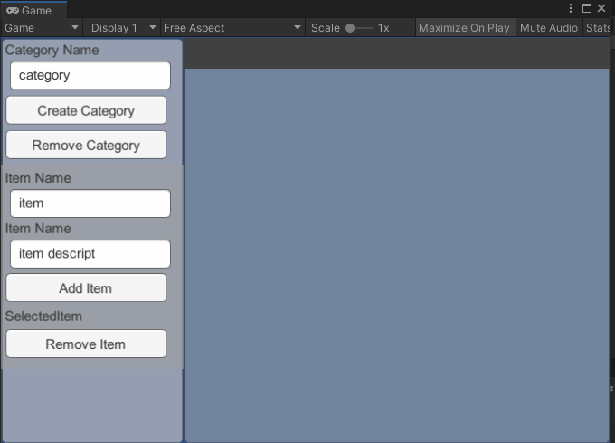

### ShopTypeTabSample

Assets/GPM/UI/Sample/TabControl/Scene/ShopTypeTabSample.scene

여러 가지 상점 타입으로 구성한 샘플입니다.
* dynamic
    * 이중Tab으로 구성된 여러 가지 타입의 상점입니다.
* vertical
    * 세로 타입의 아이템 상점 샘플입니다.
* horizontal
    * 가로 타입의 아이템 상점 샘플입니다.
* vertical(inside)
    * 그룹으로 구성된 세로 타입의 아이템 상점 샘플입니다.
* horizontal(inside)
    * 그룹으로 구성된 가로 타입의 아이템 상점 샘플입니다.
  
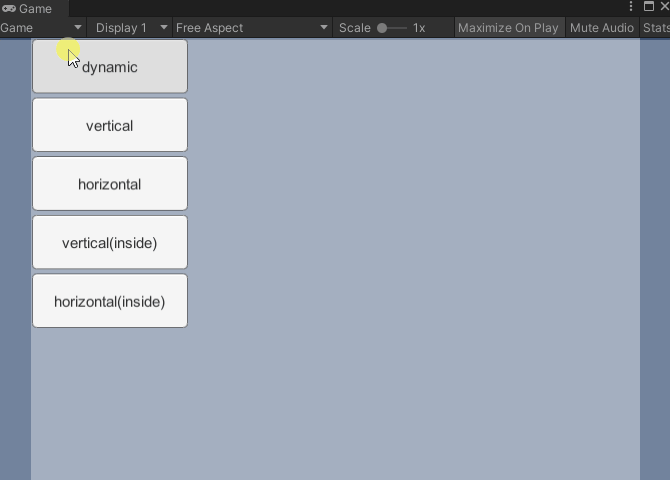

