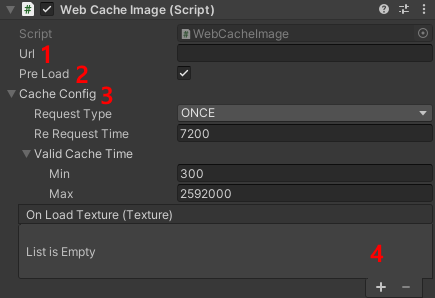

# WebCacheImage

🌏 [한국어](README.md)

## 🚩 Table of Contents

* [Overview](#Overview)
* [How to use](#How-to-use)
* [API](#api)

## Overview

This component displays images by caching web images using URLs.

## How to use
Add a **WebCacheImage** component to your UI object.
* If RawImage does not exist, a RawImage component is also created.
* If there is a RawImage, it is linked to the RawImage component.



1. Url: The URL to load the image.
2. Pre Load: A delay occurs when obtaining an image through a web request. If a cache is available, it will preload the image.
3. Cache Config: Detailed cache settings
    * Request Type: Set the cache request type
    * Re Request Time: Set the maximum revalidation period for the cache (in seconds)
    * Valid Cache Time
        * min: Minimum cache validity period (in seconds)
        * max: Maximum cache validity period (in seconds)
4. On Load Texture: The event that occurs when the texture is loaded through a request.

### Cache Details

WebCacheImage uses CacheStorage for image cache management.
* It can be controlled through Cache Config.
* Reference : [Using Web Cache More Effectively](https://github.com/nhn/gpm.unity/tree/main/docs/CacheStorage#%EB%8D%94-%ED%9A%A8%EA%B3%BC%EC%A0%81%EC%9D%B8-%EC%9B%B9-%EC%BA%90%EC%8B%9C-%EC%82%AC%EC%9A%A9)

### Request Header Settings

Can set the headers through the arguments.

```cs
WebCacheImage cache;

Dictionary<string, string> header = new Dictionary<string, string>();
header.Add("key", "value");

cache.SetHeader(header);
```

## API

### SetUrl

Set the URL to load the image.

```cs
void SetUrl(string url)
void SetUrl(string url, Dictionary<string, string> header)
```

**Example**
```cs
WebCacheImage cache;

string url = "url";

cache.SetUrl(url);
```

```cs
WebCacheImage cache;

string url = "url";
Dictionary<string, string> header = new Dictionary<string, string>();
header.Add("key", "value");

cache.SetUrl(url, header);
```

### SetLoadTextureEvent

Set an event when loading an image.

```cs
void SetLoadTextureEvent(UnityAction<Texture> onListener)
```

**Example**
```cs
WebCacheImage cache;
cache.SetLoadTextureEvent(OnLoadTexture);

public void OnLoadTexture(Texture texture)
{
}
```

### AddLoadTextureEvent

Adds an event when loading an image.

```cs
void AddLoadTextureEvent(UnityAction<Texture> onListener)
```

**Example**
```cs
WebCacheImage cache;
cache.AddLoadTextureEvent(OnLoadTexture);

public void OnLoadTexture(Texture texture)
{
}
```

### CleatLoadTextureEvent

Initializes the event when loading an image.
```cs
void CleatLoadTextureEvent()
```

**Example**
```cs
WebCacheImage cache;
cache.CleatLoadTextureEvent();
```

### SetPreloadSetting

Sets whether to preload the image when requesting it.

```cs
void void SetPreloadSetting(bool preLoad) 
```

**Example**
```cs
WebCacheImage cache;

cache.SetPreloadSetting(true);
```

### SetHeader

Sets the headers used when requesting an image.

```cs
void SetHeader(Dictionary<string, string> header)
```

**Example**
```cs
WebCacheImage cache;

Dictionary<string, string> header = new Dictionary<string, string>();
header.Add("key", "value");
    
cache.SetHeader(header);
```

### SetCacheConfig

Sets the detailed cache configuration when requesting an image.

```cs
void SetCacheConfig(CacheRequestConfiguration config)
```

**Example**
```cs
WebCacheImage cache;

CacheRequestConfiguration cacheConfig = new CacheRequestConfiguration(
            CacheRequestType.ONCE, 
            60 * 60 * 2, 
            new CacheValidTime(60 * 5, 60 * 60 * 24 * 30)); 
    
cache.SetCacheConfig(cacheConfig);
```

### SetCacheRequestType

Sets how to revalidate the cache when requesting an image.

```cs
void SetCacheRequestType(CacheRequestType requestType)
```

**Example**
```cs
WebCacheImage cache;

CacheRequestType requestType = CacheRequestType.FIRSTPLAY;
    
cache.SetCacheRequestType(requestType);
```

### SetCacheReRequestTime

Sets the time for revalidating the cache when requesting an image.

```cs
void SetCacheReRequestTime(double reRequestTime)
```

* After the specified time (in seconds), the server will revalidate whether the image has changed.
* If the value is 0, it follows the expiration time set by the content server.
* Revalidation will occur sooner compared to the content expiration set on the server.

**Example**
```cs
WebCacheImage cache;

double reRequestTime = 60 * 60 * 2; // 2 Hours
    
cache.SetCacheReRequestTime(reRequestTime);
```

### SetCacheValidMinTime

Sets the minimum reuse period for the image cache.

```
public void SetCacheValidMinTime(double min)
```

* Setting a minimum time (in seconds) means the cached version will be used until that time.
* If the value is 0, it will be ignored.

**Example**
```cs
WebCacheImage cache;

double validCacheMinTime = 60 * 5;  // 5 Minutes
    
cache.SetCacheValidMinTime(validCacheMinTime);
```

### SetCacheValidMaxTime

Sets the maximum reuse period for the image cache.

```cs
public void SetCacheValidMaxTime(double max)
```

* Setting a maximum time (in seconds) means a new cache will be downloaded after that time.
* If the value is 0, it will be ignored.

**Example**
```cs
WebCacheImage cache;

double validCacheMaxTime = 60 * 60 * 24 * 30; // 30 Days
    
cache.SetCacheValidMaxTime(validCacheMaxTime);
```

### SetCacheValidTime

Sets the minimum and maximum reuse periods for the image cache.

```cs
void SetCacheValidTime(double min, double max)
```

* Setting a minimum time (in seconds) means the cached version will be used until that time.
* Setting a maximum time (in seconds) means a new cache will be downloaded after that time.
* If the value is 0, it will be ignored.

**Example**
```cs
WebCacheImage cache;

double validCacheMinTime = 60 * 5; // 5 Minutes
double validCacheMaxTime = 60 * 60 * 24 * 30; // 30 Days
    
cache.SetCacheValidTime(validCacheMinTime, validCacheMaxTime);
```

### GetURL

Gets the URL for the image to be loaded.

```cs
string GetURL()
```

### GetPreloadSetting

Gets whether to preload the image when requesting it.

```cs
bool GetPreloadSetting()  
```

### GetCacheRequestType

Gets the time for revalidating the cache when requesting an image.

```cs
CacheRequestType GetCacheRequestType()
```

### GetCacheReRequestTime

Gets the minimum reuse period for the image cache.

```cs
double GetCacheReRequestTime()
```

### GetCacheValidMinTime

Gets the maximum reuse period for the image cache.

```cs
double GetCacheValidMinTime()
```

### GetCacheValidMaxTime

이미지 캐시의 최대 재사용 기간을 얻습니다.

```cs
double GetCacheValidMaxTime()
```