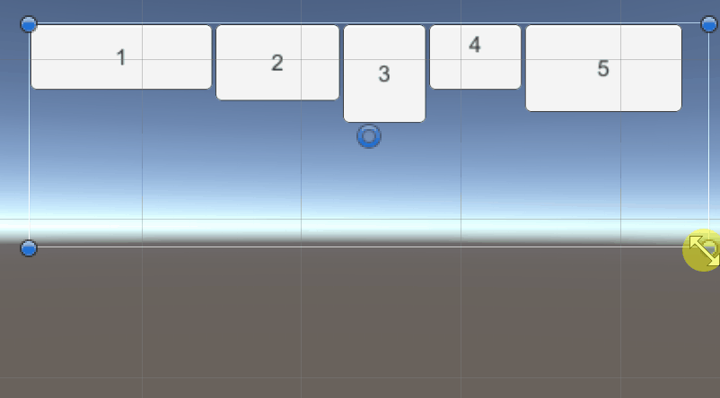
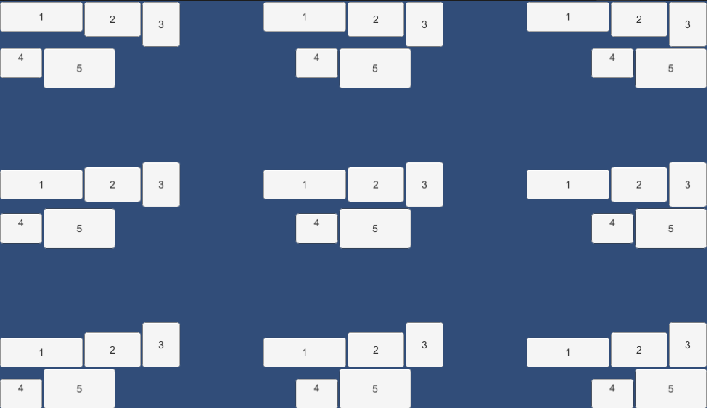
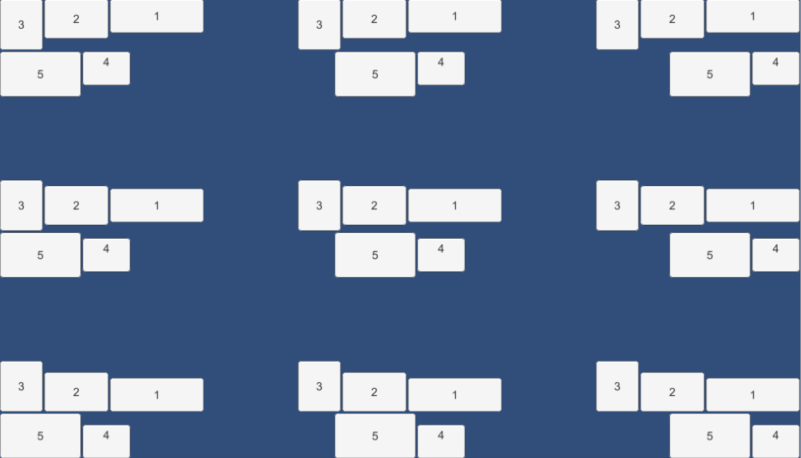
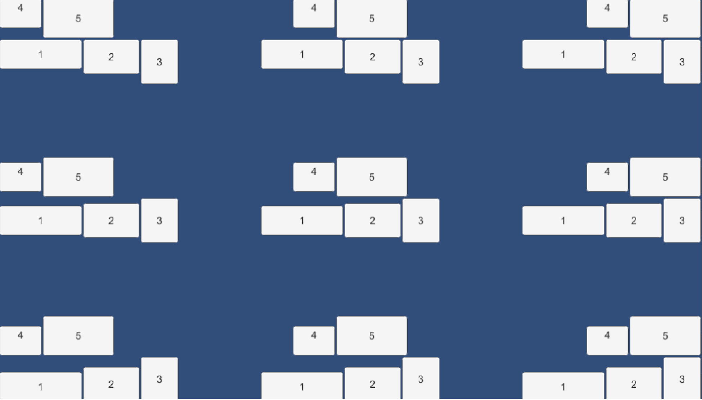
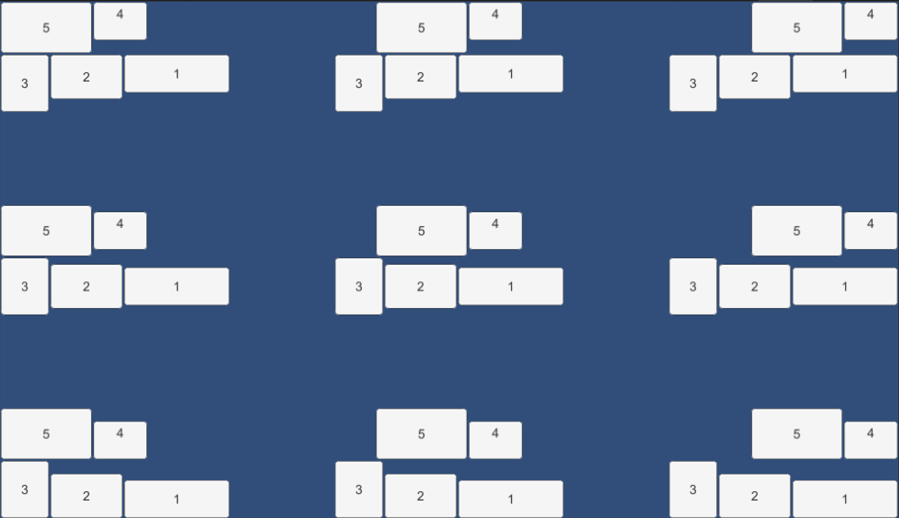
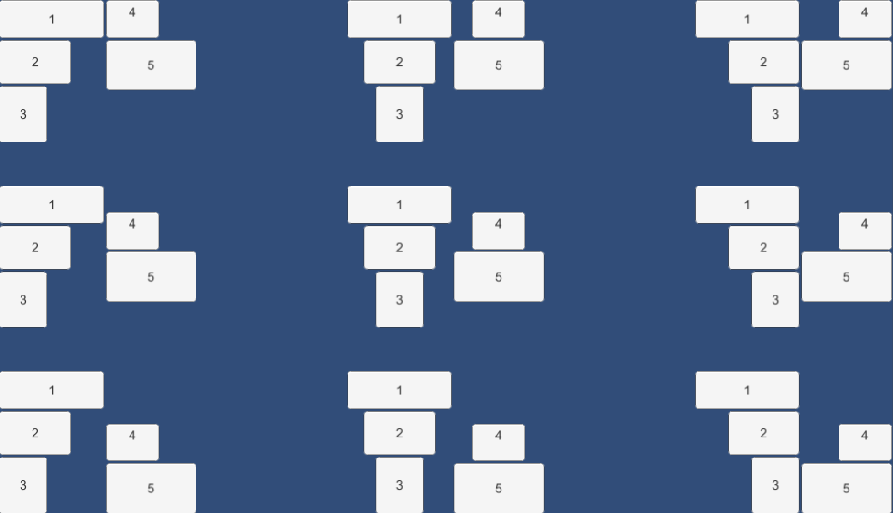
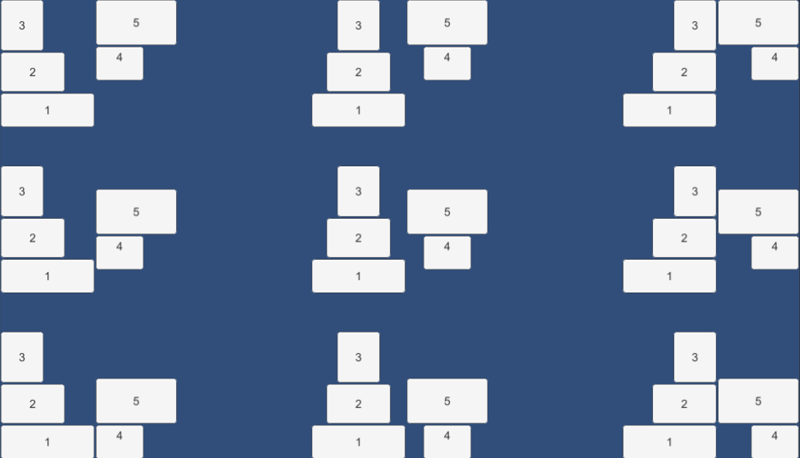
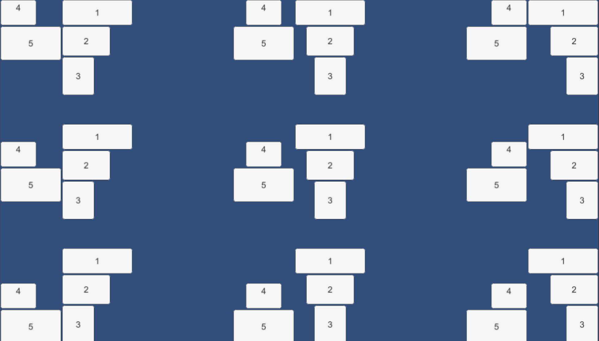
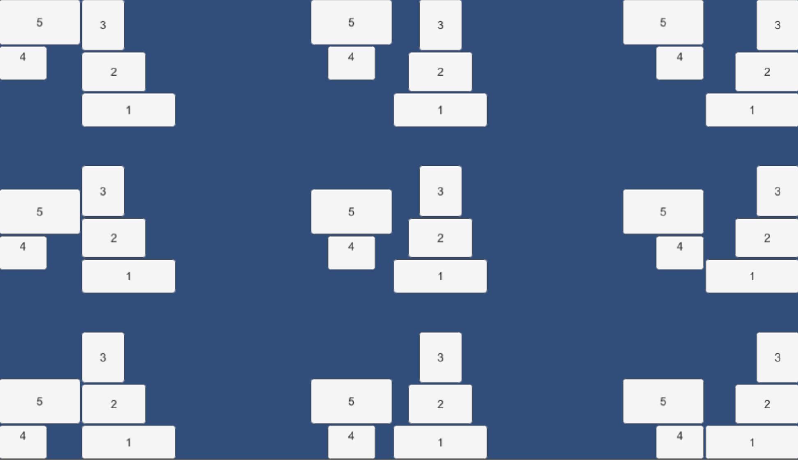

# WrapLayoutGroup

🌏 [English](README.en.md)

## 🚩 목차

* [개요](#개요)
* [요소](#요소)
* [Sample](#sample)

## 개요
UI 사각영역(RectTansform) 내에서 수직, 또는 수평으로 자식 요소를 정렬시키는 컴포넌트 입니다.
영역을 벗어나면 다음 라인으로 정렬시킵니다.

## 요소

* Child Alignment
    * 자식 요소들의 정렬 조건을 설정합니다.
* Is Vertical
    * 정렬 기준을 수직, 또는 수평인지를 결정하는 요소입니다
    * main
        * 수직, 수평의 기준이 되는 라인입니다.
        * IsVertival : false
            * 수직
        * IsVertival : true
            * 수평
    * croll
        * main 라인에서 영역을 벗어났을때 정렬하는 라인입니다.
        * IsVertival : false
            * 수평
        * IsVertival : true
            * 수직
* Main Inverse
    * main요소를 반대로 정렬합니다.
* Cross Inverse
    * cross 요소를 반대로 정렬합니다.

## Sample
* 각 영역에 Child Alignment와 상태값에 따라 정렬되는 상태를 볼 수 있습니다.

### IsVertical : false
### Main Inverse : false
### Cross Inverse: false

---

### IsVertical : false
### Main Inverse : true
### Cross Inverse: false

---

### IsVertical : false
### Main Inverse : false
### Cross Inverse: true

---

### IsVertical : false
### Main Inverse : true
### Cross Inverse: true

---

### IsVertical : true
### Main Inverse : false
### Cross Inverse: false

---

### IsVertical : true
### Main Inverse : true
### Cross Inverse: false

---

### IsVertical : true
### Main Inverse : false
### Cross Inverse: true

---

### IsVertical : true
### Main Inverse : true
### Cross Inverse: true
