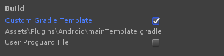

# WebView

🌏 [한국어](README.md)

## 🚩 Table of Contents

* [Overview](#Overview)
* [Specifications](#Specifications)
* [Platform specific settings](#-Platform-specific-settings)
* [API](#-API)


## Overview
게임에서 다양하게 사용할 수 있는 웹뷰를 제공합니다.

## Specifications

### Supported Unity Version

* 2018.4.0 or higher

### Supported Android version

* 4.4 or higher

### Supported iOS version

* 11 or higher

### Supported platforms

* Anroid
* iOS 

### Supported features
| Category | Spec |
| --- | --- |
| Navigation | title |
|  | back |
|  | close |
| ShowUrl API | url |
|  | open Callback |
|  | close Callback |
|  | scheme Callback |
|  | schemeList |

## 🔨 Platform specific settings

###  Android

GPM WebView uses [Gradle](https://docs.unity3d.com/Manual/android-gradle-overview.html) to set the dependencies needed in Android.
In a project that uses a version before Unity 2019.3, you need to switch to **Gradle** instead of **Internal** settings.

* Gradle settings
    1.  Go to **File > Build Settings > Player Settings > Android > Publishing Settings** and enable **Custom Gradle Template** to create an `Assets/Plugins/Android/mainTemplate.gradle` file.
        * 
        * If you are already using a mainTemplate.gradle file, you may skip this step.
    2.  Uncomment any comment in mainTemplate.gradle.
        ```gradle
        // ENERATED BY UNITY. REMOVE THIS COMMENT TO PREVENT OVERWRITING WHEN EXPORTING AGAIN
        ```
    3.  Add dependencies in mainTemplate.gradle.
        ```gradle
        dependencies {
            implementation 'org.jetbrains.kotlin:kotlin-stdlib-jdk7:1.3.72'
        }
        ```
        * If they are already added in another package, you may skip this step.

### iOS
* Setting Other Linker Flags
    * In **Build Settings > Linking > Other Linker Flags** of Xcode Target, you need to add -ObjC.

## 🔨 API

### ShowUrl

Displays the WebView.

**Required parameter**
* url: the url transmitted to the parameter must be a valid value.
* openCallback: When WebView is open, the success result is notified via a callback.

**Optional parameter**
* configuration: With GpmWebViewRequest.Configuration, WebView options can be changed.
* closeCallback: The closing of WebView is notified to users via a callback.
* schemeList: Specifies the list of custom schemes that users want to receive.
    * Entering 'https://' allows you receive all URLs that begin with 'https://' as schemeEvent.
    * A scheme received as schemeEvent is not redirected.
* schemeEvent: Any URL that includes a custom scheme specified using schemeList is notified via a callback.

#### Configuration

| Parameter | Values | Description |
| ------------------------ | ---------------------------------------- | --------------------------- |
| title                    | string                                   | WebView title                 |
| orientation       | ScreenOrientation.Unknown    | not specified (device settings) |
|                          | ScreenOrientation.Portrait       | portrait mode                       |
|                          | ScreenOrientation.PortraitUpsideDown      | flipped portrait mode                       |
|                          | ScreenOrientation.LandscapeLeft</br>ScreenOrientation.Landscape | landscape mode              |
|                          | ScreenOrientation.LandscapeRight | rotate landscape mode 180 degrees              |
|                          | ScreenOrientation.AutoRotation | auto              |
| contentMode</br>(iOS only)              | GamebaseWebViewContentMode.RECOMMENDED        | recommended browsers for the current platform    |
|                          | GamebaseWebViewContentMode.MOBILE             | mobile browser            |
|                          | GamebaseWebViewContentMode.DESKTOP            | desktop browser          |


**API**
```cs
static void ShowUrl(
    string url,
    GpmWebViewRequest.Configuration configuration,
    GpmWebViewCallback.GpmWebViewErrorDelegate openCallback,
    GpmWebViewCallback.GpmWebViewErrorDelegate closeCallback,
    List<string> schemeList,
    GpmWebViewCallback.GpmWebViewDelegate<string> schemeEvent)
```

**Example**

```cs
public void ShowUrl()
{
    GpmWebView.ShowUrl(
        "https://www.nhn.com",
        new GpmWebViewRequest.Configuration() {
            title = "WebView Title",
            orientation = ScreenOrientation.AutoRotation,
            contentMode = GpmWebViewContentMode.MOBILE// iOS only
        },
        OnOpenCallback,
        OnCloseCallback,
        new List<string>()
        {
            "USER_ CUSTOM_SCHEME"
        },
        OnSchemeEvent);
}

private void OnOpenCallback(GpmWebViewError error)
{
    // TODO
}

private void OnCloseCallback(GpmWebViewError error)
{
    // TODO
}

private void OnSchemeEvent(string data, GpmWebViewError error)
{
    // TODO
}
```

### Close

You can close the WebView using the following API.

**API**
```cs
static void Close()
```

**Example**

```cs
public void Close()
{
    GpmWebView.Close();
}
```