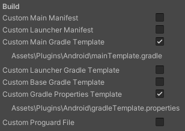
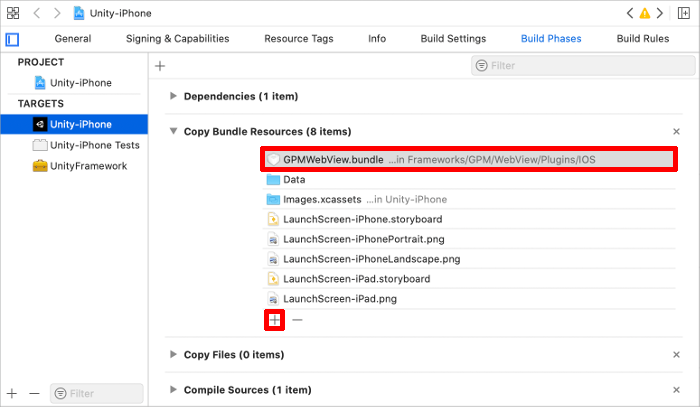

# WebView

🌏 [English](README.en.md)

## 🚩 목차

* [개요](#개요)
* [설치](#설치)
* [스펙](#스펙)
* [플랫폼별 설정](#-플랫폼별-설정)
* [API](#-api)
* [Release notes](./ReleaseNotes.md)


## 개요

게임에서 다양하게 사용할 수 있는 웹뷰를 제공합니다.

## 설치

1. [Game Package Manger 설치](https://assetstore.unity.com/packages/tools/utilities/game-package-manager-147711)
2. 실행 : [Unity Menu > Tools > GPM > Manager](https://github.com/nhn/gpm.unity#%EC%8B%A4%ED%96%89)
3. 서비스 설치 : WebView

## 스펙

### Unity 지원 버전

* 2019.4.0 이상

### Android 지원 버전

* 4.4 이상

### iOS 지원버전

* 12 이상

### 지원 플랫폼

* Android
* iOS 

### 지원하는 기능

| Category | Spec |
| --- | --- |
| Style | Popup |
|   | Fullscreen |
| Navigation | Visibility |
|   | Color |
|   | Title |
|   | Back |
|   | Forward |
|   | Close |
| Show API | URL, HTML file, HTML string |
|   | Callback |
|   | Scheme List |
| Position, Size API | SetPosition, GetX, GetY |
|   | SetSize, GetWidth, GetHeight |
|   | SetMargins |
| SafeBrowsing | Show |
|   | Close</br>(iOS only) |
| Other | IsActive |
|   | Screen orientation |
|   | Add JavaScript |
|   | Execute JavaScript |
|   | Clear Cookies |
|   | Clear Cache |
|   | Can Go Back |
|   | Can Go Forward |
|   | Go Back |
|   | Go Forward |
|   | Multiple Windows |
|   | Scheme command |
|   | File download</br>(Android only) |
|   | File upload</br>(Android API 21 이상) |
|   | User agent string |
|   | Set auto rotation |
|   | Show WebBrowser |

## 🔨 플랫폼별 설정

###  Android

#### Gradle 설정

1.  **File > Build Settings > Player Settings > Android > Publishing Settings**에서 **Custom Main Gradle Template**을 활성화하면 `Assets/Plugins/Android/mainTemplate.gradle` 파일이 생성됩니다.
    * 
    * 사용 중인 mainTemplate.gradle 파일이 있을 때는 생략할 수 있습니다.
2.  mainTemplate.gradle에서 dependencies를 추가합니다.
    ```gradle
    dependencies {
        ...
        // 필수 구성 요소
        implementation 'org.jetbrains.kotlin:kotlin-stdlib-jdk7:1.3.72'
        
        // ShowSafeBrowsing API를 사용할 경우 추가
        implementation 'androidx.browser:browser:1.3.0'
    }
    ```
    * 다른 패키지에서 이미 추가한 경우 해당 과정을 제외할 수 있습니다.
3. **File > Build Settings > Player Settings > Android > Publishing Settings**에서 **Custom Gradle Properties Template**을 활성하면 `Assets/Plugins/Android/gradleTemplate.properties` 파일이 생성됩니다.
    * 
    
4. gradleTemplate.properties 파일의 마지막 줄에 AndroidX 설정을 추가합니다.
    ```gradle
    **ADDITIONAL_PROPERTIES**
    android.useAndroidX=true
    ```

### iOS

#### Other Linker Flags 설정

Xcode Target(Unity-iPhone)에서 **Build Settings > Linking > Other Linker Flags**에 -ObjC를 추가해야 합니다.

#### GPMWebView.bundle

Unity 특정 버전에서 iOS 빌드 시, **내비게이션 바**의 버튼이 보이지 않는 현상이 발생할 수 있습니다.
해당 현상이 발생하면, Xcode Target(Unity-iPhone)의 **Xcode Project > Build Phases > Copy Bundle Resource** 설정에서 + 버튼을 눌러 `GPMWebView.bundle` 파일 검색하여 추가하십시오.



### 자동화 선택
선택 사항으로 프로세스 자동화를 위해 [OnPostprocessBuild](https://docs.unity3d.com/ScriptReference/Build.IPostprocessBuildWithReport.OnPostprocessBuild.html)와 [PBXProject](https://docs.unity3d.com/ScriptReference/iOS.Xcode.PBXProject.html) class를 사용할 수 있습니다.

확인 및 테스트 버전 :

* Unity 2020.3.21

**Example**

```cs
using System.IO;
using UnityEditor;
using UnityEditor.Build;
using UnityEditor.Build.Reporting;
using UnityEditor.iOS.Xcode;

public class BuildProcessor : IPostprocessBuildWithReport
{
    public int callbackOrder { get { return 0; } }

    public void OnPostprocessBuild(BuildReport report)
    {
        if (report.summary.platform == BuildTarget.iOS)
        {
            // Initialize PBXProject instance
            var pbxprojPath = Path.Combine(report.summary.outputPath, "Unity-iPhone.xcodeproj/project.pbxproj");
            var pbxProject = new PBXProject();
            pbxProject.ReadFromFile(pbxprojPath);

            // Get GUID of target
            var targetGuid = pbxProject.GetUnityMainTargetGuid();

            // Setting Other Linker Flags (adding -ObjC to Other Linker Flags in Build Settings)
            pbxProject.AddBuildProperty(targetGuid, "OTHER_LDFLAGS", "-ObjC");

            // GPMWebView.bundle (adding GPMWebView.bundle to Copy Bundle Resources in Build Phases)
            var webViewBundleGuid = pbxProject.AddFile("Frameworks/GPM/WebView/Plugins/IOS/GPMWebView.bundle", "GPMWebView.bundle", PBXSourceTree.Build);
            pbxProject.AddFileToBuild(targetGuid, webViewBundleGuid);

            pbxProject.WriteToFile(pbxprojPath);
        }
    }
}
```

**참고**

[AddBuildProperty](https://docs.unity3d.com/ScriptReference/iOS.Xcode.PBXProject.AddBuildProperty.html)가 중복 빌드 속성을 무시하므로 `-ObjC`와 `GPMWebView.bundle`이 한 번만 추가됩니다.

## 🔨 API

### Namespace
```cs
using Gpm.WebView;
```

### ShowUrl

WebView를 표시합니다.

**Required 파라미터**

* url : 파라미터로 전송되는 url은 유효한 값이어야 합니다.
* configuration : GpmWebViewRequest.Configuration으로 WebView의 옵션을 변경할 수 있습니다.

**Optional 파라미터**

* callback : WebView에서 발생하는 콜백을 전달받습니다.
* schemeList : 사용자가 받고 싶은 커스텀 스킴(scheme) 목록을 지정합니다.
    * 'https://'를 입력하면 'https://'로 시작하는 모든 url을 schemeEvent로 받을 수 있습니다.
    * schemeEvent로 받은 scheme은 redirect 되지 않습니다.

#### Configuration

| Parameter | Values | Description |
| ------------------------- | ----------------------------------------- | -------------------------------- |
| style                     | GpmWebViewStyle.POPUP                     | 팝업 모드 |
|                           | GpmWebViewStyle.FULLSCREEN                | 전체 화면 모드 |
| orientation               | GpmOrientation                            | 화면 회전 |
| isClearCookie             | bool                                      | 쿠키 제거 |
| isClearCache              | bool                                      | 캐시 제거 |
| backgroundColor           | string                                    | 배경 색상 |
| isNavigationBarVisible    | bool                                      | 내비게이션 바 활성 또는 비활성 |
| navigationBarColor        | string                                    | 내비게이션 바 색상 |
| title                     | string                                    | WebView의 제목</br>null 또는 string.Empty 할당에 웹페이지의 타이틀 사용</br>title 글자 미표기에 공백(" ") 사용 |
| orientation               | UnityEngine.ScreenOrientation             | GPM WebView v1.1.0에서 제거되었습니다. |
| isBackButtonVisible       | bool                                      | 뒤로 가기 버튼 활성 또는 비활성  |
| isForwardButtonVisible    | bool                                      | 앞으로 가기 버튼 활성 또는 비활성 |
| isCloseButtonVisible      | bool                                      | 닫기 버튼 활성 또는 비활성 |
| supportMultipleWindows    | bool                                      | GPM WebView의 다중 창 지원 여부 |
| userAgentString           | string                                    | GPM WebView의 userAgentString 설정 |
| addJavascript             | string                                    | GPM WebView에 JavaScript 추가 |
| customSchemePostCommand   | GpmWebViewRequest.CustomSchemePostCommand | Custom scheme 후처리 명령 추가 |
| position                  | GpmWebViewRequest.Position                | Popup WebView 위치 지정 |
| size                      | GpmWebViewRequest.Size                    | Popup WebView 크기 지정 |
| margins                   | GpmWebViewRequest.Margins                 | Popup WebView 여백 지정 |
| isBackButtonCloseCallbackUsed</br>(Android only) | bool               | Back 버튼 사용으로 WebView 종료 대신 Callback 전달 |
| isMaskViewVisible</br>(iOS only) | bool                               | Popup WebView 배경 활성 또는 비활성 |
| contentMode</br>(iOS only)| GamebaseWebViewContentMode.RECOMMENDED    | 현재 플랫폼 추천 브라우저 |
|                           | GamebaseWebViewContentMode.MOBILE         | 모바일 브라우저 |
|                           | GamebaseWebViewContentMode.DESKTOP        | 데스크탑 브라우저 |
| isAutoRotation</br>(iOS only) | bool                                  | WebView 회전 설정</br>Screen.orientation을 수동 설정하지 않을 때만 true를 지정합니다. |

**API**

```cs
public static void ShowUrl(
    string url,
    GpmWebViewRequest.Configuration configuration,
    GpmWebViewCallback.GpmWebViewDelegate callback,
    List<string> schemeList)
```

**Example**

```cs
using Gpm.WebView;

// FullScreen
public void ShowUrlFullScreen()
{
    GpmWebView.ShowUrl(
        "https://google.com/",
        new GpmWebViewRequest.Configuration()
        {
            style = GpmWebViewStyle.FULLSCREEN,
            orientation = GpmOrientation.UNSPECIFIED,
            isClearCookie = true,
            isClearCache = true,
            backgroundColor = "#FFFFFF",
            isNavigationBarVisible = true,
            navigationBarColor = "#4B96E6",
            title = "The page title.",
            isBackButtonVisible = true,
            isForwardButtonVisible = true,
            isCloseButtonVisible = true,
            supportMultipleWindows = true,
#if UNITY_IOS
            contentMode = GpmWebViewContentMode.MOBILE
#endif
        },
        // See the end of the code example
        OnCallback,
        new List<string>()
        {
            "USER_ CUSTOM_SCHEME"
        });
}

// Popup default
public void ShowUrlPopupDefault()
{
    GpmWebView.ShowUrl(
        "https://google.com/",
        new GpmWebViewRequest.Configuration()
        {
            style = GpmWebViewStyle.POPUP,
            orientation = GpmOrientation.UNSPECIFIED,
            isClearCookie = true,
            isClearCache = true,
            isNavigationBarVisible = true,
            isCloseButtonVisible = true,
            supportMultipleWindows = true,
#if UNITY_IOS
            contentMode = GpmWebViewContentMode.MOBILE,
            isMaskViewVisible = true,
#endif
        },
        // See the end of the code example
        OnCallback,
        new List<string>()
        {
            "USER_ CUSTOM_SCHEME"
        });
}

// Popup custom position and size
public void ShowUrlPopupPositionSize()
{
    GpmWebView.ShowUrl(
        "https://google.com/",
        new GpmWebViewRequest.Configuration()
        {
            style = GpmWebViewStyle.POPUP,
            orientation = GpmOrientation.UNSPECIFIED,
            isClearCookie = true,
            isClearCache = true,
            isNavigationBarVisible = true,
            isCloseButtonVisible = true,
            position = new GpmWebViewRequest.Position
            {
                hasValue = true,
                x = (int)(Screen.width * 0.1f),
                y = (int)(Screen.height * 0.1f)
            },
            size = new GpmWebViewRequest.Size
            {
                hasValue = true,
                width = (int)(Screen.width * 0.8f),
                height = (int)(Screen.height * 0.8f)
            },
            supportMultipleWindows = true,
#if UNITY_IOS
            contentMode = GpmWebViewContentMode.MOBILE,
            isMaskViewVisible = true,
#endif
        }, null, null);
}

// Popup custom margins
public void ShowUrlPopupMargins()
{
    GpmWebView.ShowUrl(
        "https://google.com/",
        new GpmWebViewRequest.Configuration()
        {
            style = GpmWebViewStyle.POPUP,
            orientation = GpmOrientation.UNSPECIFIED,
            isClearCookie = true,
            isClearCache = true,
            isNavigationBarVisible = true,
            isCloseButtonVisible = true,
            margins = new GpmWebViewRequest.Margins
            {
                hasValue = true,
                left = (int)(Screen.width * 0.1f),
                top = (int)(Screen.height * 0.1f),
                right = (int)(Screen.width * 0.1f),
                bottom = (int)(Screen.height * 0.1f)
            },
            supportMultipleWindows = true,
#if UNITY_IOS
            contentMode = GpmWebViewContentMode.MOBILE,
            isMaskViewVisible = true,
#endif
        }, null, null);
}

private void OnCallback(
    GpmWebViewCallback.CallbackType callbackType,
    string data,
    GpmWebViewError error)
{
    Debug.Log("OnCallback: " + callbackType);
    switch (callbackType)
    {
        case GpmWebViewCallback.CallbackType.Open:
            if (error != null)
            {
                Debug.LogFormat("Fail to open WebView. Error:{0}", error);
            }
            break;
        case GpmWebViewCallback.CallbackType.Close:
            if (error != null)
            {
                Debug.LogFormat("Fail to close WebView. Error:{0}", error);
            }
            break;
        case GpmWebViewCallback.CallbackType.PageStarted:
            if (string.IsNullOrEmpty(data) == false)
            {
                Debug.LogFormat("PageStarted Url : {0}", data);
            }
            break;
        case GpmWebViewCallback.CallbackType.PageLoad:
            if (string.IsNullOrEmpty(data) == false)
            {
                Debug.LogFormat("Loaded Page:{0}", data);
            }
            break;
        case GpmWebViewCallback.CallbackType.MultiWindowOpen:
            Debug.Log("MultiWindowOpen");
            break;
        case GpmWebViewCallback.CallbackType.MultiWindowClose:
            Debug.Log("MultiWindowClose");
            break;
        case GpmWebViewCallback.CallbackType.Scheme:
            if (error == null)
            {
                if (data.Equals("USER_ CUSTOM_SCHEME") == true || data.Contains("CUSTOM_SCHEME") == true)
                {
                    Debug.Log(string.Format("scheme:{0}", data));
                }
            }
            else
            {
                Debug.Log(string.Format("Fail to custom scheme. Error:{0}", error));
            }
            break;
        case GpmWebViewCallback.CallbackType.GoBack:
            Debug.Log("GoBack");
            break;
        case GpmWebViewCallback.CallbackType.GoForward:
            Debug.Log("GoForward");
            break;
        case GpmWebViewCallback.CallbackType.ExecuteJavascript:
            Debug.LogFormat("ExecuteJavascript data : {0}, error : {1}", data, error);
            break;
#if UNITY_ANDROID
        case GpmWebViewCallback.CallbackType.BackButtonClose:
            Debug.Log("BackButtonClose");
            break;
#endif
    }
}
```

### ShowHtmlFile

**Assets > StreamingAssets** 폴더에 있는 HTML 파일을 웹뷰에 불러옵니다.


ShowHtmlFile API의 filePath 값은 아래 코드를 참고하여 입력하십시오.

```cs
#if UNITY_IOS
    // "file://" + Application.streamingAssetsPath + "/" + "YOUR_HTML_PATH.html"
    string.Format("file://{0}/{1}", Application.streamingAssetsPath, "YOUR_HTML_PATH.html");
#elif UNITY_ANDROID
    // "file:///android_asset/" + "YOUR_HTML_PATH.html"
    string.Format("file:///android_asset/{0}", "YOUR_HTML_PATH.html");
#endif
```

**API**

```cs
public static void ShowHtmlFile(
    string filePath,
    GpmWebViewRequest.Configuration configuration,
    GpmWebViewCallback.GpmWebViewDelegate callback,
    List<string> schemeList)
```

**Example**

```cs
using Gpm.WebView;

public void ShowHtmlFile()
{
    var htmlFilePath = string.Empty;
#if UNITY_IOS
        htmlFilePath = string.Format("file://{0}/{1}", Application.streamingAssetsPath, "YOUR_HTML_PATH.html");
#elif UNITY_ANDROID
        htmlFilePath = string.Format("file:///android_asset/{0}", "YOUR_HTML_PATH.html");
#endif

    GpmWebView.ShowHtmlFile(
        htmlFilePath,
        new GpmWebViewRequest.Configuration()
        {
            style = GpmWebViewStyle.FULLSCREEN,
            orientation = GpmOrientation.UNSPECIFIED,
            isClearCookie = true,
            isClearCache = true,
            backgroundColor = "#FFFFFF",
            isNavigationBarVisible = true,
            navigationBarColor = "#4B96E6",
            title = "The page title.",
            isBackButtonVisible = true,
            isForwardButtonVisible = true,
            isCloseButtonVisible = true,
            supportMultipleWindows = true,
#if UNITY_IOS
            contentMode = GpmWebViewContentMode.MOBILE
#endif
        },
        OnCallback,
        new List<string>()
        {
            "USER_ CUSTOM_SCHEME"
        });
}

```

### ShowHtmlString

지정된 HTML 문자열을 웹뷰에 불러옵니다.

**API**

```cs
public static void ShowHtmlString(
    string htmlString,
    GpmWebViewRequest.Configuration configuration,
    GpmWebViewCallback.GpmWebViewDelegate callback,
    List<string> schemeList)
```

**Example**

```cs
using Gpm.WebView;

public void ShowHtmlString()
{
    GpmWebView.ShowHtmlString(
        "${HTML_STRING}",
        new GpmWebViewRequest.Configuration()
        {
            style = GpmWebViewStyle.FULLSCREEN,
            orientation = GpmOrientation.UNSPECIFIED,
            isClearCookie = true,
            isClearCache = true,
            backgroundColor = "#FFFFFF",
            isNavigationBarVisible = true,
            navigationBarColor = "#4B96E6",
            title = "The page title.",
            isBackButtonVisible = true,
            isForwardButtonVisible = true,
            isCloseButtonVisible = true,
            supportMultipleWindows = true,
#if UNITY_IOS
            contentMode = GpmWebViewContentMode.MOBILE
#endif
        },
        OnCallback,
        new List<string>()
        {
            "USER_ CUSTOM_SCHEME"
        });
}
```

### ShowSafeBrowsing

App에서 Android Chrome 또는 iOS Safari 브라우저를 표시합니다.</br>
👉 **GpmWebViewSafeBrowsing** class를 사용합니다.

**Required 파라미터**

* url : 파라미터로 전송되는 url은 유효한 값이어야 합니다.

**Optional 파라미터**

* configuration : GpmWebViewRequest.ConfigurationSafeBrowsing으로 NavigationBar의 색상을 변경할 수 있습니다.
* callback : 브라우저의 Open, Close 콜백을 전달받습니다.

#### Configuration

| Parameter | Values | Description |
| ------------------------- | ----------------------------------------- | -------------------------------- |
| navigationBarColor        | string                                    | 내비게이션 바 색상 |
| navigationTextColor</br>(iOS only) | string                           | 내비게이션 텍스트 색상 |

**API**

```cs
public static void ShowSafeBrowsing(
    string url,
    GpmWebViewRequest.ConfigurationSafeBrowsing configuration = null,
    GpmWebViewCallback.GpmWebViewDelegate callback = null)
```

**Example**

```cs
public void OpenSafeBrowsing()
{
    GpmWebViewSafeBrowsing.ShowSafeBrowsing(sampleUrl,
        new GpmWebViewRequest.ConfigurationSafeBrowsing()
        {
            navigationBarColor = "#4B96E6",
            navigationTextColor = "#FFFFFF"
        },
        OnCallback);
}
```

### CloseSafeBrowsing

다음 API를 이용하여 SafeBrowsing을 닫을 수 있습니다.

**API**

```cs
public static void CloseSafeBrowsing()
```

**Example**

```cs
public void CloseSafeBrowsing()
{
    GpmWebViewSafeBrowsing.CloseSafeBrowsing();
}
```

### ExecuteJavaScript

지정된 JavaScript 문자열을 실행합니다.

**API**

```cs
public static void ExecuteJavaScript(string script)
```

**Example**

```cs
public void ExecuteJavaScriptSample()
{
    GpmWebView.ExecuteJavaScript("alert('ExecuteJavaScript');");
}
```

### Close

다음 API를 이용해 WebView를 닫을 수 있습니다.

**API**

```cs
public static void Close()
```

**Example**

```cs
public void Close()
{
    GpmWebView.Close();
}
```

### IsActive

WebView 활성화 여부를 확인합니다.

**API**

```cs
public static bool IsActive()
```

**Example**

```cs
public bool Something()
{
    if (GpmWebView.IsActive() == true)
    {
        ...
    }
}
```

### CanGoBack

WebView에 이전 방문 기록이 있는지 확인합니다.

**API**

```cs
public static bool CanGoBack()
```

### CangoForward

WebView에 다음 방문 기록이 있는지 확인합니다.

```cs
public static bool CanGoForward()
```

### GoBack

WebView의 이전 방문 기록으로 이동합니다.

**API**

```cs
public static void GoBack()
```

**Example**

```cs
public void GoBack()
{
    GpmWebView.GoBack();
}
```

### GoForward

WebView의 다음 방문 기록으로 이동합니다.

**API**

```cs
public static void GoForward()
```

**Example**

```cs
public void GoForward()
{
    GpmWebView.GoForward();
}
```

### SetPosition

Popup WebView의 위치를 조정합니다.

**API**

```cs
public static void SetPosition(int x, int y)
```

**Example**

```cs
public void SetPosition()
{

    GpmWebView.SetPosition((int)(Screen.width * 0.1f), (int)(Screen.height * 0.1f));
}
```

### SetSize

Popup WebView의 크기를 조정합니다.

**API**

```cs
public static void SetSize(int width, int height)
```

**Example**

```cs
public void SetSize()
{

    GpmWebView.SetSize((int)(Screen.width * 0.8f), (int)(Screen.height * 0.8f));
}
```

### SetMargins

Popup WebView의 여백을 조정합니다.

**API**

```cs
public static void SetMargins(int left, int top, int right, int bottom)
```

**Example**

```cs
public void SetMargins()
{
    GpmWebView.SetMargins((int)(Screen.width * 0.1f), (int)(Screen.height * 0.1f), (int)(Screen.width * 0.1f), (int)(Screen.height * 0.1f));
}
```

### GetX, GetY

WebView의 위치를 반환합니다.

**API**

```cs
public static int GetX()
public static int GetY()
```

**Example**

```cs
public void Something()
{
    if (GpmWebView.IsActive() == true)
    {
        int x = GpmWebView.GetX();
        int y = GpmWebView.GetY();
        ...
    }
}
```

### GetWidth, GetHeight

WebView의 크기를 반환합니다.

**API**

```cs
public static int GetWidth()
public static int GetHeight()
```

**Example**

```cs
public void Something()
{
    if (GpmWebView.IsActive() == true)
    {
        int width = GpmWebView.GetWidth();
        int height = GpmWebView.GetHeight();
        ...
    }
}
```

### ShowWebBrowser

Android/iOS의 기본 브라우저를 표시합니다.</br>

**Required 파라미터**

* url : 파라미터로 전송되는 url은 유효한 값이어야 합니다.

**API**

```cs
public static void ShowWebBrowser(string url)
```

**Example**

```cs
public void OpenWebBrowser()
{
    GpmWebView.ShowWebBrowser(sampleUrl);
}
```
